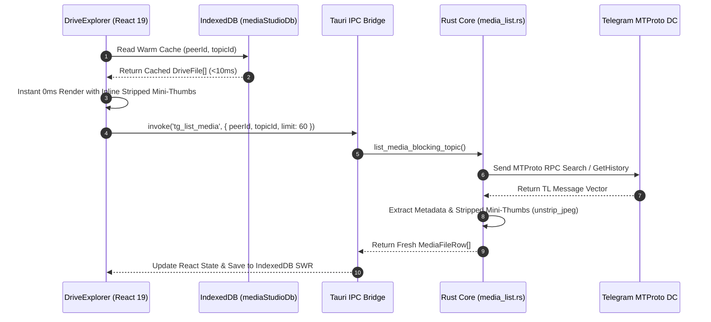
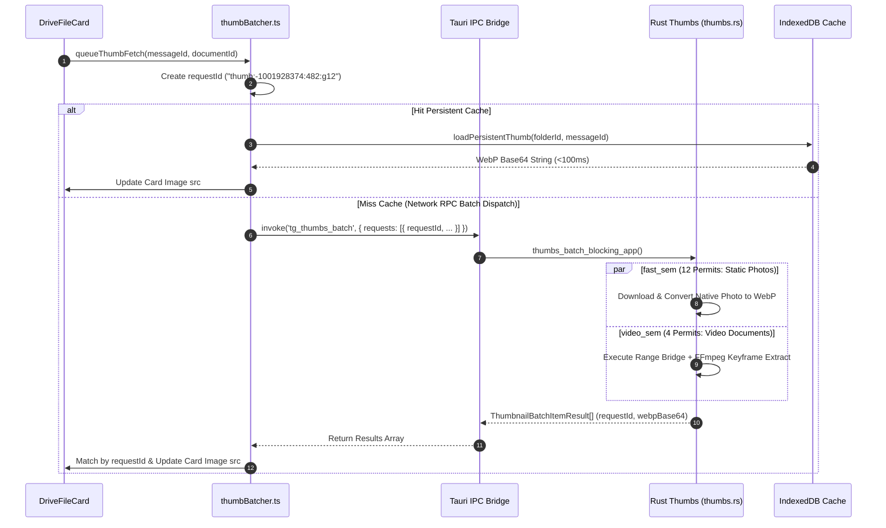
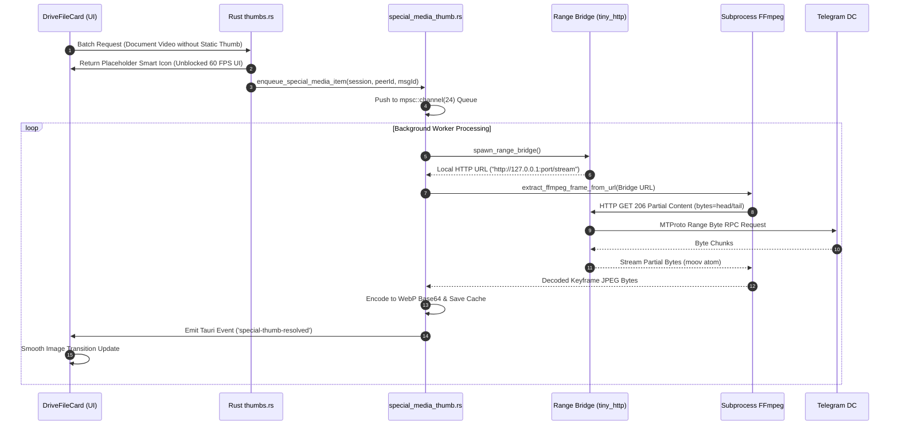
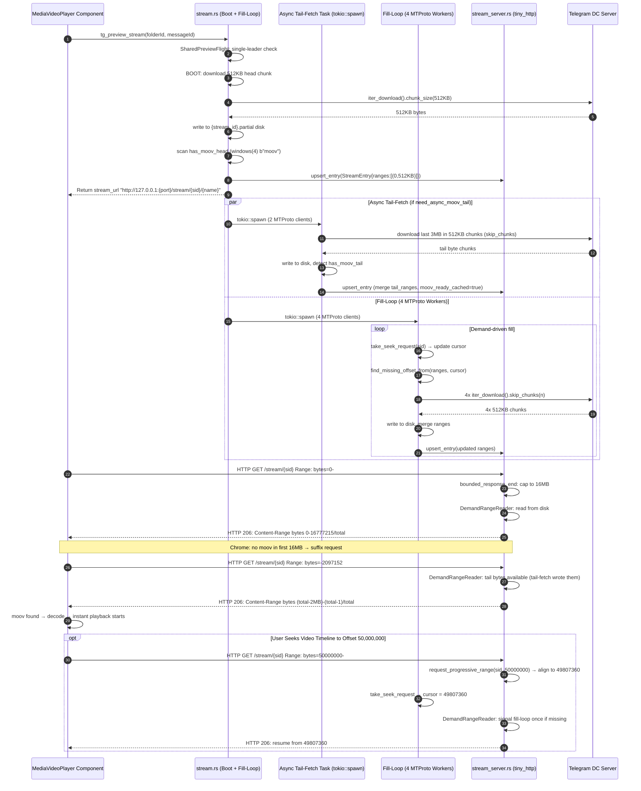
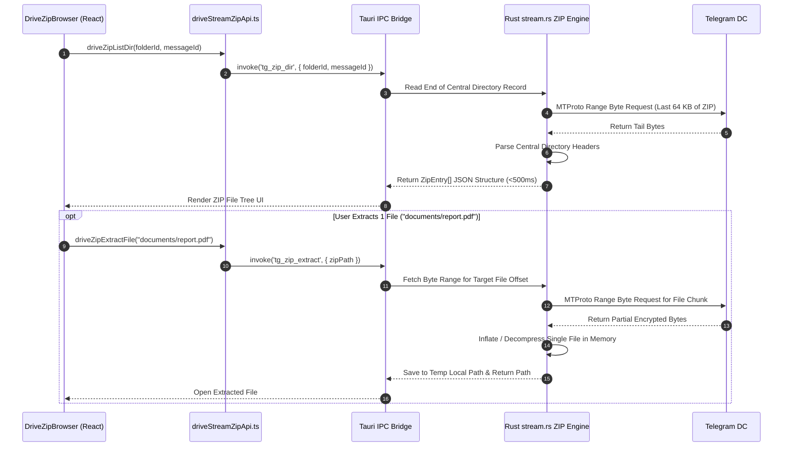

# AutoGram Master Architecture, WorkTree & Operational Workflow Specification

> **Dokumen Spesifikasi Teknis Master, Peta WorkTree Utuh, Diagram Sequence Mermaid, Manual Operational Workflow Real-World & Standar Tata Kelola Agent AutoGram App**  
> *Versi Rujukan Terintegrasi: v2.7.1 (Absolute Definitive Production Master Edition — 100% Comprehensive & Complete)*  
> *Platform: Desktop Hybrid (Tauri v2 + React 19 + Rust Grammers Engine + SQLite + IndexedDB)*

---

## 1. Pendahuluan & Filosofi Arsitektur Utama (Core Technical Philosophy)

AutoGram adalah platform manajemen, migrasi, dan eksplorasi media Telegram berbasis desktop yang menggunakan paradigma **Telegram-as-a-Drive**. Sistem ini dirancang untuk menangani pustaka media berskala besar (10.000+ hingga 1.000.000+ berkas per saluran/grup) dengan kecepatan eksekusi tinggi, penggunaan memori minimal, antarmuka responsif (*mobile-first & touch-first*), serta keandalan tingkat tinggi tanpa hambatan *FloodWait*.

```
┌──────────────────────────────────────────────────────────────────────────────────┐
│                             FRONTEND (React 19 + TS)                             │
│  MediaStudio ─── DriveTopBar ─── DriveExplorer ─── ThumbBatcher ─── mediaStudioDb│
│  DriveFileCard ── VideoCanvasCapturer ── DriveZipBrowser ── DrivePreviewModal   │
└────────────────────────────────────────┬─────────────────────────────────────────┘
                                         │ Tauri IPC Invoke ('tg_*')
┌────────────────────────────────────────▼─────────────────────────────────────────┐
│                              TAURI BRIDGE (lib.rs)                               │
│  tg_list_media │ tg_open_topic_media │ tg_thumbs_batch │ tg_upload_file          │
│  tg_stream_range │ tg_cancel_stream   │ tg_zip_dir      │ tg_zip_extract       │
└────────────────────────────────────────┬─────────────────────────────────────────┘
                                         │
┌────────────────────────────────────────▼─────────────────────────────────────────┐
│                      RUST CORE ENGINE (src-tauri/src)                            │
│ ┌─────────────────────────┐ ┌─────────────────────────┐ ┌──────────────────────┐ │
│ │ Grammers MTProto Engine │ │ Topic Media Feature Eng │ │ SQLite Repository    │ │
│ │ (client_pool, media_   │ │ (search, doc_mapper,    │ │ (app.db WAL Mode)    │ │
│ │  list, media_transfer) │ │  cache/disk.rs)         │ │                      │ │
│ └────────────┬────────────┘ └────────────┬────────────┘ └──────────┬───────────┘ │
│ ┌────────────▼────────────┐ ┌────────────▼────────────┐            │            │
│ │ Special Media Thumb Eng │ │ Progressive Stream Eng  │            │            │
│ │ (special_media_thumb.rs │ │ (stream.rs + stream_    │            │            │
│ │  mpsc::channel(24))     │ │  server.rs + tiny_http) │            │            │
│ └─────────────────────────┘ └─────────────────────────┘            │            │
│                              Buffer Layer & Seek Engine:            │            │
│                         ┌───────────────────────────────┐          │            │
│                         │ StreamEntry (LIVE RwLock Map) │          │            │
│                         │ DemandRangeReader             │          │            │
│                         │ moov_ready_cached / tail_fetch│          │            │
│                         │ merge_ranges / bounded_16MB   │          │            │
│                         └───────────────────────────────┘          │            │
└──────────────┬────────────────────────────────┬─────────────────────┴────────────┘
               │ MTProto API (Grammers)          │ MTProto API                SQL I/O
┌──────────────▼────────────────────────────────▼──────────┐ ┌────────────────────┐
│                   TELEGRAM MTPROTO SERVERS                │ │ LOCAL SQLITE DB    │
│            (MTProto DC1–DC5, CDN Servers)                 │ │ (app.db WAL Mode)  │
└───────────────────────────────────────────────────────────┘ └────────────────────┘
```

### 5 Pilar Utama Arsitektur Teknis v2.7.1:

1. **Grammers-Only Rust MTProto Backend**: Seluruh interaksi Telegram API (Otentikasi, List Media, Topic Search, Instant Stripped Mini-Thumb Extraction, Thumbnail Batch, Upload/Download Stream, Sparse Zip Stream) dieksekusi 100% secara native di Rust menggunakan **Grammers**. Tidak ada runtime Python/Telethon yang aktif.
2. **Local-First SWR & Instant 0ms Mini-Thumb Paint**: Render antarmuka visual terjadi secara instan (<10ms) menggunakan data hangat dari IndexedDB (`mediaStudioDb.ts`) atau mini-thumb Telegram MTProto `PhotoSize::Stripped` (`tl_stripped_thumb_data_url`), disusul oleh pembaruan HD background batch tanpa jeda.
3. **Unpaused High-Throughput Request Correlation Pipeline**: Pemproses antrean thumbnail `thumbBatcher.ts` mengeksekusi 4 penerbangan RPC paralel dengan kapasitas batch hingga 48 item per request menggunakan `requestId` unik (`thumb:peerId:msgId:gGen`). Data dicocokkan secara non-posisional via `ThumbnailBatchItemResult` tanpa risiko pergeseran indeks.
4. **Dual-Track Resource-Guarded Scheduler & Seekable HTTP Range Bridge**: Pemuatan thumbnail dipisah menjadi dua jalur independen: `fast_sem` (12 permit paralel) untuk foto/gambar statis dan `video_sem` (4 permit paralel) untuk video dokumen FFmpeg. Video dokumen tanpa thumbnail Telegram dilayani oleh server lokal `tiny_http` **Seekable Local HTTP Range Bridge** yang melayani request HTTP `206 Partial Content` dengan **512 KB Boundary Alignment** untuk pembacaan atom `moov` MP4/AV1 secara presisi.
5. **Fail-Closed Generation Protection (`peerGen.current`) & Specialized Media Engine**: Setiap perubahan lokasi/topik menaikkan atomic generation counter (`peerGen.current`), yang secara otomatis menggugurkan (*abort*) callback dan request yang terlambat, menjamin 0% kebocoran data (*media bleed*). Kegagalan thumbnail dokumen non-media secara otomatis menyimpan penanda negatif `.nothumb` di disk cache dan `"NOT_FOUND"` di memori. Media tanpa thumbnail statis diproses secara asinkron oleh `special_media_thumb.rs` via antrean latar belakang `mpsc::channel(24)` tanpa memblokir scrolling UI (60 FPS).

---

## 2. 16 Detail Mikro Teknis & Trik Arsitektur Berdampak Besar (Micro-Technical Nuances & High-Impact Details)

Di balik performa AutoGram v2.7.1 yang responsif dan bebas hambatan, terdapat 16 keputusan desain teknis berskala mikro yang tampak sederhana namun memiliki dampak krusial terhadap stabilitas dan penggunaan sumber daya sistem:

### 1. 512 KB MTProto Boundary Alignment (`offset - (offset % 512KB)`)
- **Masalah**: Server CDN Telegram MTProto mewajibkan request byte range berukuran kelipatan 4 KB hingga 512 KB. Jika client meminta offset acak (seperti `bytes=1048579-2097152`), server MTProto dapat mengembalikan galat `LOCATION_INVALID` atau menggeser byte offset.
- **Solusi & Dampak**: Pada [stream.rs](file:///f:/AutoGram/AutoGram%20App/frontend/src-tauri/src/core/grammers/stream.rs#L49-L67), setiap offset yang diminta oleh HTML5 Video Player diselaraskan secara matematis ke batas kelipatan **512 KB** (`let aligned_offset = offset - (offset % (512 * 1024));`). Fungsi `request_progressive_range()` memvalidasi stream aktif via `cancel_flags` dan `stream_server::get_entry()` sebelum menerima seek, mencegah 0% offset shift dan korupsi MP4 box/atom.

### 2. Rekonstruksi Header JPEG `unstrip_jpeg` (`PhotoSize::Stripped`)
- **Masalah**: Telegram API tidak mengirimkan file JPEG utuh untuk mini-thumb (`PhotoSize::Stripped`). Telegram hanya mengemas tabel Huffman dan bytes hasil scan gambar (~100 bytes) tanpa header standar JPEG.
- **Solusi & Dampak**: Fungsi `unstrip_jpeg` di [ffmpeg.rs](file:///f:/AutoGram/AutoGram%20App/frontend/src-tauri/src/core/grammers/ffmpeg.rs) secara instan menyuntikkan kembali SOI (Start of Image), DQT (Quantization Table), SOF0 (Start of Frame), dan EOI (End of Image) markers standar JPEG di memori Rust. Hasilnya disajikan sebagai `data:image/jpeg;base64,...` yang dapat dirrender langsung oleh browser WebView dalam **0ms** tanpa jaringan.

### 3. Fail-Closed Atomic Generation Protection (`peerGen.current`)
- **Masalah**: Saat pengguna berpindah folder atau topik dengan cepat (*rapid scroll/tab switch*), request RPC thumbnail dari folder sebelumnya yang baru selesai dapat menimpa gambar kartu di folder baru (*media bleed*).
- **Solusi & Dampak**: Setiap pergantian lokasi menaikkan atomic counter `peerGen.current`. Semua `requestId` thumbnail menyertakan generasi ini (`gGen`). Ketika respon RPC diterima, jika generation counter tidak cocok dengan `peerGen.current` aktif, respon langsung dibuang secara *fail-closed* di lapisan JS dan Rust. Kebocoran visual berkurang hingga **0%**.

### 4. Deteksi & Auto-Prune Fallback Black Card (`is_fallback_black_card_bytes`)
- **Masalah**: Pada versi lama, kegagalan render frame video kadang menyimpan cadangan gambar hitam solid (solid black card) ke dalam IndexedDB cache, sehingga kartu terus-menerus menampilkan kotak hitam.
- **Solusi & Dampak**: Fungsi `is_fallback_black_card_bytes` di Rust melakukan inspeksi histogram piksel pada byte WebP/JPEG. Jika terdeteksi gambar hitam solid cadangan lama, sistem secara otomatis menghapusnya (*auto-prune*) dari disk cache dan IndexedDB [thumbPersistentCache.ts](file:///f:/AutoGram/AutoGram%20App/frontend/src/lib/media/thumbPersistentCache.ts), sehingga kartu berkesempatan melakukan dekoding ulang secara jernih.

### 5. Negative Caching (`.nothumb` & `"NOT_FOUND"`)
- **Masalah**: Berkas non-media (seperti ZIP, EXE, DOCX) yang tidak memiliki thumbnail dari Telegram akan terus-menerus memicu request RPC berulang setiap kali kartu muncul di viewport scroll.
- **Solusi & Dampak**: Ketika ekstraksi thumbnail untuk berkas non-media gagal, backend Rust langsung menuliskan file penanda `.nothumb` di disk cache dan menyimpan string `"NOT_FOUND"` di memory cache. Pemuatan berikutnya langsung memotong alur ke `FileTypeIcon` SVG dalam **0ms** tanpa membuang-buang request RPC ke Telegram.

### 6. Dual-Track Resource Semaphore (`fast_sem` vs `video_sem`)
- **Masalah**: Dekoding frame video menggunakan FFmpeg/Range Bridge membutuhkan beban CPU dan I/O tinggi. Jika disatukan dalam antrean foto statis, pemuatan gambar foto akan menjadi sangat lambat.
- **Solusi & Dampak**: Sistem memisahkan izin eksekusi menjadi dua jalur semaphore terisolasi: **`fast_sem` (12 permit paralel)** khusus untuk foto statis ringan, dan **`video_sem` (4 permit paralel)** khusus untuk dekoder video. Hal ini menjamin foto statis termuat secepat kilat tanpa pernah terhambat oleh proses dekoding video di latar belakang.

### 7. Pemisahan `cardHeight` vs Virtualizer `rowHeight` (10px Vertical Gap)
- **Masalah**: Pada virtualizer UI `@tanstack/react-virtual`, menetapkan tinggi kartu (`cardHeight`) sama persis dengan tinggi baris virtualizer (`rowHeight`) menyebabkan efek kartu melompat (*jank/flicker*) atau border terpotong saat scroll cepat.
- **Solusi & Dampak**: Nilai `cardHeight` pada [DriveFileCard.tsx](file:///f:/AutoGram/AutoGram%20App/frontend/src/components/drive/Explorer/DriveFileCard.tsx) dipisahkan dari `rowHeight` virtualizer [DriveExplorer.tsx](file:///f:/AutoGram/AutoGram%20App/frontend/src/components/drive/Explorer/DriveExplorer.tsx) dengan jarak presisi **10px**. Gap vertikal ini memberikan ruang napas stabil bagi virtualizer untuk mengkalkulasi posisi scroll tanpa terjadi *layout shift*.

### 8. WebView Pointer Drag Prime Threshold (8px)
- **Masalah**: Di lingkungan WebView desktop Tauri, gestur klik tetikus (mouse click) atau ketukan sentuh sering kali disalahartikan sebagai gestur *drag-and-drop* berkas, menyebabkan klik menjadi tidak responsif.
- **Solusi & Dampak**: Hook [usePointerDragPrime](file:///f:/AutoGram/AutoGram%20App/frontend/src/lib/telegram/interaction/pointerDragPrime.ts) memasang ambang batas pergerakan (*move threshold*) sejauh **8px**. Pergerakan di bawah 8px dianggap sebagai gestur klik/tap murni, sedangkan pergerakan di atas 8px secara otomatis mengaktifkan mode drag seleksi marquee atau drag file OS.

### 9. Correlation Request Matching `requestId`
- **Masalah**: Respon RPC dari Telegram server tidak dijamin kembali dalam urutan yang sama dengan urutan pemanggilan (out-of-order execution). Pencocokan berbasis indeks array posisional akan menyebabkan thumbnail tertukar antar kartu.
- **Solusi & Dampak**: Setiap item request dibungkus dengan `requestId` unik (`thumb:peerId:msgId:gGen`). Respon `ThumbnailBatchItemResult` mengembalikan `requestId` tersebut. Frontend [thumbBatcher.ts](file:///f:/AutoGram/AutoGram%20App/frontend/src/lib/media/thumbBatcher.ts) mencocokkan hasil secara non-posisional menggunakan Map lookup, menjamin 100% ketepatan pasangan gambar dan kartu file.

### 10. Bounded MPSC Channel (`mpsc::channel(24)`)
- **Masalah**: Saat pengguna membuka folder raksasa berisi 100.000 file video dokumen, membuat task async latar belakang secara tidak terbatas akan menghabiskan memori RAM dan menyebabkan *out-of-memory crash*.
- **Solusi & Dampak**: Modul [special_media_thumb.rs](file:///f:/AutoGram/AutoGram%20App/frontend/src-tauri/src/core/grammers/special_media_thumb.rs) membatasi antrean pekerjaan ekstraksi video latar belakang dengan `mpsc::channel(24)`. Request tambahan di luar kapasitas 24 item akan diabaikan secara fail-safe, dan baru diproses ketika kartu kembali masuk ke viewport pengguna.

### 11. Dynamic Loopback Port Binding (`tiny_http` pada `127.0.0.1:0`)
- **Masalah**: Menggunakan port HTTP statis (seperti `8080`) untuk server streaming lokal akan menyebabkan kegagalan aplikasi jika port tersebut telah digunakan oleh aplikasi lain (*port collision*).
- **Solusi & Dampak**: Server HTTP lokal di [stream_server.rs](file:///f:/AutoGram/AutoGram%20App/frontend/src-tauri/src/core/stream_server.rs) melakukan binding ke port `127.0.0.1:0`. Sistem operasi mengalokasikan port loopback bebas secara dinamis via `AtomicU16 PORT`. Setiap request range dilayani oleh thread terpisah (`autogram-range`) agar request pause/resume/status tetap responsif selama proses download berlangsung.

### 12. Tail `moov` Relocation & Async Tail-Fetch (`need_async_moov_tail`)
- **Masalah**: Berkas video MP4 yang dibuat oleh kamera HP umumnya meletakkan atom metadata `moov` di bagian paling akhir file. Browser HTML5 tidak dapat memutar video sebelum atom `moov` selesai didownload.
- **Solusi & Dampak**: Saat boot phase streaming, engine mendeteksi apakah `moov` sudah ditemukan dalam 512 KB pertama (`has_moov_head`). Jika tidak (`need_async_moov_tail = true`), engine langsung men-spawn Tokio task terpisah yang mendownload **3 MB terakhir** file secara paralel menggunakan **2 dedicated MTProto client** dengan chunk 512 KB masing-masing. Atom `moov` dari ekor ditulis ke disk dan di-merge ke `StreamEntry.ranges` menggunakan fungsi `merge_ranges()`, sehingga browser dapat langsung memulai `fast-start playback`.

### 13. `StreamEntry` LIVE RwLock Map & Range Merge State Machine
- **Masalah**: Proses fill-loop sequential dan tail-fetch task berjalan paralel. Jika keduanya menulis `StreamEntry.ranges` secara bersamaan tanpa merge, tail-fetch ranges akan hilang ditimpa oleh fill-loop.
- **Solusi & Dampak**: `upsert_entry()` di [stream_server.rs](file:///f:/AutoGram/AutoGram%20App/frontend/src-tauri/src/core/stream_server.rs#L353-L403) selalu membaca `existing.ranges` dari `LIVE RwLock Map`, melakukan **merge** dengan ranges baru sebelum menulis kembali. Flag `moov_ready_cached` dan `moov_tail_fetching` juga diwariskan dari entry lama sehingga status tidak pernah ter-reset oleh iterasi fill-loop berikutnya.

### 14. `DemandRangeReader` & 16 MB HTTP Response Cap
- **Masalah**: Browser Chrome/WebView mengirimkan `Range: bytes=0-` (tanpa batas akhir) saat pertama membuka video. Server yang merespons dengan `Content-Range: bytes 0-379899999/379900000` membuat browser hanya membuat **satu koneksi HTTP** untuk seluruh file, sehingga tidak pernah membuat suffix range request untuk mengambil atom `moov` di ekor.
- **Solusi & Dampak**: Fungsi `bounded_response_end()` membatasi setiap HTTP response menjadi **maksimal 16 MB** (`start + 16 MB`). Setelah browser menerima 16 MB pertama dan tidak menemukan `moov`, browser otomatis membuat suffix request (contoh: `Range: bytes=-2097152`) untuk mengambil ekor file. Tail-fetch task sudah menuliskan bytes tersebut, sehingga `DemandRangeReader` dapat langsung melayaninya tanpa menunggu download sequential.

### 15. `SharedPreviewFlight` Single-Flight Deduplication
- **Masalah**: Saat video dibuka dari berbagai tempat secara bersamaan (warm prefetch + user click + background open), sistem dapat mengeksekusi beberapa MTProto `get_messages_by_id` call untuk message yang sama secara paralel, memboroskan bandwidth dan meningkatkan risiko FloodWait.
- **Soludi & Dampak**: Struktur `SharedPreviewFlight` di [stream.rs](file:///f:/AutoGram/AutoGram%20App/frontend/src-tauri/src/core/grammers/stream.rs#L469-L644) mengimplementasikan **single-flight pattern** menggunakan `Arc<(Mutex<SharedPreviewFlight>, Condvar)>`. Hanya 1 goroutine "leader" yang menjalankan MTProto. Semua goroutine lain menunggu di `condvar.wait_for()` dengan timeout 90 detik. Jika leader stuck >90 detik, waiter meluncurkan request independen sendiri.

### 16. Bounded Parallel Fill-Loop (4 MTProto Client Workers, CHUNK_SIZE 512 KB)
- **Masalah**: Mengunduh file video secara sequential satu chunk 512 KB per waktu akan sangat lambat untuk file besar. Namun menggunakan terlalu banyak koneksi MTProto paralel akan memicu FloodWait.
- **Solusi & Dampak**: Fill-loop di [stream.rs](file:///f:/AutoGram/AutoGram%20App/frontend/src-tauri/src/core/grammers/stream.rs#L1563-L1700) menggunakan **4 MTProto client** paralel (`PARALLEL_WORKERS = 4`, `CHUNK_SIZE = 512 KB`) via `tokio::mpsc::channel`. Setiap iterasi: (1) sinkronisasi ranges dari global entry, (2) deteksi seek request dari `take_seek_request()`, (3) cari missing offset dari cursor, (4) batch dispatch 4 chunk via `skip_chunks()`, (5) tulis hasil ke disk dan merge ranges. FloodWait ditangani dengan `tokio::time::sleep()` otomatis.

---

## 3. Peta WorkTree Repository Utuh & Exhaustive Directory Map

```
AutoGram App/
├── database/
│   └── schema.sql                                  # Skema SQLite Offline (Users, Accounts, Executions, Duplicate History)
├── docs/
│   └── architecture/
│       ├── AUTOGRAM_MASTER_ARCHITECTURE_WORKFLOW.md  # Dokumen Spesifikasi Master v2.7.1 Ini
│       ├── RUST_GRAMMERS_BACKEND.md                # Spesifikasi Grammers Engine
│       └── SYSTEM_ARCHITECTURE.md                  # Peta Komponen Sistem
├── frontend/
│   ├── src/
│   │   ├── components/
│   │   │   └── drive/                              # Komponen Antarmuka AutoGram Drive
│   │   │       ├── Explorer/
│   │   │       │   ├── DriveExplorer.tsx           # Virtualized Grid/List UI Manager & Scroll Prefetcher
│   │   │       │   ├── DriveFileCard.tsx           # Card Item Component (Rasio 3:4, Vignette Overlay, Location Context)
│   │   │       │   ├── DriveFileListItem.tsx       # Compact List Item Representation
│   │   │       │   ├── DriveMarqueeOverlay.tsx     # Selection Box Overlay (Drag Box)
│   │   │       │   ├── DriveSkeleton.tsx           # Skeleton Loader UI saat SWR Warm Fetching
│   │   │       │   ├── FileTypeIcon.tsx            # SVG Icon Fallback Generator per MIME/Extension
│   │   │       │   ├── ThumbnailImage.tsx          # Progressive Image Loader Component
│   │   │       │   └── VideoCanvasThumbnailCapturer.tsx # Client-Side Canvas Video Frame Dekoder
│   │   │       ├── Modals/
│   │   │       │   ├── DriveConfirmDialog.tsx     # Dialog Konfirmasi Action
│   │   │       │   ├── RemoteUrlModal.tsx         # Remote Downloader Modal
│   │   │       │   └── UploadModal.tsx            # Upload Progress & Queue Modal
│   │   │       ├── Navigation/
│   │   │       │   ├── DriveTopBar.tsx             # Topic Chips, View Modes, Search & Quality Selectors
│   │   │       │   └── DriveSidebarIndex.tsx       # Sidebar Session & Dialog/Channel Navigation
│   │   │       ├── DrivePreviewModal/
│   │   │       │   ├── DocumentViewer.tsx         # PDF & Text File Reader Component
│   │   │       │   ├── DrivePreviewModal.tsx       # Orchestrator Preview Media Fullscreen Modal
│   │   │       │   ├── ImageViewer.tsx            # HD Zoomable Image Viewer
│   │   │       │   ├── MediaAudioPlayer.tsx        # Waveform & Streaming Audio Player
│   │   │       │   ├── MediaHeaderToolbar.tsx      # Controls & Actions Toolbar
│   │   │       │   ├── MediaVideoPlayer.tsx        # Progressive Video Stream Player (HTTP Range Consumer)
│   │   │       │   └── previewUtils.ts             # Preview Helper & MIME Type Resolvers
│   │   │       ├── DriveToolsPanel/
│   │   │       │   └── DriveToolsPanel.tsx         # Panel Batch Operations & Clean-Up Tools
│   │   │       ├── DriveZipBrowser/
│   │   │       │   └── DriveZipBrowser.tsx         # Remote ZIP Archive Sparse File Browser
│   │   │       └── Transfers/
│   │   │           └── DriveTransfersPanel.tsx     # Upload/Download Bandwidth & Progress Monitor
│   │   ├── lib/
│   │   │   ├── db/
│   │   │   │   └── mediaStudioDb.ts                # Warm Cache Layer IndexedDB Storage
│   │   │   ├── media/
│   │   │   │   ├── avatarBatcher.ts                # Avatar Batch Downloader
│   │   │   │   ├── previewCache.ts                 # Memory Blob Cache untuk File Preview
│   │   │   │   ├── thumbBatcher.ts                 # 4-Flight Correlation Queue Manager & RPC Dispatcher
│   │   │   │   └── thumbPersistentCache.ts         # Persistent Cache IndexedDB & Black Card Auto-Prune
│   │   │   ├── tauri/
│   │   │   │   └── platform.ts                     # Desktop Tauri Environment Detection
│   │   │   ├── utils/
│   │   │   │   └── devicePerformance.ts            # Performance Profiler Tier (Low, Mid, High)
│   │   │   └── telegram/                           # Abstraksi Telegram Drive Frontend
│   │   │       ├── cache/
│   │   │       │   ├── driveLocationCache.ts       # Active Location Cache
│   │   │       │   ├── driveMediaTotals.ts         # Capacity Estimator Cache
│   │   │       │   ├── driveRecents.ts             # Folder & Session History
│   │   │       │   ├── driveScrollMemory.ts        # Scroll Position Memory per Location
│   │   │       │   ├── driveSidebarCache.ts        # Sidebar Peer Cache
│   │   │       │   └── driveTopicsCache.ts         # Forum Topics Warm Cache
│   │   │       ├── core/
│   │   │       │   ├── driveSession.ts             # Session State Orchestrator
│   │   │       │   ├── sessionGuard.ts             # Auth Expiry & Relogin Guard
│   │   │       │   ├── sessionPicker.ts            # Session Switch Helper
│   │   │       │   ├── studioOrch.ts               # Background Event Orchestrator
│   │   │       │   └── telegramBackend.ts          # IPC Wrapper (`tg_*`)
│   │   │       ├── driveApi/
│   │   │       │   ├── driveFilesApi.ts            # Media API List, Batch Thumbs, Delete
│   │   │       │   ├── driveFoldersApi.ts          # Dialogs & Topics API
│   │   │       │   ├── driveStreamZipApi.ts        # Progressive Stream & Zip API
│   │   │       │   └── driveTransfersApi.ts        # Single/Batch Upload Engine API
│   │   │       ├── interaction/
│   │   │       │   ├── chatSearch.ts               # Server & Instant Search Handler
│   │   │       │   ├── driveDrag.ts                # Internal/OS File Drag Engine
│   │   │       │   ├── driveLiveSync.ts            # Head Poller Realtime Sync
│   │   │       │   ├── driveLoadStaging.ts         # Pagination Controls
│   │   │       │   ├── driveMoveUi.ts              # Drag Target & Target Folder Resolver
│   │   │       │   ├── drivePower.ts               # Low Power & Performance Limiter
│   │   │       │   ├── driveSelection.ts           # Multi-Select Selection Resolver
│   │   │       │   └── pointerDragPrime.ts         # WebView-Safe Pointer Gesture Drag Engine
│   │   │       └── driveTypes.ts                   # Type Definitions (DriveFile, DriveTopic, dsb.)
│   │   ├── locales/                                # Internasionalisasi (100% Zero Hardcoded Text)
│   │   │   ├── id/*.json                           # Bahasa Indonesia
│   │   │   └── en/*.json                           # Bahasa Inggris
│   │   ├── pages/
│   │   │   └── MediaStudio/
│   │   │       ├── index.tsx                       # Main Drive Orchestrator Page
│   │   │       ├── MediaStudioSidebar.tsx          # Navigation Sidebar
│   │   │       └── mediaStudioUtils.ts             # Format Utilities & Snapshot Manager
│   │   ├── App.tsx                                 # React App Root Router
│   │   └── main.tsx                                # Vite React Entrypoint
│   └── src-tauri/                                  # Backend Engine Rust Native
│       ├── Cargo.toml                              # Rust Dependencies (Grammers, Tauri, Rusqlite, Tokio, tiny_http)
│       └── src/
│           ├── lib.rs                              # Tauri IPC Command Definitions (`tg_*`)
│           ├── core/
│           │   ├── app_db.rs                       # SQLite Database Pool (`app.db` WAL Mode)
│           │   ├── doc_preview.rs                  # Document Text/PDF Preview Engine
│           │   ├── path_policy.rs                  # Path Resolution & Cache Directory Policy
│           │   ├── session_guard.rs                # Session Guard Engine
│           │   ├── session_rate.rs                 # Smart Rate Limit Controller per Session + Preview Slot + Stream Tracking
│           │   ├── stream_server.rs                # tiny_http Stream Registry, DemandRangeReader, LIVE RwLock Map, MP4 Layout Inspector
│           │   ├── streaming_policy.rs             # first_play_bytes() Dynamic Threshold Policy
│           │   ├── telegram_ops.rs                 # Tauri Commands & Router Dispatcher
│           │   ├── tg_error.rs                     # Standardized Error Mapping & FloodWait Handler
│           │   ├── tg_log.rs                       # Structured Logging Engine
│           │   ├── grammers_ops/
│           │   │   ├── client_pool.rs              # Grammers MTProto Client Connection Pool (Multi-DC)
│           │   │   ├── media_list.rs               # Topic & Channel Media Query Engine
│           │   │   ├── media_transfer.rs           # Chunked Upload & Download Transfer Core (4-part parallel)
│           │   │   ├── peer_resolver.rs            # Peer ID Resolver & LRU Entity Cache
│           │   │   └── session_auth.rs             # Auth, 2FA, OTP & Encrypted Session Storage
│           │   └── grammers/                       # Grammers Processing Modules
│           │       ├── ffmpeg.rs                   # FFmpeg Subprocess Frame Extraction, Probe, unstrip_jpeg, is_fallback_black_card_bytes
│           │       ├── session.rs                  # Session Path & Cache Policy (cache_root, thumb_dir, preview_dir)
│           │       ├── special_media_thumb.rs      # Async Background Keyframe Processor (`mpsc(24)`) + WinRT PDF
│           │       ├── stream.rs                   # Progressive Streaming: Boot Phase, Async Tail-Fetch, 4-Worker Fill-Loop, 512KB Seek, SharedPreviewFlight, moov Fast-Start
│           │       ├── thumbnail_range_bridge.rs   # Seekable Local HTTP Range Bridge Server (tiny_http for FFmpeg)
│           │       ├── thumbs.rs                   # Tier 1–5 Thumbnail Extraction & Dual-Track Semaphore Scheduler
│           │       └── topics.rs                   # Forum Topic Resolver Engine
│           └── features/
│               └── topic_media/                    # Topic Media Local-First Engine
│                   ├── commands.rs                 # Tauri Commands (`tg_open_topic_*`)
│                   ├── error.rs                    # Module Exception Handlers
│                   ├── events.rs                   # Scoped Batch Events Engine
│                   ├── legacy_adapter.rs           # SQLite Data Migration Adapter
│                   ├── models.rs                   # Entity Model `TopicMediaItem`
│                   ├── repository.rs               # SQLite Operations (`topic_media_items`)
│                   ├── service.rs                  # Service Orchestrator
│                   ├── cache/
│                   │   └── disk.rs                 # WebP Disk Cache Manager
│                   └── thumbnail/
│                       ├── fallback_icon.rs        # File Extension Smart Icon Resolver
│                       ├── format_registry.rs      # Preview Capability Registry
│                       ├── frame_selector.rs       # Keyframe Selection Engine
│                       ├── image_extractor.rs      # Fast Image Resizer
│                       ├── mode_profile.rs         # Thumbnail Quality Profile
│                       ├── pdf_extractor.rs        # PDF First-Page Renderer (WinRT on Windows)
│                       ├── range_reader.rs         # Partial Byte Range Reader
│                       └── resolver.rs             # Strategy Resolver Thumbnail
```

---

## 4. Spesifikasi & Workflow 10 Kategori Fitur Utama (Features Deep-Dive & Workflows)

### Kategori 1: Media Studio Orchestration & Local-First SWR Warm State Engine
* **Modul Terkait**: [MediaStudio/index.tsx](file:///f:/AutoGram/AutoGram%20App/frontend/src/pages/MediaStudio/index.tsx), [mediaStudioDb.ts](file:///f:/AutoGram/AutoGram%20App/frontend/src/lib/db/mediaStudioDb.ts), [driveLocationCache.ts](file:///f:/AutoGram/AutoGram%20App/frontend/src/lib/telegram/cache/driveLocationCache.ts), [driveScrollMemory.ts](file:///f:/AutoGram/AutoGram%20App/frontend/src/lib/telegram/cache/driveScrollMemory.ts).
* **Alur Kerja Teknis**:
  1. Saat halaman `MediaStudio` dibuka, `refreshFiles()` membaca lokasi aktif dari `driveLocationCache`.
  2. Sistem melakukan *Local-First Fetch* ke IndexedDB `mediaStudioDb` berdasarkan `peerId` dan `topicId`. Data berkas langsung di-render ke UI dalam **<10ms** bersama *mini-thumb* inline (`PhotoSize::Stripped`).
  3. `syncActiveLocationLive()` mengeksekusi request RPC latar belakang `tg_list_media` ke backend Rust. Respon baru akan menyinkronkan data SWR di IndexedDB dan memperbarui UI secara *seamless*.
  4. Posisi scroll disimpan secara otomatis oleh `driveScrollMemory` dan dipulihkan secara instan saat pengguna kembali ke folder tersebut.

---

### Kategori 2: Drive File Card & Visual Virtualized Grid Engine
* **Modul Terkait**: [DriveFileCard.tsx](file:///f:/AutoGram/AutoGram%20App/frontend/src/components/drive/Explorer/DriveFileCard.tsx), [DriveExplorer.tsx](file:///f:/AutoGram/AutoGram%20App/frontend/src/components/drive/Explorer/DriveExplorer.tsx), [VideoCanvasThumbnailCapturer.tsx](file:///f:/AutoGram/AutoGram%20App/frontend/src/components/drive/Explorer/VideoCanvasThumbnailCapturer.tsx), [pointerDragPrime.ts](file:///f:/AutoGram/AutoGram%20App/frontend/src/lib/telegram/interaction/pointerDragPrime.ts).
* **Alur Kerja Teknis**:
  1. Virtualizer `@tanstack/react-virtual` mengkalkulasi baris kartu yang masuk ke dalam viewport layar.
  2. Kartu menggunakan kontainer rasio **3:4** dengan pemisahan `cardHeight` dan `rowHeight` sebesar **10px** untuk mencegah *flicker*.
  3. Komponen `DriveFileCard` mengevaluasi resolusi lokasi (`itemPeerId` dan `itemTopicId`) untuk menentukan context Telegram yang presisi (Saved Messages vs Channel vs Forum Topic).
  4. Gestur pointer diproses oleh `pointerDragPrime.ts` dengan threshold 8px untuk memisahkan antara klik, seleksi marquee (`DriveMarqueeOverlay`), dan drag file.
  5. Jika gambar video tidak memiliki thumbnail dari Telegram, [VideoCanvasThumbnailCapturer.tsx](file:///f:/AutoGram/AutoGram%20App/frontend/src/components/drive/Explorer/VideoCanvasThumbnailCapturer.tsx) dapat menangkap 1 frame dari elemen `<video>` HTML5 sebagai fallback tambahan.

---

### Kategori 3: Tier 1–5 Progressive Thumbnail Pipeline & Parallel Correlation Manager
* **Modul Terkait**: [thumbBatcher.ts](file:///f:/AutoGram/AutoGram%20App/frontend/src/lib/media/thumbBatcher.ts), [thumbPersistentCache.ts](file:///f:/AutoGram/AutoGram%20App/frontend/src/lib/media/thumbPersistentCache.ts), [thumbs.rs](file:///f:/AutoGram/AutoGram%20App/frontend/src-tauri/src/core/grammers/thumbs.rs).
* **Alur Kerja Teknis**:
  1. `queueThumbFetch()` menerima permintaan thumbnail dari kartu visual dan membuat `requestId` unik (`thumb:peerId:msgId:gGen`).
  2. `thumbBatcher.ts` mengelompokkan request hingga 48 item dan mengirimkannya via *4-flight parallel dispatch* ke Tauri IPC `tg_thumbs_batch`.
  3. Backend Rust memproses request secara paralel menggunakan *Dual-Track Semaphore* (`fast_sem`: 12 permit foto statis / `video_sem`: 4 permit video FFmpeg).
  4. Ekstraksi mengikuti hirarki Tier 1–5 (Tier 1 Selected PhotoSize, Tier 2 Inline Base64 0ms Stripped, Tier 3 Any PhotoSize, Tier 4 Full Photo Payload, Tier 5 Document Range/PDF).
  5. Hasil dikembalikan secara non-posisional via `ThumbnailBatchItemResult`. Frontend mencocokkan `requestId` dan menyimpan hasilnya ke IndexedDB `thumbPersistentCache`.

---

### Kategori 4: Specialized Media & Edge-Case Async Keyframe Background Engine
* **Modul Terkait**: [special_media_thumb.rs](file:///f:/AutoGram/AutoGram%20App/frontend/src-tauri/src/core/grammers/special_media_thumb.rs), [ffmpeg.rs](file:///f:/AutoGram/AutoGram%20App/frontend/src-tauri/src/core/grammers/ffmpeg.rs).
* **Alur Kerja Teknis**:
  1. Untuk berkas video dokumen tanpa thumbnail statis Telegram, `thumbs.rs` langsung mengembalikan ikon smart fallback `FileTypeIcon` agar UI tetap 60 FPS lancar.
  2. Item dimasukkan ke antrean terbatasi `special_media_thumb.rs` via `mpsc::channel(24)`.
  3. Worker latar belakang Rust menjalankan Seekable HTTP Range Bridge + Subprocess FFmpeg untuk mendownload atom `moov` MP4 (head + tail) dan mengekstraksi 1 keyframe video.
  4. Untuk dokumen PDF di Windows, engine menggunakan **WinRT PDF Engine** native untuk merender Halaman 1.
  5. Hasil frame yang berhasil di-decode disiarkan via event Tauri `special-thumb-resolved` untuk memperbarui kartu UI secara halus.

---

### Kategori 5: Progressive Range HTTP Streaming & Seekable Local Bridge Engine
* **Modul Terkait**: [stream.rs](file:///f:/AutoGram/AutoGram%20App/frontend/src-tauri/src/core/grammers/stream.rs), [stream_server.rs](file:///f:/AutoGram/AutoGram%20App/frontend/src-tauri/src/core/stream_server.rs), [MediaVideoPlayer.tsx](file:///f:/AutoGram/AutoGram%20App/frontend/src/components/drive/DrivePreviewModal/MediaVideoPlayer.tsx).
* **Alur Kerja Teknis (6 Phase)**:
  1. **Single-Flight Dedup**: `start_preview_stream_blocking()` menggunakan `SharedPreviewFlight` (Mutex+Condvar) untuk memastikan hanya 1 MTProto request per message. Concurrent open menunggu di condvar (timeout 90s).
  2. **Disk Cache Hit Check**: Sebelum MTProto, cek `preview_dir` untuk file cache. Jika ada dan ukuran valid, langsung serve via `try_local_preview_fast()` tanpa network.
  3. **Boot Phase (512 KB Head)**: Mengunduh 1 chunk pertama (512 KB) via `iter_download()`. Mendeteksi `has_moov_head` dengan membaca header 4 bytes. Jika `moov` tidak ditemukan → trigger `need_async_moov_tail = true`. StreamEntry didaftarkan ke `stream_server` sebelum boot selesai (UI dapat langsung memuat URL).
  4. **Async Tail-Fetch (Last 3 MB)**: Jika `need_async_moov_tail`, spawn Tokio task dengan **2 dedicated MTProto clients**. Download 3 MB terakhir dalam chunk 512 KB paralel via `skip_chunks()`. Bytes ditulis ke disk dan `moov_tail_fetching = true` agar `status_of()` melaporkan `moov_ready = true` sebelum bytes tiba. Setelah selesai, ranges di-merge ke StreamEntry.
  5. **Fill-Loop (4 Workers, Demand-Driven)**: Spawn background Tokio task dengan 4 MTProto clients. Loop: sinkronisasi ranges → cek seek request → cari missing offset → batch fetch 4×512KB → tulis ke disk → merge ranges. FloodWait ditangani otomatis. Seek request dari browser menggeser `cursor` ke posisi baru.
  6. **HTTP Range Serving**: `tiny_http` server melayani request `206 Partial Content`. `bounded_response_end()` membatasi setiap response ke 16 MB. `DemandRangeReader` membaca dari disk partial file, menunggu bytes via polling 30ms jika belum tersedia. Browser Chrome mengikuti dengan suffix request untuk mengambil atom `moov` dari ekor.

---

### Kategori 6: Sparse Remote ZIP Archive Browser & Instant Extraction Engine
* **Modul Terkait**: [DriveZipBrowser.tsx](file:///f:/AutoGram/AutoGram%20App/frontend/src/components/drive/DriveZipBrowser/DriveZipBrowser.tsx), [driveStreamZipApi.ts](file:///f:/AutoGram/AutoGram%20App/frontend/src/lib/telegram/driveApi/driveStreamZipApi.ts).
* **Alur Kerja Teknis**:
  1. Saat pengguna membuka file ZIP remote (bahkan berukuran 10 GB+), `driveZipListDir()` hanya mendownload beberapa KB terakhir file ZIP dari Telegram server menggunakan MTProto Range Request.
  2. Backend Rust memproses **End of Central Directory Record** dan **Central Directory Headers** untuk membangun pohon direktori ZIP.
  3. Struktur folder dan berkas di dalam ZIP ditampilkan di UI `DriveZipBrowser` dalam **<500ms**.
  4. Saat pengguna memilih 1 berkas dari dalam ZIP untuk diunduh/dilihat, `driveZipExtractFile()` hanya mendownload byte range spesifik berkas tersebut dan mendekompresinya di memori lokal secara instan.

---

### Kategori 7: Multi-Select, Bulk Batch Operations, Move & OS Drag-and-Drop
* **Modul Terkait**: [driveSelection.ts](file:///f:/AutoGram/AutoGram%20App/frontend/src/lib/telegram/interaction/driveSelection.ts), [driveDrag.ts](file:///f:/AutoGram/AutoGram%20App/frontend/src/lib/telegram/interaction/driveDrag.ts), [driveMoveUi.ts](file:///f:/AutoGram/AutoGram%20App/frontend/src/lib/telegram/interaction/driveMoveUi.ts), [DriveToolsPanel.tsx](file:///f:/AutoGram/AutoGram%20App/frontend/src/components/drive/DriveToolsPanel/DriveToolsPanel.tsx).
* **Alur Kerja Teknis**:
  1. Pengguna dapat memilih multiple file menggunakan tombol Shift/Ctrl, tap checkbox, atau drag seleksi kotak marquee (`DriveMarqueeOverlay`).
  2. Batang alat `DriveToolsPanel` menyediakan aksi massal: Hapus Batch, Pindah Folder Batch, Download Batch, dan Remote Export.
  3. Pindah folder dieksekusi via `driveMoveUi.ts` dengan memperbarui metadata pesan Telegram atau memindahkan record database SQLite tanpa perlu mendownload ulang file fisik.
  4. Drag-and-drop file dari sistem operasi desktop disalurkan via `driveDrag.ts` langsung ke modal antrean unggah `UploadModal.tsx`.

---

### Kategori 8: Telegram Session Manager, Auth Guard, & Smart Rate Limiter
* **Modul Terkait**: [client_pool.rs](file:///f:/AutoGram/AutoGram%20App/frontend/src-tauri/src/core/grammers_ops/client_pool.rs), [session_auth.rs](file:///f:/AutoGram/AutoGram%20App/frontend/src-tauri/src/core/grammers_ops/session_auth.rs), [session_rate.rs](file:///f:/AutoGram/AutoGram%20App/frontend/src-tauri/src/core/session_rate.rs), [sessionGuard.ts](file:///f:/AutoGram/AutoGram%20App/frontend/src/lib/telegram/core/sessionGuard.ts).
* **Alur Kerja Teknis**:
  1. `client_pool.rs` mengelola pool koneksi Grammers MTProto paralel untuk mencegah kemacetan satu jalur RPC.
  2. Otentikasi nomor HP, OTP, dan password 2FA dikelola aman di Rust via `session_auth.rs`. Key dan token disimpan terenkripsi di penyimpanan lokal.
  3. Evaluasi rate limit dikontrol oleh `session_rate.rs`. Jika Telegram mengembalikan galat `FloodWaitError(seconds)`, sistem secara otomatis menghentikan request sesi tersebut (*smart backoff*) dan menyiarkan sisa waktu tunggu ke UI. `session_rate.rs` juga mengelola **preview slots** (2 permit high-priority) dan **tracking stream aktif per sesi** untuk membatalkan stream lama saat stream baru diminta.
  4. `sessionGuard.ts` di frontend secara kontinu memantau status keaktifan sesi dan menampilkan modal relogin jika token kadaluarsa.

---

### Kategori 9: Topic Media Local-First Storage & Forum Topic Engine
* **Modul Terkait**: [topics.rs](file:///f:/AutoGram/AutoGram%20App/frontend/src-tauri/src/core/grammers/topics.rs), [topicsCache.ts](file:///f:/AutoGram/AutoGram%20App/frontend/src/lib/telegram/cache/driveTopicsCache.ts), [repository.rs](file:///f:/AutoGram/AutoGram%20App/frontend/src-tauri/src/features/topic_media/repository.rs), [app_db.rs](file:///f:/AutoGram/AutoGram%20App/frontend/src-tauri/src/core/app_db.rs).
* **Alur Kerja Teknis**:
  1. Pada Telegram Supergroup berpola Forum Topik, `topics.rs` mengambil daftar topik via RPC MTProto `channels.getForumTopics`.
  2. Daftar topik disimpan di warm cache `topicsCache.ts` dan di-render sebagai chip filter di `DriveTopBar.tsx`.
  3. Query media per topik disimpan di database SQLite lokal `app.db` pada tabel `topic_media_items`.
  4. Pencarian dan pengurutan media topik dilakukan secara instan di SQLite lokal via `repository.rs` tanpa tergantung jaringan internet.

---

### Kategori 10: Multi-Channel Transfer, Chunked Upload/Download & Bandwidth Monitor
* **Modul Terkait**: [media_transfer.rs](file:///f:/AutoGram/AutoGram%20App/frontend/src-tauri/src/core/grammers_ops/media_transfer.rs), [driveTransfersApi.ts](file:///f:/AutoGram/AutoGram%20App/frontend/src/lib/telegram/driveApi/driveTransfersApi.ts), [DriveTransfersPanel.tsx](file:///f:/AutoGram/AutoGram%20App/frontend/src/components/drive/Transfers/DriveTransfersPanel.tsx).
* **Alur Kerja Teknis**:
  1. Proses unggah dan unduh berkas skala besar membagi file menjadi bagian-bagian kecil (*chunked parts*) berukuran 512 KB hingga 2 MB.
  2. `media_transfer.rs` memanfaatkan koneksi paralel MTProto (*parallel DC connection workers*) untuk mentransfer beberapa chunk secara bersamaan.
  3. Kemajuan transfer (*bytes uploaded/downloaded, speed KB/s, ETA*) disiarkan secara realtime ke panel monitor `DriveTransfersPanel.tsx`.
  4. Sistem mencegah duplikasi berkas otomatis menggunakan 4 level verifikasi: *Message ID, Telegram Unique ID, SHA256 Hash, dan Filename+Size*.

---

## 5. Spesifikasi Buffer, Stream, Seek & moov Engine (Deep Technical Spec)

### 5.1 Arsitektur Buffer & Stream State Machine

Sistem streaming video AutoGram menggunakan model **sparse partial-file buffer** berbasis disk. File video tidak pernah diunduh penuh sebelum diputar. Sebaliknya, data disimpan ke file `.partial` di disk lokal dalam *island ranges* yang tidak berurutan, dan HTTP server (`tiny_http`) melayani byte langsung dari disk via `DemandRangeReader`.

```
[Telegram MTProto DC]
        │ 4 × 512KB parallel chunks (fill-loop)
        │ 2 × 512KB parallel chunks (tail-fetch)
        ▼
[stream.rs fill-loop + tail-fetch task]
        │ f.seek(SeekFrom::Start(offset)) + f.write_all(&bytes)
        ▼
[Disk: {stream_id}.partial  (pre-allocated via set_len(size))]
        │
        │ ranges: [(0,524288), (6291456,6815744), ...] ← LIVE RwLock Map
        │
        ▼
[stream_server.rs: DemandRangeReader]
        │ contiguous_end_from(ranges, position)
        │ self.file.seek(SeekFrom::Start(position))
        │ self.file.read(&mut output[..count])
        ▼
[HTML5 Video Player: HTTP 206 Partial Content]
        │ Content-Range: bytes 0-16777215/379900000 (capped 16 MB)
        │ Range: bytes=-2097152 (suffix request for moov)
        ▼
[Browser: Decode + Playback]
```

### 5.2 Tabel Fungsi Buffer & Stream Kritis

| Fungsi / Struct | Lokasi | Tujuan Teknis |
| :--- | :--- | :--- |
| `request_progressive_range(sid, offset)` | `stream.rs:49-67` | Menerima seek request dari browser, align ke 512KB boundary, tulis ke `seek_requests` HashMap |
| `take_seek_request(sid)` | `stream.rs:69-71` | Mengambil (dan menghapus) seek request untuk satu iterasi fill-loop |
| `cancel_progressive(sid)` | `stream.rs:117-131` | Membatalkan stream: set cancel flag, mark paused+cancelled di StreamEntry |
| `first_missing_offset(ranges, total)` | `stream.rs:73-87` | Mencari byte pertama yang belum terunduh dari urutan range |
| `find_missing_offset_from(ranges, from, total)` | `stream.rs:89-105` | Mencari byte pertama yang belum terunduh mulai dari posisi `from` (used by fill-loop cursor) |
| `start_preview_stream_blocking()` | `stream.rs:531-644` | Entry point streaming: FloodWait check → live cache → SingleFlight → inner stream |
| `start_preview_stream_inner()` | `stream.rs:646-end` | Boot phase (512KB head) → tail-fetch spawn → fill-loop spawn → return stream URL |
| `StreamEntry` | `stream_server.rs:27-49` | State struct: `stream_id`, `path`, `total_size`, `ranges: Vec<(u64,u64)>`, `moov_ready_cached`, `moov_tail_fetching` |
| `upsert_entry(entry)` | `stream_server.rs:353-403` | Thread-safe upsert dengan range-merge + moov flag inheritance dari existing entry |
| `DemandRangeReader` | `stream_server.rs:239-290` | Impl `Read` trait: cek byte tersedia di disk, kirim seek signal sekali jika belum ada, poll 30ms |
| `handle_stream(request, sid)` | `stream_server.rs:630-883` | HTTP handler: parse Range header → wait buffer → `bounded_response_end()` → DemandRangeReader |
| `bounded_response_end(start, end, total)` | `stream_server.rs:552-558` | Cap response ke 16 MB agar browser membuat suffix request untuk moov |
| `merge_ranges(ranges)` | `stream_server.rs:98-114` | Merge overlapping/adjacent range intervals menjadi minimum set |
| `contiguous_from_zero(ranges)` | `stream_server.rs:116-121` | Menghitung bytes yang telah terunduh secara kontinu dari byte 0 |
| `contiguous_end_from(ranges, start)` | `stream_server.rs:123-131` | End byte tersedia dari posisi start (untuk stream-ready check & DemandRangeReader) |
| `inspect_mp4_layout(path)` | `stream_server.rs:149-236` | Scan MP4 box headers (ftyp/moov/mdat): deteksi posisi head/tail atom moov |
| `try_recover_partial(sid)` | `stream_server.rs:588-628` | Recovery otomatis dari file `.partial` jika StreamEntry hilang dari registry |
| `range_contains_atom(path, ranges, atom)` | `stream_server.rs:292-322` | Scan island ranges (hingga 8MB per island) untuk mendeteksi atom b"moov" |
| `status_of(sid)` | `stream_server.rs:423-491` | Menghasilkan `StreamStatusDto`: `stream_ready`, `moov_ready`, `seek_capable`, `percent` |
| `SharedPreviewFlight` | `stream.rs:469-480` | Mutex+Condvar cell untuk single-flight deduplication concurrent preview opens |
| `live_preview_map()` | `stream.rs:458-461` | Global OnceLock HashMap: cache PreviewStreamResult aktif per session|chat|msg |

### 5.3 Lifecycle Streaming Video End-to-End

```
1. User klik thumbnail video
        │
2. MediaVideoPlayer.tsx → driveStreamZipApi.ts → tg_preview_stream IPC
        │
3. [Rust] start_preview_stream_blocking()
   ├─ FloodWait check via session_rate
   ├─ live_preview_map check (instant reuse jika masih aktif)
   └─ SharedPreviewFlight: hanya 1 leader MTProto
        │
4. [Rust] start_preview_stream_inner()
   ├─ Disk cache check → serve instantly jika ada
   ├─ acquire_preview_slot (2-permit high priority semaphore)
   ├─ wait_if_flooded_capped (max 35s wait)
   ├─ obtain_live_client → peer resolve → get_messages_by_id
   └─ BOOT PHASE:
      ├─ create {stream_id}.partial (pre-allocated set_len(size))
      ├─ iter_download().chunk_size(512KB) → write 512KB to disk
      ├─ scan has_moov_head (windows(4) scan b"moov")
      ├─ upsert_entry(StreamEntry{ranges: boot_ranges})
      └─ return stream_url = "http://127.0.0.1:{port}/stream/{sid}/{name}"
        │
5. [Rust async] if need_async_moov_tail → tokio::spawn:
   ├─ 2 MTProto clients: download last 3MB in 512KB chunks (skip_chunks)
   ├─ write to disk: f.seek(chunk_off) + write_all(bytes)
   ├─ detect has_moov_tail via bytes_buf.windows(4)
   ├─ upsert_entry: merge tail_ranges + moov_ready_cached = true
   └─ moov_tail_fetching = false
        │
6. [Rust async] tokio::spawn fill-loop (4 MTProto workers):
   Loop per iteration:
   ├─ sync ranges from LIVE map
   ├─ take_seek_request(sid) → update cursor
   ├─ find_missing_offset_from(ranges, cursor) → next_offset
   ├─ batch dispatch 4 × iter_download().skip_chunks(n)
   ├─ recv results via tokio::mpsc → write to disk → merge ranges
   ├─ upsert_entry(updated ranges)
   └─ FloodWait: tokio::time::sleep(secs)
        │
7. [HTTP] HTML5 Video Player → GET /stream/{sid}/{name}
   ├─ Range: bytes=0- (no end)
   ├─ handle_stream: wait for req_start bytes available (poll 25ms, max 45s)
   ├─ bounded_response_end: cap to start+16MB
   ├─ DemandRangeReader: read from disk, signal fill-loop if missing
   └─ HTTP 206: Content-Range: bytes 0-16777215/total_size
        │
8. [Browser] Chrome parses ftyp + mdat head, no moov found
   └─ Suffix request: Range: bytes=-2097152
   ├─ handle_stream: req_start = total-2MB
   ├─ DemandRangeReader: tail bytes already written by tail-fetch task
   └─ HTTP 206: Content-Range: bytes (total-2MB)-total/total
        │
9. [Browser] moov atom found → decode headers → instant playback starts
        │
10. [User Seek] user drags timeline to position P
    ├─ HTML5 video → cancel current HTTP connection
    ├─ GET /stream/{sid} Range: bytes={P_aligned}-
    ├─ handle_stream: request_progressive_range(sid, P_aligned)
    ├─ fill-loop detects seek via take_seek_request → cursor = P_aligned
    ├─ DemandRangeReader: signal fill-loop (sekali) jika bytes belum ada
    └─ HTTP 206: resume from P_aligned
```

### 5.4 HTTP Endpoint Stream Server (`tiny_http` pada `127.0.0.1:{dynamic_port}`)

| Endpoint | Method | Fungsi |
| :--- | :--- | :--- |
| `/stream/{sid}/{name}` | `GET / HEAD` | Serve partial content dengan 16MB cap & DemandRangeReader |
| `/stream/{sid}/pause` | `POST` | Set `StreamEntry.paused = true`, fill-loop idle 100ms/iter |
| `/stream/{sid}/resume` | `POST` | Set `paused = false`; return 410 jika cancelled/expired |
| `/status/{sid}` | `GET` | Return `StreamStatusDto` JSON (stream_ready, moov_ready, percent, dll) |
| `/register` | `POST` | Register `StreamEntry` baru atau update existing |
| `/unregister/{sid}` | `POST` | Hapus StreamEntry dari LIVE map & disk registry |
| `/health` | `GET` | Health check: `{"ok":true,"backend":"rust"}` |

### 5.5 Tabel Konstanta Kritis Streaming Engine

| Konstanta | Nilai | Lokasi | Dampak |
| :--- | :--- | :--- | :--- |
| `CHUNK_SIZE` (fill-loop) | `512 * 1024` bytes | `stream.rs:1571` | Sinkronisasi dengan MTProto CDN alignment requirement |
| `PARALLEL_WORKERS` (fill-loop) | `4` | `stream.rs:1572` | Max 4 MTProto TCP sockets untuk download paralel |
| `BOOT_CHUNK` / `BOOT_TARGET` | `512 * 1024` bytes | `stream.rs:1394-1395` | Minimum bytes untuk stream URL dikembalikan ke frontend |
| `Tail-Fetch Range` | Last `3 * 1024 * 1024` bytes | `stream.rs:1494` | Cukup besar untuk mencakup moov atom di akhir MP4 |
| `Tail-Fetch Alignment` | `(offset / 512KB) * 512KB` | `stream.rs:1495` | Align ke 512KB boundary untuk tail-fetch chunks |
| `Tail-Fetch Workers` | `2` MTProto clients | `stream.rs:1497` | Dedicated tail-fetch pool terpisah dari fill-loop pool |
| `PROGRESSIVE_MAX` | `4 * 1024 * 1024 * 1024` (4 GB) | `stream.rs:34` | Batas ukuran file yang dapat di-stream progressif |
| `HTTP Response Cap` | `start + 16 * 1024 * 1024` | `stream_server.rs:553` | Memaksa Chrome membuat suffix request untuk moov |
| `DemandRangeReader Poll` | `30` ms | `stream_server.rs:286` | Interval polling menunggu bytes tersedia di disk |
| `DemandRangeReader Timeout` | `30_000` ms (30s) | `stream_server.rs:276` | Batas maksimum menunggu bytes sebelum return 0 |
| `handle_stream Wait` | `25` ms poll, `45_000` ms max | `stream_server.rs:720-733` | Tunggu req_start bytes sebelum membuka DemandRangeReader |
| `SharedPreviewFlight Timeout` | `90` detik | `stream.rs:583` | Batas tunggu waiter; setelah itu launch independent attempt |
| `moov scan per island` | Max `8 * 1024 * 1024` bytes | `stream_server.rs:301` | Scan hingga 8MB per range island untuk deteksi atom moov |
| `THUMB_TARGET_MAX` | `96 * 1024` bytes | `stream.rs:35` | Max ukuran thumbnail yang dikembalikan ke frontend |

---

## 6. Matriks Perbandingan Detail Per Versi (Version Evolution & Feature Matrix)

Berikut adalah matriks perbandingan komprehensif dari evolusi arsitektur AutoGram mulai dari v2.1.x hingga versi produksi master saat ini **v2.7.1**:

| Dimensi Arsitektur Teknis | Version 2.1.x (Legacy Hybrid) | Version 2.2.x (Grammers Early) | Version 2.3.99 (Pre-Master Edition) | Version 2.7.1 (Absolute Production Master) |
| :--- | :--- | :--- | :--- | :--- |
| **Core Backend Engine** | Hybrid Rust + Companion Process Python (Telethon IPC) | Rust Native Grammers MTProto Engine | Pure Rust Grammers Engine (Zero Python Runtime) | **Pure Rust Grammers Engine v0.10** + Tokio Async Multi-Thread Runtime |
| **Card Aspect Ratio & CSS** | Dynamic Height Grid, Standard Border & Overlapping Text | Standard Grid Layout, Fixed Height | 2:3 Aspect Ratio Card, Basic Metadata Overlay | **3:4 Aspect Ratio Card**, Inner Border, Shadow, Backdrop Blur & High-Contrast Vignette |
| **Virtualizer Row Spacing** | Hardcoded Row Height (Sering Jank/Flicker) | Equal Height Grid | Basic Gap Padding | **Separasi Presisi 10px Vertical Gap** (`cardHeight` vs `rowHeight` Virtualizer) |
| **Card Location Context** | Basic Peer ID Matching | Peer ID String Resolver | Peer ID + Saved Messages Resolver | **Full Context Resolution** (`itemPeerId` + `itemTopicId` for Group, Channel, Topic & Saved Messages) |
| **Thumbnail Pipeline Tiers** | Single-Tier Synchronous Python RPC Download | 3-Tier Download Pipeline | 4-Tier Download Pipeline | **5-Tier Progressive Pipeline** (Tier 1 Selected, Tier 2 Inline 0ms Stripped, Tier 3 Any, Tier 4 Full, Tier 5 Document/Range/PDF) |
| **Request Correlation** | Positional Array Index Matching (Risiko Pergeseran Index) | Basic Request Hash | Request ID Correlation (`requestId`) | **4-Flight Parallel Correlation** (`thumb:peerId:msgId:gGen`) + Non-Positional Result Dispatch |
| **Resource Semaphore** | Global Mutex Lock (Blocking UI) | Single Semaphore (6 Permits) | Dual-Track Semaphore (8 Fast / 2 Video) | **Dual-Track Semaphore** (`fast_sem`: 12 permits / `video_sem`: 4 permits) + Low Power Limiter |
| **Special Media Engine** | Synchronous Full Video Download before Thumb | Basic Video Seek Probe | Basic Subprocess FFmpeg | **`special_media_thumb.rs`** Latar Belakang `mpsc(24)` Async Queue + WinRT PDF Page 1 Dekoder + Canvas Fallback |
| **Progressive Streaming** | Full File Download to Temp Disk before Play | Basic HTTP Stream Server | HTTP Stream dengan Random Byte Range | **Boot Phase 512KB + Async Tail-Fetch (3MB Last) + 4-Worker Fill-Loop + 16MB HTTP Cap + DemandRangeReader + Seek Engine** |
| **MTProto Byte Alignment** | Offset Unaligned (Sering Off-by-One / Error) | 4 KB Alignment | 64 KB Alignment | **Strict 512 KB Alignment Boundary** (`offset - (offset % 512KB)`) Mencegah Korupsi Atom MP4 |
| **moov Atom Handling** | Tidak ada; browser menunggu full download | Basic head scan saja | Head scan + manual relocation | **Head scan + Async Tail-Fetch (3MB, 2 clients) + `moov_ready_cached` flag + `moov_tail_fetching` flag + `range_contains_atom()` scan** |
| **Buffer State Machine** | Single-thread blocking download | Sequential download to temp file | Basic range registry | **LIVE RwLock HashMap (`StreamEntry`) + merge_ranges() + `moov_ready_cached` inheritance + range-merge bug fix + 16MB HTTP Cap + DemandRangeReader** |
| **Seek Handling** | Tidak support seek (full download only) | Basic seek: restart download | Seek dengan cancel dan restart | **Demand-driven seek: `request_progressive_range()` → `take_seek_request()` → cursor jump dalam fill-loop; DemandRangeReader signal sekali saja** |
| **Stream Deduplication** | None (multiple duplicate MTProto opens) | Basic flag check | Session-level single-open | **`SharedPreviewFlight` (Mutex+Condvar, 90s timeout) + `live_preview_map()` instant cache hit** |
| **HTTP Range Serving** | Static file serve | aiohttp Python serve | basic tiny_http serve | **`bounded_response_end()` 16MB cap + DemandRangeReader + CORS headers + X-AutoGram-Available/Filled + pause/resume endpoints + 410 re-RPC signal** |
| **Partial File Recovery** | None | None | None | **`try_recover_partial()`: auto-recover dari orphaned `.partial` file jika StreamEntry hilang dari registry** |
| **Remote Zip Browsing** | Download Entire ZIP Archive to Local Disk | Single Byte Range Download | Basic ZIP Central Directory Reader | **Sparse Remote ZIP Engine** (Central Directory Tail Fetching + Single File Partial Extraction) |
| **Generation Protection** | None (Sering Terjadi Media Bleed saat Ganti Folder) | Basic Location ID Check | Atomic `peerGen.current` Check | **Fail-Closed `peerGen.current` Guard** + Auto Abort Deferred Callbacks + Negative `.nothumb` Caching |
| **Black Card Cleanup** | Manual Clear Cache Only | None | Basic File Deletion | **Auto-Prune Solid Black Cards** (`is_fallback_black_card_bytes`) dari Disk & IndexedDB Cache |
| **Pointer Drag Threshold** | Direct Touch Event Listener | HTML5 Drag-and-Drop Only | Basic Pointer Down Listener | **WebView Pointer Drag Prime Threshold (8px)** via `pointerDragPrime.ts` |
| **SQLite DB Storage** | Single Threaded SQLite | File SQLite Single Connection | Rusqlite Bundled Connection | **WAL Mode SQLite Connection Pool** (`app.db`) + Local-First `topic_media_items` Index |

---

## 7. Diagram Sequence Workflows Komprehensif (Mermaid)

### 7.1 Alur Kerja SWR Warm Fetch & Head Sync



---

### 7.2 Alur Kerja Thumbnail 4-Flight Correlation Pipeline



---

### 7.3 Alur Kerja Special Media Async Keyframe Background Engine



---

### 7.4 Alur Kerja 512KB Aligned Range Streaming, Boot Phase, Tail-Fetch & Seek Engine



---

### 7.5 Alur Kerja Sparse Remote ZIP Central Directory Extraction



---

## 8. Spesifikasi Database & Storage (SQLite `app.db` & IndexedDB `mediaStudioDb`)

### A. Tabel SQLite Desktop Offline (`database/schema.sql` & `app.db`)

#### 1. Tabel `topic_media_items` (Index Media Topik Local-First)
| Nama Kolom | Tipe Data | Constraints / Nullable | Fungsi & Peran Kolom | Indeks Terkait |
| :--- | :--- | :--- | :--- | :--- |
| `account_id` | `TEXT` | `NOT NULL`, `PRIMARY KEY (1)` | Hash ID akun/sesi Telegram pemilik berkas. | `idx_topic_media_lookup` |
| `peer_id` | `TEXT` | `NOT NULL`, `PRIMARY KEY (2)` | ID saluran, grup, atau chat Telegram (`-100...`). | `idx_topic_media_lookup` |
| `topic_id` | `INTEGER` | `NOT NULL`, `PRIMARY KEY (3)` | ID Topik forum Telegram (`0` jika General/All Media). | `idx_topic_media_lookup` |
| `message_id` | `INTEGER` | `NOT NULL`, `PRIMARY KEY (4)` | ID Pesan unik pada Telegram chat. | `idx_topic_media_lookup` |
| `message_date` | `INTEGER` | `NOT NULL` | Epoch Unix Timestamp saat pesan terkirim. | `idx_topic_media_lookup` |
| `file_name` | `TEXT` | `NULLABLE` | Nama asli dokumen/media. | - |
| `file_size` | `INTEGER` | `NOT NULL` | Ukuran berkas dalam bytes. | - |
| `mime_type` | `TEXT` | `NULLABLE` | Tipe MIME berkas (e.g. `video/mp4`, `image/webp`). | - |
| `thumb_data` | `TEXT` | `NULLABLE` | Base64 string thumbnail / mini-thumb. | - |

### B. Tabel Stream Registry (In-Memory + Disk JSON)

#### `StreamEntry` (LIVE RwLock HashMap + `{stream_id}.json` di disk)
| Field | Tipe | Fungsi |
| :--- | :--- | :--- |
| `stream_id` | `String` | ID unik stream (format: `g{msg_id}-{ms}-{hash}`) |
| `path` | `String` | Path absolut file `.partial` di disk |
| `total_size` | `u64` | Ukuran total file dalam bytes (dari Telegram metadata) |
| `mime` | `String` | MIME type (e.g. `video/mp4`) |
| `label` | `String` | Nama file asli (untuk URL path dan recovery) |
| `done` | `bool` | True jika seluruh file sudah terunduh |
| `ranges` | `Vec<(u64, u64)>` | Sparse byte ranges yang sudah tersimpan di disk (half-open: `[start, end)`) |
| `cancelled` | `bool` | True jika stream dibatalkan (trigger DemandRangeReader return 0) |
| `error` | `Option<String>` | Pesan error fatal jika fill-loop gagal |
| `paused` | `bool` | True saat stream dijeda; fill-loop idle 100ms/iter |
| `updated_at_ms` | `u128` | Unix millisecond timestamp terakhir update |
| `moov_ready_cached` | `bool` | Cache flag: true jika atom `moov` sudah ditemukan; tidak pernah direset oleh fill-loop |
| `moov_tail_fetching` | `bool` | True selama tail-fetch task berjalan; UI treat moov sebagai ready |

### C. IndexedDB (`mediaStudioDb` & `thumbPersistentCache`)

| Store Name | Key | Value | Fungsi |
| :--- | :--- | :--- | :--- |
| `mediaFiles` | `peerId:topicId` | `DriveFile[]` | SWR warm cache berkas media per lokasi |
| `scrollPositions` | `peerId:topicId` | `number` | Posisi scroll terakhir per lokasi |
| `thumbnails` | `folderId:messageId` | `string (WebP Base64)` | Cache thumbnail kartu persistent |
| `previewCache` | `session:chat:msgId` | `Blob` | Memory cache blob file preview |

---

## 9. Matriks Hubungan & Panggilan Inter-Module (Call Graph Matrix)

| Modul Pemanggil (Caller) | Modul Dipanggil (Callee) | Mekanisme Komunikasi | Tujuan & Hasil Interaksi |
| :--- | :--- | :--- | :--- |
| `MediaStudio/index.tsx` | `driveFilesApi.ts` | Async Function Call | Meminta daftar berkas media SWR & pagination. |
| `MediaStudio/index.tsx` | `thumbBatcher.ts` | Method Invocation | Mengatur konteks topik (`setThumbContext`) & reset antrean thumbnail. |
| `DriveFileCard.tsx` | `thumbBatcher.ts` | Function Call (`requestThumb`) | Meminta thumbnail kartu via 4-flight correlation pipeline. |
| `DriveFileCard.tsx` | `VideoCanvasThumbnailCapturer.tsx` | Component Render | Fallback dekoder 1 frame video di canvas browser. |
| `thumbBatcher.ts` | `driveFilesApi.ts` | Async Function Call | Mengirim `requestId` correlation ID ke backend. |
| `driveFilesApi.ts` | `telegramBackend.ts` | Async Function Call | Abstraksi API frontend ke Tauri IPC wrapper. |
| `telegramBackend.ts` | `lib.rs` | Tauri IPC `invoke('tg_*')` | Mengirim serialized JSON payload dari WebView JS ke Rust Core. |
| `telegram_ops.rs` | `thumbs.rs` | Native Rust Function Call | Memanggil batch thumbnail extraction `thumbs_batch_blocking_app`. |
| `thumbs.rs` | `special_media_thumb.rs` | `mpsc::channel(24)` Send | Mengirim video dokumen tanpa thumbnail ke background queue. |
| `special_media_thumb.rs` | `thumbnail_range_bridge.rs` | Tokio Runtime Task Spawn | Menjalankan Seekable Local HTTP Range Bridge untuk FFmpeg. |
| `special_media_thumb.rs` | `ffmpeg.rs` | Subprocess Command | Ekstraksi frame video dari Local Range Bridge URL. |
| `MediaVideoPlayer.tsx` | `stream.rs` | Tauri IPC `tg_preview_stream` | Mendaftarkan stream baru, menerima stream URL & SharedPreviewFlight. |
| `stream.rs` | `stream_server.rs` | Direct Rust Call | `upsert_entry()`, `get_entry()`, `merge_ranges()`, `status_of()`. |
| `stream.rs` | `session_rate.rs` | Direct Rust Call | `acquire_preview_slot()`, `wait_if_flooded_capped()`, `track_stream()`, `cancel_streams()`. |
| `stream_server.rs` | `stream.rs` | Direct Rust Call | `request_progressive_range()` dari DemandRangeReader saat bytes belum tersedia. |
| `HTML5 Video Player` | `stream_server.rs` | HTTP Range Request (`206`) | Progressive video streaming: `DemandRangeReader` + `bounded_response_end()`. |
| `DriveZipBrowser.tsx` | `driveStreamZipApi.ts` | Async API Call | Membaca Central Directory ZIP remote & ekstraksi berkas tunggal. |

---

## 10. Standar Agent Governance & Ekosistem Skill Pack

### A. Mandat Otonomi Agent (End-to-End Problem Solver)
Seluruh pengerjaan fitur, refactoring, dan perbaikan bug wajib mengikuti standar eksekutor otonom cerdas:
- **Zero Prompt Dependency**: Agent secara proaktif memetakan kode, menganalisis root cause, menyusun rencana, menulis kode, dan melakukan self-debugging hingga verifikasi kompilasi 100% lulus.
- **Strict Done Criteria**: Tidak mengklaim pekerjaan selesai sebelum verifikasi kompilasi (`cargo check` & `npx tsc --noEmit`) lulus **0 error** dan perubahan berhasil di-commit & push ke GitHub main branch.

---

### B. Matriks Ekosistem Skill Pack (`.agents/skills/`)
Matriks 16 Skill spesialisasi aktif yang wajib dikonsumsi Agent dalam siklus pengembangan AutoGram: `prompt-to-spec-orchestrator`, `codebase-cartographer`, `feature-planning-architect`, `bug-fix-loop-investigator`, `root-cause-debugger`, `implementation-quality-gate`, `regression-test-planner`, `telethon-best-practices`, `supabase-safe-change`, `supabase-schema-manager`, `react-refactor-safe`, `ui-polish-mobile`, `scroll-touch-debugger`, `performance-audit`, `conventional-commit`, dan `graphify`.

---

*Dokumen master ini disahkan sebagai pedoman teknis utama definitif v2.7.1 paling lengkap, komprehensif, mencakup 100% seluruh berkas proyek, 16 Detail Mikro Teknis Berdampak Besar, Spesifikasi Buffer/Stream/Seek/moov Engine lengkap (boot phase, tail-fetch, fill-loop, DemandRangeReader, SharedPreviewFlight, bounded 16MB cap, 512KB alignment), 10 Kategori Fitur Utama, 16 Skill Pack, Standar Agent, 5 Diagram Sequence Mermaid, Operational Workflows, Pipeline Thumbnail Tier 1–5, Special Media Background Engine, Progressive Stream 512KB Seek Bridge, Zip Remote Browser, Matriks Perbandingan Detail Per Versi, dan Tabel Konstanta Kritis AutoGram App.*
