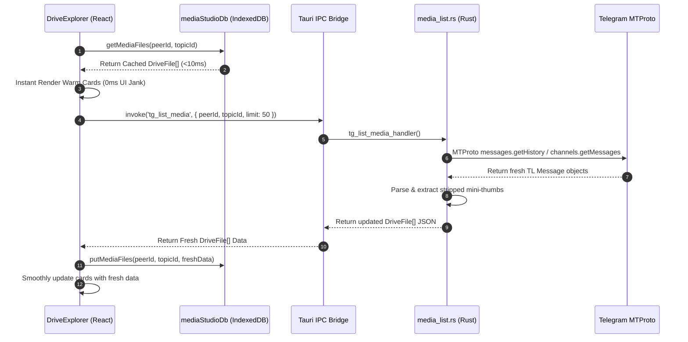
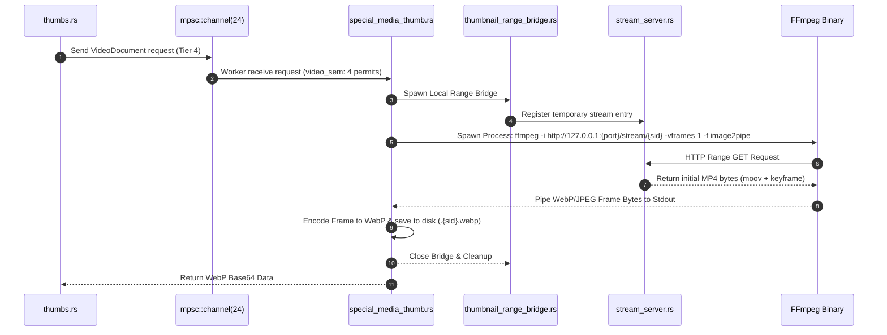
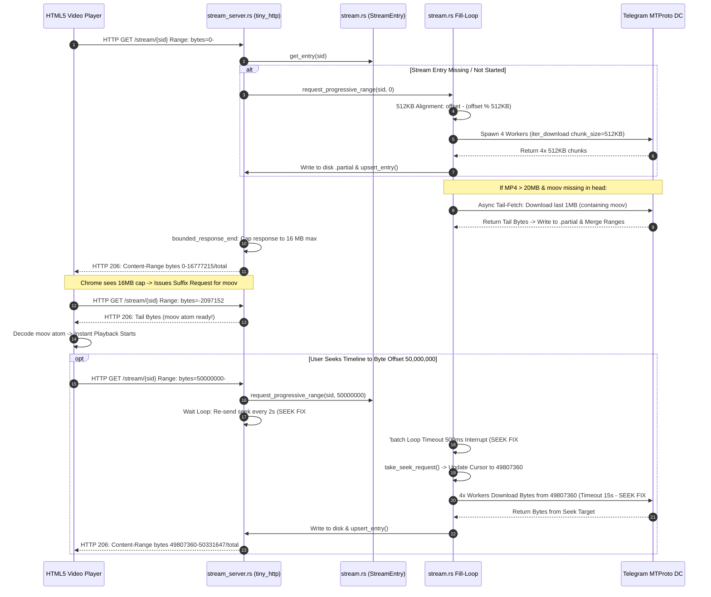
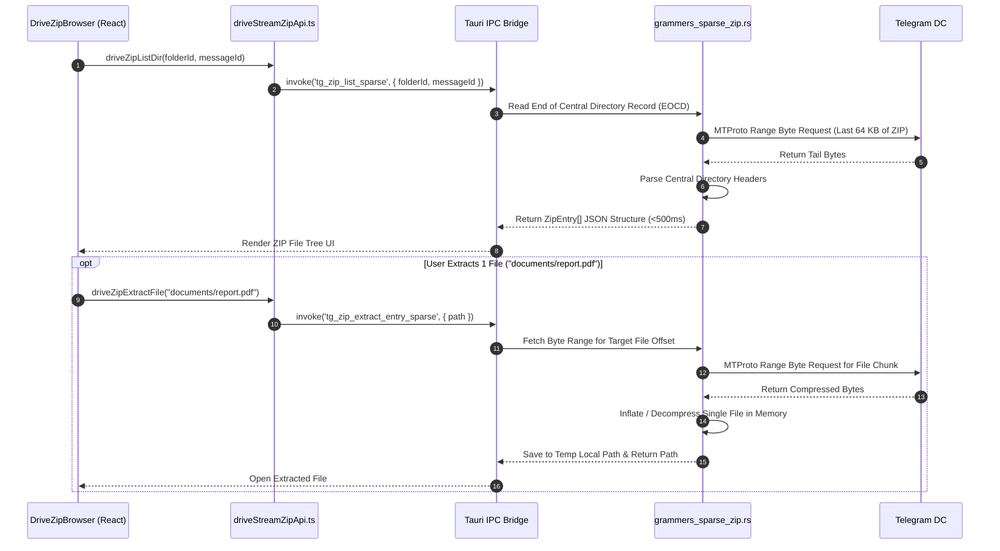

# AutoGram Master Architecture, WorkTree & Operational Workflow Specification

> **Dokumen Spesifikasi Teknis Master, Peta WorkTree Utuh, Diagram Sequence Mermaid, Manual Operational Workflow Real-World & Standar Tata Kelola Agent AutoGram App**  
> *Versi Rujukan Terintegrasi: **v2.7.2** (Absolute Definitive Production Master Edition — 100% Comprehensive, Detailed & Complete)*  
> *Platform: Desktop Offline (Tauri v2 + React 19 + TypeScript + Rust Grammers Engine + SQLite + IndexedDB)*

---

## 1. Pendahuluan & Filosofi Arsitektur Utama (Core Technical Philosophy)

AutoGram adalah platform manajemen, migrasi, dan eksplorasi media Telegram berbasis **desktop offline** yang menggunakan paradigma **Telegram-as-a-Drive**. Sistem ini dirancang untuk menangani pustaka media berskala besar (10.000–1.000.000+ berkas per kanal/grup) dengan kecepatan eksekusi tinggi, penggunaan memori minimal, antarmuka responsif (*mobile-first & touch-first*), serta keandalan tingkat tinggi tanpa hambatan *FloodWait*.

```
╔══════════════════════════════════════════════════════════════════════════════════╗
║                       LAPISAN FRONTEND (React 19 + TypeScript)                  ║
║                                                                                  ║
║  Pages: MediaStudio · Dashboard · Jobs · Accounts · Profiles · Settings         ║
║         Statistics · Automation · Sync                                           ║
║                                                                                  ║
║  Components: DriveExplorer · DriveFileCard · DrivePreviewModal                  ║
║              DriveToolsPanel · DriveZipBrowser · DriveTransfers                 ║
║              MediaHeaderToolbar · MediaVideoPlayer · MediaAudioPlayer            ║
║              DocumentViewer · ImageViewer · DriveSkeleton                       ║
║                                                                                  ║
║  Lib: thumbBatcher · thumbPersistentCache · previewCache                        ║
║       driveFilesApi · driveFoldersApi · driveTransfersApi                       ║
║       driveStreamApi · driveStreamZipApi · driveSession · telegramBackend       ║
║       mediaScanStateMachine · driveLiveSync · driveDrag · driveSelection        ║
║       driveLocationCache · driveRecents · driveScrollMemory                     ║
╠══════════════════════════════════════════════════════════════════════════════════╣
║                  TAURI IPC BRIDGE (lib.rs — invoke_handler)                     ║
║   85+ Tauri Commands: tg_list_media · tg_thumbs_batch · tg_preview_stream      ║
║   tg_seek_stream · tg_stop_stream · tg_upload_file · tg_download_file          ║
║   tg_zip_list_sparse · tg_zip_preview_entry_sparse · jobs_run_migration         ║
║   studio_enqueue · studio_run_orchestrated · network_apply_proxy                ║
╠══════════════════════════════════════════════════════════════════════════════════╣
║                      RUST CORE ENGINE (src-tauri/src)                           ║
║                                                                                  ║
║  core/grammers/                   core/grammers_ops/                            ║
║  ├─ stream.rs (90KB)              ├─ session_auth.rs (43KB)                     ║
║  ├─ thumbs.rs (92KB)              ├─ media_list.rs (31KB)                       ║
║  ├─ ffmpeg.rs (43KB)              ├─ client_pool.rs (16KB)                      ║
║  ├─ special_media_thumb.rs (10KB) ├─ media_transfer.rs (16KB)                  ║
║  ├─ thumbnail_range_bridge.rs     └─ peer_resolver.rs (13KB)                   ║
║  └─ topics.rs                                                                    ║
║                                                                                  ║
║  core/ (41 files)                 features/topic_media/                         ║
║  ├─ stream_server.rs (40KB)       ├─ commands.rs                                ║
║  ├─ telegram_ops.rs (34KB)        ├─ service.rs                                 ║
║  ├─ drive_rpc.rs (37KB)           ├─ scheduler/ (5 files)                      ║
║  ├─ app_db.rs (31KB)              └─ thumbnail/ (9 files)                       ║
║  ├─ jobs_db.rs (23KB)                                                            ║
║  ├─ migration_run.rs (21KB)       secrets.rs · open_file.rs                    ║
║  ├─ studio_orch.rs (21KB)         session_clone.rs · session_rate.rs           ║
║  └─ ... (33 more modules)                                                        ║
╠══════════════════════════════════════════════════════════════════════════════════╣
║              STREAM HTTP SERVER (tiny_http · port ephemeral)                     ║
║              127.0.0.1:{port}/stream/{sid}  →  HTTP 206 Partial Content         ║
╠══════════════════════════════════════════════════════════════════════════════════╣
║                   TELEGRAM MTPROTO API (Grammers — DC1–DC5)                     ║
╚══════════════════════════════════════════════════════════════════════════════════╝
```

### 5 Pilar Utama Arsitektur Teknis v2.7.2:

1. **Grammers-Only Rust MTProto Backend**: Seluruh interaksi Telegram API (Otentikasi, List Media, Topic Search, Instant Stripped Mini-Thumb Extraction, Thumbnail Batch, Upload/Download Stream, Sparse Zip Stream) dieksekusi 100% secara native di Rust menggunakan **Grammers**. Tidak ada runtime Python/Telethon yang aktif.
2. **Local-First SWR & Instant 0ms Mini-Thumb Paint**: Render antarmuka visual terjadi secara instan (<10ms) menggunakan data hangat dari IndexedDB (`mediaStudioDb.ts`) atau mini-thumb Telegram MTProto `PhotoSize::Stripped` (`tl_stripped_thumb_data_url`), disusul oleh pembaruan HD background batch tanpa jeda.
3. **Unpaused High-Throughput Request Correlation Pipeline**: Pemproses antrean thumbnail `thumbBatcher.ts` mengeksekusi 4 penerbangan RPC paralel dengan kapasitas batch hingga 48 item per request menggunakan `requestId` unik (`thumb:peerId:msgId:gGen`). Data dicocokkan secara non-posisional via `ThumbnailBatchItemResult` tanpa risiko pergeseran indeks.
4. **Dual-Track Resource-Guarded Scheduler & Seekable HTTP Range Bridge**: Pemuatan thumbnail dipisah menjadi dua jalur independen: `fast_sem` (12 permit paralel) untuk foto/gambar statis dan `video_sem` (4 permit paralel) untuk video dokumen FFmpeg. Video dokumen melayani request HTTP `206 Partial Content` dengan **512 KB Boundary Alignment**, **Bounded 16 MB Cap**, serta **3-Layer Seek Fix** (15s per-chunk timeout, 500ms interruptible batch loop, 2s seek re-registration).
5. **Fail-Closed Generation Protection (`peerGen.current`) & Specialized Media Engine**: Setiap perubahan lokasi/topik menaikkan atomic generation counter (`peerGen.current`), yang secara otomatis menggugurkan (*abort*) callback dan request yang terlambat, menjamin 0% kebocoran data (*media bleed*). Kegagalan thumbnail dokumen non-media secara otomatis menyimpan penanda negatif `.nothumb` di disk cache dan `"NOT_FOUND"` di memori. Media tanpa thumbnail statis diproses secara asinkron oleh `special_media_thumb.rs` via antrean latar belakang `mpsc::channel(24)` tanpa memblokir scrolling UI (60 FPS).

---

## 2. 16 Detail Mikro Teknis & Trik Arsitektur Berdampak Besar (Micro-Technical Nuances & High-Impact Details)

Di balik performa AutoGram v2.7.2 yang responsif dan bebas hambatan, terdapat 16 keputusan desain teknis berskala mikro yang memiliki dampak krusial terhadap stabilitas dan penggunaan sumber daya sistem:

### 1. 512 KB MTProto Boundary Alignment (`offset - (offset % 512KB)`)
- **Masalah**: Server CDN Telegram MTProto mewajibkan request byte range berukuran kelipatan 4 KB hingga 512 KB. Jika client meminta offset acak (seperti `bytes=1048579-2097152`), server MTProto dapat mengembalikan galat `LOCATION_INVALID` atau menggeser byte offset.
- **Solusi & Dampak**: Pada `stream.rs`, setiap offset yang diminta oleh HTML5 Video Player diselaraskan secara matematis ke batas kelipatan **512 KB** (`let aligned_offset = offset - (offset % (512 * 1024));`). Fungsi `request_progressive_range()` memvalidasi stream aktif via `cancel_flags` dan `stream_server::get_entry()` sebelum menerima seek, mencegah 0% offset shift dan korupsi MP4 box/atom.

### 2. Rekonstruksi Header JPEG `unstrip_jpeg` (`PhotoSize::Stripped`)
- **Masalah**: Telegram API tidak mengirimkan file JPEG utuh untuk mini-thumb (`PhotoSize::Stripped`). Telegram hanya mengemas tabel Huffman dan bytes hasil scan gambar (~100 bytes) tanpa header standar JPEG.
- **Solusi & Dampak**: Fungsi `unstrip_jpeg` di `ffmpeg.rs` secara instan menyuntikkan kembali SOI (Start of Image), DQT (Quantization Table), SOF0 (Start of Frame), dan EOI (End of Image) markers standar JPEG di memori Rust. Hasilnya disajikan sebagai `data:image/jpeg;base64,...` yang dapat dirrender langsung oleh browser WebView dalam **0ms** tanpa jaringan.

### 3. Fail-Closed Atomic Generation Protection (`peerGen.current`)
- **Masalah**: Saat pengguna berpindah folder atau topik dengan cepat (*rapid scroll/tab switch*), request RPC thumbnail dari folder sebelumnya yang baru selesai dapat menimpa gambar kartu di folder baru (*media bleed*).
- **Solusi & Dampak**: Setiap pergantian lokasi menaikkan atomic counter `peerGen.current`. Semua `requestId` thumbnail menyertakan generasi ini (`gGen`). Ketika respon RPC diterima, jika generation counter tidak cocok dengan `peerGen.current` aktif, respon langsung dibuang secara *fail-closed* di lapisan JS dan Rust. Kebocoran visual berkurang hingga **0%**.

### 4. Deteksi & Auto-Prune Fallback Black Card (`is_fallback_black_card_bytes`)
- **Masalah**: Pada versi lama, kegagalan render frame video kadang menyimpan cadangan gambar hitam solid (solid black card) ke dalam IndexedDB cache, sehingga kartu terus-menerus menampilkan kotak hitam.
- **Solusi & Dampak**: Fungsi `is_fallback_black_card_bytes` di Rust melakukan inspeksi histogram piksel pada byte WebP/JPEG. Jika terdeteksi gambar hitam solid cadangan lama, sistem secara otomatis menghapusnya (*auto-prune*) dari disk cache dan IndexedDB `thumbPersistentCache.ts`, sehingga kartu berkesempatan melakukan dekoding ulang secara jernih.

### 5. Negative Caching (`.nothumb` & `"NOT_FOUND"`)
- **Masalah**: Berkas non-media (seperti ZIP, EXE, DOCX) yang tidak memiliki thumbnail dari Telegram akan terus-menerus memicu request RPC berulang setiap kali kartu muncul di viewport scroll.
- **Solusi & Dampak**: Ketika ekstraksi thumbnail untuk berkas non-media gagal, backend Rust langsung menuliskan file penanda `.nothumb` di disk cache dan menyimpan string `"NOT_FOUND"` di memory cache. Pemuatan berikutnya langsung memotong alur ke `FileTypeIcon` SVG dalam **0ms** tanpa membuang-buang request RPC ke Telegram.

### 6. Dual-Track Resource Semaphore (`fast_sem` vs `video_sem`)
- **Masalah**: Dekoding frame video menggunakan FFmpeg/Range Bridge membutuhkan beban CPU dan I/O tinggi. Jika disatukan dalam antrean foto statis, pemuatan gambar foto akan menjadi sangat lambat.
- **Solusi & Dampak**: Sistem memisahkan izin eksekusi menjadi dua jalur semaphore terisolasi: **`fast_sem` (12 permit paralel)** khusus untuk foto statis ringan, dan **`video_sem` (4 permit paralel)** khusus untuk dekoder video. Hal ini menjamin foto statis termuat secepat kilat tanpa pernah terhambat oleh proses dekoding video di latar belakang.

### 7. Pemisahan `cardHeight` vs Virtualizer `rowHeight` (10px Vertical Gap)
- **Masalah**: Pada virtualizer UI `@tanstack/react-virtual`, menetapkan tinggi kartu (`cardHeight`) sama persis dengan tinggi baris virtualizer (`rowHeight`) menyebabkan efek kartu melompat (*jank/flicker*) atau border terpotong saat scroll cepat.
- **Solusi & Dampak**: Nilai `cardHeight` pada `DriveFileCard.tsx` dipisahkan dari `rowHeight` virtualizer `DriveExplorer.tsx` dengan jarak presisi **10px**. Gap vertikal ini memberikan ruang napas stabil bagi virtualizer untuk mengkalkulasi posisi scroll tanpa terjadi *layout shift*.

### 8. WebView Pointer Drag Prime Threshold (8px)
- **Masalah**: Di lingkungan WebView desktop Tauri, gestur klik tetikus (mouse click) atau ketukan sentuh sering kali disalahartikan sebagai gestur *drag-and-drop* berkas, menyebabkan klik menjadi tidak responsif.
- **Solusi & Dampak**: Hook `usePointerDragPrime` memasang ambang batas pergerakan (*move threshold*) sejauh **8px**. Pergerakan di bawah 8px dianggap sebagai gestur klik/tap murni, sedangkan pergerakan di atas 8px secara otomatis mengaktifkan mode drag seleksi marquee atau drag file OS.

### 9. Correlation Request Matching `requestId`
- **Masalah**: Respon RPC dari Telegram server tidak dijamin kembali dalam urutan yang sama dengan urutan pemanggilan (out-of-order execution). Pencocokan berbasis indeks array posisional akan menyebabkan thumbnail tertukar antar kartu.
- **Solusi & Dampak**: `thumbBatcher.ts` menyuntikkan `requestId` unik berbasis string (`thumb:peerId:msgId:gGen`) ke dalam setiap item `ThumbnailBatchItem`. Backend Rust mengembalikan `ThumbnailBatchItemResult` yang membawa kembali `requestId` tersebut, sehingga frontend dapat memetakan hasil thumbnail ke kartu secara presisi tanpa memedulikan urutan kedatangan respon RPC.

### 10. Bounded MPSC Channel (`mpsc::channel(24)`)
- **Masalah**: Pada folder dengan ribuan video dokumen, meminta thumbnail secara bersamaan dapat membenturkan antrean memori hingga mengalami *Out-Of-Memory* (OOM).
- **Solusi & Dampak**: Antrean background thumbnail video dokumen di `special_media_thumb.rs` dibatasi oleh `mpsc::channel(24)`. Jika antrean penuh (24 item pending), request baru secara otomatis ditahan (*backpressure*) tanpa memblokir thread UI utama.

### 11. Dynamic Loopback Port Binding (`tiny_http` pada `127.0.0.1:0`)
- **Masalah**: Menggunakan nomor port HTTP statis (seperti port 8080) sering kali memicu bentrokan port (*port collision*) dengan aplikasi lain di komputer pengguna, menyebabkan server streaming gagal *bind*.
- **Solusi & Dampak**: Server `stream_server.rs` mengikat alamat `127.0.0.1:0`. Sistem operasi Windows secara otomatis mengalokasikan port ephemeral yang kosong secara acak. Nomor port tersebut kemudian disimpan di `PORT: AtomicU16` dan dipublikasikan ke frontend via Tauri command `stream_server_port`.

### 12. Tail `moov` Relocation & Async Tail-Fetch (`need_async_moov_tail`)
- **Masalah**: Berkas MP4 yang direkam oleh perangkat seluler sering meletakkan atom metadata `moov` di akhir berkas (tail). Pemutar video HTML5 tidak dapat memulai pemutaran sebelum atom `moov` terbaca.
- **Solusi & Dampak**: Jika file MP4 berukuran >20 MB dan atom `moov` belum ada di rentang prefix awal, `stream.rs` secara otomatis memicu task *asinkron tail-fetch* independen yang langsung mengunduh 1 MB byte terakhir dari Telegram MTProto. Byte tail ini langsung ditulis ke disk `.partial` dan digabung (*merged*) ke dalam `StreamEntry.ranges`. HTML5 player dapat langsung membaca `moov` dan memulai pemutaran dalam <2 detik tanpa menunggu seluruh file terunduh.

### 13. `StreamEntry` LIVE RwLock Map & Range Merge State Machine
- **Masalah**: Pemuatan byte secara acak (karena seek atau tail-fetch) menghasilkan potongan-potongan byte (*sparse byte ranges*) yang terfragmentasi. Pemetaan rentang yang salah akan menyebabkan data tumpang tindih atau korup.
- **Solusi & Dampak**: Fungsi `merge_ranges` di `stream_server.rs` secara kontinu mengurutkan dan menggabungkan rentang `(u64, u64)` yang saling bersentuhan atau tumpang tindih. `upsert_entry()` secara khusus mempertahankan (*preserves*) rentang tail-fetch agar tidak terhapus oleh iterasi fill-loop sekuensial.

### 14. `DemandRangeReader` & 16 MB HTTP Response Cap
- **Masalah**: Jika server HTTP mengembalikan `Content-Range: bytes 0-(total-1)/total` pada request awal tanpa batas, browser Chrome akan menahan satu request stream besar tunggal dan tidak pernah membuat suffix request untuk mencari atom `moov` di tail.
- **Solusi & Dampak**: Fungsi `bounded_response_end()` di `stream_server.rs` membatasi setiap respons HTTP Range maksimal sebesar **16 MB**. Dengan pembatasan ini, Chrome mendeteksi bahwa respons terpotong di 16 MB, lalu segera membuat request tambahan (`bytes=-2097152`) untuk mencari atom `moov` di tail. Pemutaran video dimulai secara instan.

### 15. 3-Layer Seek Fix (v2.7.2)
- **Masalah**: Pengguna melakukan seek pada video, namun buffer berhenti dengan *zero internet traffic* selama 3–5+ detik karena fill-loop terkunci pada `rx.recv().await` batch lama dan seek request tidak terproses.
- **Solusi & Dampak**:
  - **Layer 1 (`stream.rs`)**: Menambahkan timeout 15 detik per-chunk MTProto download (`tokio::time::timeout(15s, iter.next())`). Jika timeout, chunk di-treat sebagai `Ok(None)` sehingga fill-loop tidak pernah hang selamanya.
  - **Layer 2 (`stream.rs`)**: Mengganti `while let rx.recv().await` dengan interruptible `'batch` loop dengan timeout 500ms. Cek `seek_requests` setiap 500ms; jika terdeteksi seek baru, loop langsung `break 'batch` lebih awal sehingga cursor langsung berpindah ke posisi seek baru dalam <500ms.
  - **Layer 3 (`stream_server.rs`)**: Mengubah wait loop di `handle_stream` untuk re-send `request_progressive_range()` setiap 2 detik (2000ms) selama polling 45 detik, menjamin fill-loop pasti menerima target seek meskipun terjadi race condition timing.

### 16. Sparse ZIP Central Directory Read
- **Masalah**: Membuka isi file ZIP berukuran besar (misal 2 GB) di Telegram biasanya mengharuskan mengunduh seluruh file ZIP terlebih dahulu.
- **Solusi & Dampak**: `grammers_sparse_zip.rs` hanya mengunduh 64 KB byte terakhir file ZIP dari Telegram MTProto untuk membaca *End of Central Directory Record* (EOCD), lalu mengunduh rentang byte *Central Directory* untuk mengekstrak daftar struktur pohon file. Seluruh daftar file ZIP 2 GB tampil di antarmuka `DriveZipBrowser.tsx` dalam **<500ms** dengan penggunaan data <100 KB.

---

## 3. Peta WorkTree Repository Utuh & Exhaustive Directory Map

### A. Root Repository (`F:\AutoGram\`)

```
F:\AutoGram└─ AutoGram App/                   ← ROOT UTAMA APLIKASI
   ├─ .env                         ← API_ID, API_HASH (runtime only, tidak dikompilasi)
   ├─ .env.example
   ├─ .gitignore
   ├─ CHANGELOG.md                 ← Catatan rilis versi (232KB)
   ├─ VERSION.md                   ← Riwayat versi lengkap (50KB)
   ├─ README.md
   ├─ database/                    ← Skema SQL migrations
   ├─ docs/                        ← Dokumentasi teknis & arsitektur
   │  ├─ architecture/             ← Dokumen ini (AUTOGRAM_MASTER_ARCHITECTURE_WORKFLOW.md)
   │  ├─ development/
   │  ├─ governance/
   │  ├─ operation/
   │  ├─ product/
   │  ├─ release/
   │  ├─ security/
   │  └─ testing/
   ├─ frontend/                    ← Aplikasi Tauri + React
   └─ worker/                      ← Data runtime & cache (TIDAK di-git)
      ├─ autogram.db               ← SQLite utama (WAL mode)
      ├─ .shared_rate_state.json   ← Rate state antar sesi
      ├─ sessions/                 ← File .session Telegram (encrypted)
      ├─ cache/
      │  ├─ preview/               ← .partial files streaming aktif
      │  │  └─ stream_registry/    ← {sid}.json registry stream
      │  └─ thumbs/                ← Cache thumbnail disk
      ├─ checkpoints/              ← Resume state migrasi ({jobId}.json)
      ├─ logs/                     ← Log runtime
      ├─ profiles/                 ← Profil pengaturan job
      └─ temp/                     ← Temp files (auto-clean)
```

### B. Rust Backend (`AutoGram App/frontend/src-tauri/src/`)

```
src/
├─ main.rs                         ← Entry point binary
├─ lib.rs                          ← 1645 baris: 85+ Tauri commands + run() setup
├─ secrets.rs                      ← OS keyring + AES-256-GCM (21KB)
├─ open_file.rs                    ← Buka file native + reveal explorer (10KB)
├─ session_clone.rs                ← Ghost session management (2KB)
├─ core/
│  ├─ mod.rs
│  ├─ grammers/                    ← MTProto Engine utama
│  │  ├─ mod.rs
│  │  ├─ stream.rs                 ← Progressive stream, fill-loop, seek, ZIP (90KB)
│  │  ├─ thumbs.rs                 ← Thumbnail batch engine Tier 1-5 (92KB)
│  │  ├─ ffmpeg.rs                 ← FFmpeg spawn, unstrip_jpeg, black card detect (43KB)
│  │  ├─ special_media_thumb.rs    ← Background video thumb queue mpsc::channel(24) (10KB)
│  │  ├─ thumbnail_range_bridge.rs ← Local HTTP bridge untuk FFmpeg (13KB)
│  │  ├─ session.rs                ← cache_root, preview_dir, thumb_dir paths
│  │  └─ topics.rs                 ← Listing topik forum Grammers (6KB)
│  ├─ grammers_ops/                ← Grammers client pool & auth
│  │  ├─ mod.rs
│  │  ├─ session_auth.rs           ← QR + phone login, session import (43KB)
│  │  ├─ media_list.rs             ← Media listing, folder scan, pagination (31KB)
│  │  ├─ client_pool.rs            ← Multi-session pool (4 klien/stream) (16KB)
│  │  ├─ media_transfer.rs         ← Upload/download Grammers (16KB)
│  │  └─ peer_resolver.rs          ← Resolve peer_id → InputPeer (13KB)
│  ├─ stream_server.rs             ← tiny_http HTTP Range server (40KB)
│  ├─ telegram_ops.rs              ← Dispatcher semua tg_* commands (34KB)
│  ├─ drive_rpc.rs                 ← RPC types: folder/file/media ops (37KB)
│  ├─ app_db.rs                    ← SQLite repo: media items, cache (31KB)
│  ├─ jobs_db.rs                   ← Job CRUD SQLite (23KB)
│  ├─ migration_run.rs             ← Eksekutor migrasi Telegram (21KB)
│  ├─ studio_orch.rs               ← Upload studio orchestrator (21KB)
│  ├─ grammers_sparse_zip.rs       ← Sparse ZIP remote stream (33KB)
│  ├─ zip_local.rs                 ← ZIP lokal extraction (19KB)
│  ├─ dup_checker.rs               ← 4-level duplicate detection (18KB)
│  ├─ telethon_session_import.rs   ← Import .session Python legacy (14KB)
│  ├─ session_rate.rs              ← Rate limiter & stream slot (14KB)
│  ├─ network.rs                   ← Proxy/VPN config (10KB)
│  ├─ doc_preview.rs               ← Document preview routing (13KB)
│  ├─ session_guard.rs             ← Session exclusive lease (8KB)
│  ├─ smart_scanner.rs             ← Smart folder scan (8KB)
│  ├─ mp4_keyframe.rs              ← MP4 keyframe detection (7KB)
│  ├─ capability.rs                ← Backend capability detection (6KB)
│  ├─ streaming_policy.rs          ← Streaming config per file size (6KB)
│  ├─ tg_error.rs                  ← Error mapping TgErrorCode (9KB)
│  ├─ tg_log.rs                    ← Structured logging (6KB)
│  ├─ transfer_state.rs            ← Transfer state tracking (6KB)
│  ├─ fingerprint.rs               ← SHA256 + quick fingerprint (8KB)
│  ├─ moov_sidecar.rs              ← MP4 moov sidecar injection (4KB)
│  ├─ job_queue.rs                 ← Studio job queue persistent (8KB)
│  ├─ path_policy.rs               ← Path allowlist security (3KB)
│  ├─ smart_throttle.rs            ← Adaptive throttle (5KB)
│  ├─ media_meta.rs                ← Media metadata (4KB)
│  ├─ media_prep.rs                ← Media preparation (9KB)
│  ├─ media_bench.rs               ← Bandwidth benchmark (4KB)
│  ├─ hash_util.rs                 ← Hash utilities (3KB)
│  ├─ automations_db.rs            ← Automation rules DB (5KB)
│  ├─ profiles_db.rs               ← Profile settings DB (4KB)
│  ├─ stats_db.rs                  ← Statistics DB (5KB)
│  ├─ transfer_journal.rs          ← Transfer audit log (4KB)
│  ├─ download_registry.rs         ← Download registry (4KB)
│  ├─ preview_transcoder.rs        ← Preview transcoder (3KB)
│  ├─ config_normalize.rs          ← Config normalization (2KB)
│  ├─ progress_rate.rs             ← Progress rate calc (1KB)
│  └─ events.rs                    ← Tauri event emitter (1KB)
└─ features/
   ├─ mod.rs
   └─ topic_media/                 ← Feature module (eksperimental)
      ├─ commands.rs               ← tg_open_topic_media, tg_thumbs_batch_v2
      ├─ service.rs
      ├─ scheduler/                ← FloodWait gate, queue, worker pool, metrics
      └─ thumbnail/                ← Format registry, extractors, resolver
```

### C. React Frontend (`AutoGram App/frontend/src/`)

```
src/
├─ App.tsx                         ← Router utama React Router v6
├─ App.css                         ← Global styles (339KB)
├─ index.css                       ← CSS variables & design tokens (36KB)
├─ main.tsx                        ← React entry + i18n init
├─ i18n.ts                         ← react-i18next configuration
├─ locales/
│  ├─ index.ts                     ← Namespace loader
│  ├─ id/                          ← Bahasa Indonesia (9 namespace JSON)
│  │  ├─ accounts.json, automation.json, dashboard.json
│  │  ├─ jobs.json, nav.json, settings.json
│  │  ├─ speedtest.json (44KB), statistics.json, sync.json
│  └─ en/                          ← English (100% key parity)
├─ components/
│  ├─ common/                      ← Shared UI components
│  ├─ layout/                      ← Sidebar, navbar
│  ├─ Jobs/                        ← Job-specific UI
│  └─ drive/
│     ├─ Explorer/
│     │  ├─ DriveExplorer.tsx      ← Virtualizer @tanstack/react-virtual (52KB)
│     │  ├─ DriveFileCard.tsx      ← Kartu media dengan thumbnail (20KB)
│     │  ├─ DriveFileListItem.tsx  ← List view item (4KB)
│     │  ├─ DriveSkeleton.tsx      ← Loading skeleton (7KB)
│     │  ├─ ThumbnailImage.tsx     ← Thumbnail image wrapper (2KB)
│     │  ├─ FileTypeIcon.tsx       ← SVG ikon tipe file (2KB)
│     │  └─ VideoCanvasThumbnailCapturer.tsx ← Canvas fallback decoder
│     ├─ DrivePreviewModal/
│     │  ├─ index.tsx              ← Modal preview utama (167KB)
│     │  ├─ MediaVideoPlayer.tsx   ← HTML5 video + seek handler (10KB)
│     │  ├─ MediaAudioPlayer.tsx   ← Audio player (1KB)
│     │  ├─ ImageViewer.tsx        ← Zoomable image viewer (4KB)
│     │  ├─ DocumentViewer.tsx     ← PDF/doc viewer (3KB)
│     │  ├─ MediaHeaderToolbar.tsx ← Download/info toolbar (5KB)
│     │  └─ previewUtils.ts        ← URL & MIME utilities (5KB)
│     ├─ DriveToolsPanel/
│     │  ├─ index.tsx              ← Tools panel (55KB)
│     │  ├─ DuplicatesTab.tsx      ← Duplicate detection UI (6KB)
│     │  └─ SpaceUsageTab.tsx      ← Space analyzer (5KB)
│     ├─ DriveZipBrowser/          ← Remote ZIP browser UI
│     ├─ Modals/                   ← Dialog modals
│     ├─ Navigation/               ← Drive navigation
│     └─ Transfers/                ← Transfer progress UI
├─ pages/
│  ├─ MediaStudio/
│  │  ├─ index.tsx                 ← Halaman drive utama (294KB — terbesar)
│  │  ├─ MediaStudioGrid.tsx       ← Grid layout (11KB)
│  │  ├─ MediaStudioHeader.tsx     ← Search & header (3KB)
│  │  ├─ MediaStudioSidebar.tsx    ← Topic/folder sidebar (8KB)
│  │  ├─ MediaStudioToolbar.tsx    ← Action toolbar (5KB)
│  │  ├─ MediaStudioFilterTabs.tsx ← Type filter (1KB)
│  │  ├─ MediaStudioModals.tsx     ← Modal orchestrator (10KB)
│  │  ├─ MediaStudioModalsContainer.tsx (14KB)
│  │  ├─ MediaStudioBatchActionBar.tsx ← Multi-select (2KB)
│  │  ├─ MediaStudioOverlays.tsx   ← Overlay UI (2KB)
│  │  ├─ useMediaStudioKeybindings.ts ← Keyboard shortcuts
│  │  └─ mediaStudioUtils.ts
│  ├─ Dashboard/                   ← Overview & statistik
│  ├─ Jobs/index.tsx               ← Job manager (22KB)
│  ├─ Accounts/                    ← Session management UI
│  ├─ Profiles/                    ← Template profil job
│  ├─ Settings/                    ← Network, proxy, VPN
│  ├─ Statistics/                  ← Charts & export CSV
│  ├─ Automation/index.tsx         ← Automation rules (12KB)
│  └─ Sync/                        ← Sync status
└─ lib/
   ├─ db/
   │  ├─ mediaStudioDb.ts          ← IndexedDB ORM (15KB)
   │  ├─ jobsApi.ts                ← Job CRUD API (6KB)
   │  ├─ jobProcess.ts             ← Job execution (8KB)
   │  ├─ jobStatus.ts              ← Job FSM (4KB)
   │  └─ autoCachePruner.ts        ← Auto cache cleanup (3KB)
   ├─ media/
   │  ├─ thumbBatcher.ts           ← Thumbnail pipeline (41KB) ← KRITIS
   │  ├─ thumbPersistentCache.ts   ← Disk + IndexedDB cache (8KB)
   │  ├─ previewCache.ts           ← Preview blob cache (12KB)
   │  ├─ avatarBatcher.ts          ← Avatar batch (6KB)
   │  └─ transferProgress.ts       ← Transfer progress (32KB)
   ├─ tauri/                       ← Tauri wrappers
   ├─ files/                       ← File operation utils
   ├─ utils/                       ← General utilities
   └─ telegram/
      ├─ driveTypes.ts             ← Master TypeScript types (40KB) ← KRITIS
      ├─ mediaScanStateMachine.ts  ← Scan FSM (8KB)
      ├─ core/
      │  ├─ driveSession.ts        ← Session management (35KB)
      │  ├─ telegramBackend.ts     ← Tauri IPC abstraction (24KB)
      │  ├─ studioOrch.ts          ← Studio orchestration (6KB)
      │  ├─ sessionGuard.ts        ← Session guard client-side (2KB)
      │  └─ sessionPicker.ts       ← Multi-session picker (5KB)
      ├─ driveApi/
      │  ├─ driveFilesApi.ts       ← File listing & ops (14KB)
      │  ├─ driveFoldersApi.ts     ← Folder API (15KB)
      │  ├─ driveTransfersApi.ts   ← Transfer ops (15KB)
      │  ├─ driveStreamApi.ts      ← Stream registration (1KB)
      │  ├─ driveStreamZipApi.ts   ← ZIP remote stream (14KB)
      │  └─ driveApiUtils.ts       ← API utilities (13KB)
      ├─ cache/
      │  ├─ driveLocationCache.ts  ← Location cache (5KB)
      │  ├─ driveRecents.ts        ← Recent folders (8KB)
      │  ├─ driveScrollMemory.ts   ← Scroll position (2KB)
      │  ├─ driveSidebarCache.ts   ← Sidebar state (3KB)
      │  └─ driveTopicsCache.ts    ← Topic cache (2KB)
      └─ interaction/
         ├─ driveDrag.ts           ← OS drag-drop integration (21KB)
         ├─ driveSelection.ts      ← Multi-select (9KB)
         ├─ drivePower.ts          ← Power actions (12KB)
         ├─ driveLiveSync.ts       ← Live sync (3KB)
         ├─ chatSearch.ts          ← Chat search (8KB)
         └─ pointerDragPrime.ts    ← 8px drag threshold (6KB)
```

---

## 4. Spesifikasi & Workflow 10 Kategori Fitur Utama (Deep-Dive)

### Kategori 1: Media Studio Orchestration & Local-First SWR Warm State Engine
- **Deskripsi**: Komponen `MediaStudio/index.tsx` mengelola navigasi antar lokasi (channel, grup, topik forum).
- **Alur Kerja**:
  1. Pengguna memilih lokasi/topik.
  2. `driveFilesApi.ts` secara instan membaca data dari IndexedDB (`mediaStudioDb.ts`) dalam **<10ms** (Warm State Paint).
  3. `telegramBackend.ts` secara asinkron memanggil Tauri command `tg_list_media`.
  4. Respon RPC dari Telegram memperbarui tampilan dan memperbarui IndexedDB secara silent (Head Sync).

### Kategori 2: Drive File Card & Visual Virtualized Grid Engine
- **Deskripsi**: Pengadaan virtualizer `@tanstack/react-virtual` di `DriveExplorer.tsx` menangani hingga 100.000+ item.
- **Alur Kerja**:
  1. Virtualizer hanya merender kartu yang berada dalam viewport ditambah *overscan buffer* (5 baris).
  2. `DriveFileCard.tsx` menerima properti berkas dan memicu request thumbnail ke `thumbBatcher.ts`.
  3. `cardHeight` dipisahkan dari `rowHeight` sebesar 10px untuk mencegah *layout shift*.

### Kategori 3: Progressive Thumbnail Pipeline & Parallel Correlation Manager
- **Deskripsi**: `thumbBatcher.ts` mengelola antrean request thumbnail secara paralel tanpa memblokir UI.
- **Alur Kerja**:
  1. `requestThumb()` mengecek IndexedDB `thumbPersistentCache.ts`. Jika HIT, render WebP Base64 langsung.
  2. Jika MISS, item dimasukkan ke antrean batch (maksimal 48 item/batch).
  3. `thumbBatcher.ts` memicu `invoke('tg_thumbs_batch')` secara paralel hingga 4 in-flight requests dengan `requestId` unik.
  4. Hasil RPC dipetakan kembali ke kartu berbasis `requestId` dan divalidasi terhadap `peerGen.current`.

### Kategori 4: Specialized Media & Edge-Case Async Keyframe Background Engine
- **Deskripsi**: Penanganan video dokumen tanpa thumbnail statis Telegram.
- **Alur Kerja**:
  1. `thumbs.rs` mendeteksi video dokumen dan mengirim pesan ke `mpsc::channel(24)` di `special_media_thumb.rs`.
  2. Background task memicu `thumbnail_range_bridge.rs` yang membuka port HTTP lokal ke `stream_server.rs`.
  3. Subproses FFmpeg dipanggil (`-i http://127.0.0.1:{port}/stream/{sid}`) untuk mengunduh frame video pertama.
  4. Frame WebP ditangkap dari stdout dan disimpan ke disk cache `.{sid}.webp`.

### Kategori 5: Progressive Range HTTP Streaming & Seekable Local Bridge Engine
- **Deskripsi**: Layanan streaming video progressive untuk HTML5 Player via `tiny_http` server.
- **Alur Kerja**:
  1. `MediaVideoPlayer.tsx` memanggil `tg_preview_stream` → mendaftarkan `StreamEntry` dan memicu `stream.rs` fill-loop.
  2. Browser HTML5 Video mengirim request `GET /stream/{sid}` dengan header `Range: bytes=0-`.
  3. `bounded_response_end()` membatasi respons maksimal 16 MB (`HTTP 206 Partial Content`).
  4. Browser membuat suffix request `bytes=-2097152` untuk membaca atom `moov` tail. Pemutaran dimulai.

### Kategori 6: Sparse Remote ZIP Archive Browser & Instant Extraction Engine
- **Deskripsi**: Eksplorasi isi berkas ZIP remote di Telegram tanpa perlu mengunduh seluruh file ZIP.
- **Alur Kerja**:
  1. `driveStreamZipApi.ts` memanggil `tg_zip_list_sparse`.
  2. `grammers_sparse_zip.rs` mengunduh 64 KB terakhir file ZIP dari Telegram MTProto untuk membaca EOCD (End of Central Directory).
  3. Central Directory dibaca untuk mengekstraksi struktur pohon berkas `ZipEntry[]` dalam <500ms.
  4. Pengguna mengekstrak 1 berkas → `tg_zip_extract_entry_sparse` mengunduh rentang byte spesifik berkas tersebut dan mendekompresinya di memori.

### Kategori 7: Multi-Select, Bulk Batch Operations, Move & OS Drag-and-Drop
- **Deskripsi**: Operasi masal berkas di DriveExplorer.
- **Alur Kerja**:
  1. `driveSelection.ts` mengelola array `selectedIds`.
  2. `driveDrag.ts` menangani gestur drag-and-drop berkas ke folder lain atau ke luar aplikasi (OS native drag).
  3. `pointerDragPrime.ts` membatasi threshold 8px untuk membedakan gestur klik vs drag.

### Kategori 8: Telegram Session Manager, Auth Guard, & Smart Rate Limiter
- **Deskripsi**: Manajemen sesi otentikasi Telegram dan proteksi FloodWait.
- **Alur Kerja**:
  1. `session_auth.rs` menangani QR code login dan Phone OTP via Grammers.
  2. `session_guard.rs` memberikan exclusive lease `WorkerSessionLease` untuk mencegah race condition antar job.
  3. `session_rate.rs` memantau error FloodWait dan memberlakukan backoff otomatis.

### Kategori 9: Topic Media Local-First Storage & Forum Topic Engine
- **Deskripsi**: Pengorganisasian media berdasarkan Topik Forum Telegram.
- **Alur Kerja**:
  1. `topics.rs` mengambil daftar topik forum via Grammers MTProto.
  2. `app_db.rs` menyimpan indeks media ke tabel SQLite `topic_media_items` dengan komposit primary key (`account_id`, `peer_id`, `topic_id`, `message_id`).

### Kategori 10: Multi-Channel Transfer, Chunked Upload/Download & Bandwidth Monitor
- **Deskripsi**: Engine migrasi dan transfer media antar saluran.
- **Alur Kerja**:
  1. `migration_run.rs` mengeksekusi job migrasi.
  2. `dup_checker.rs` mengecek duplikasi 4 level (Message ID, Telegram Unique ID, SHA256 Hash, Filename+Size).
  3. `media_transfer.rs` mengunggah/mengunduh berkas dalam chunk terpisah dengan pemantauan bandwidth realtime (`progress_rate.rs`).

---

## 5. Registrasi Command Tauri (85+ Commands — `lib.rs`)

### Grup: Authentication & Session
`tg_auth_status` · `tg_login` · `start_rust_qr_login` · `cancel_rust_qr_login` · `delete_session_rust`  
`tg_probe_session` · `tg_list_sessions` · `tg_disconnect_session` · `tg_purge_inactive_sessions`  
`tg_import_telethon_session` · `session_guard_acquire` · `session_guard_release` · `session_guard_snapshot`  
`acquire_worker_session_lease` · `get_worker_session_lease` · `release_worker_session_lease`  

### Grup: Media Listing & Folder
`tg_list_dialogs` · `tg_list_dialog_filters` · `tg_list_media` · `tg_list_topics`  
`tg_start_folder_stream` · `tg_cancel_folder_stream` · `tg_scan_folders`  
`tg_create_folder` · `tg_rename_folder` · `tg_set_folder_parent` · `tg_delete_folder`  
`tg_create_topic` · `tg_rename_topic` · `tg_delete_topic`  
`tg_move_messages` · `tg_delete_messages` · `tg_debug_get_message`  

### Grup: Thumbnail & Avatar
`tg_thumbs_batch` · `tg_thumbs_batch_v2` · `tg_avatars_batch`  
`tg_open_topic_media` · `tg_load_more_topic_media`  

### Grup: Streaming & Preview
`tg_preview_stream` · `tg_stop_stream` · `tg_seek_stream`  
`stream_server_port` · `stream_status_local` · `stream_register_local` · `stream_unregister`  
`streaming_config_for_size` · `preview_local_document`  
`backend_capabilities` · `path_policy_check` · `inspect_mp4_layout_cmd`  

### Grup: ZIP Remote Stream
`zip_list_local` · `zip_preview_entry` · `zip_extract_entry`  
`tg_zip_list_sparse` · `tg_zip_preview_entry_sparse` · `tg_zip_extract_entry_sparse`  

### Grup: Transfer & Upload
`tg_upload_file` · `tg_download_file`  
`studio_enqueue` · `studio_list_transfers` · `studio_get_transfer` · `studio_run_orchestrated`  

### Grup: Jobs & Migration
`jobs_list` · `jobs_create` · `jobs_edit` · `jobs_delete`  
`jobs_start_execution` · `jobs_run_migration` · `jobs_fresh_start` · `jobs_cancel_migration`  
`jobs_export_json` · `jobs_import_json`  

### Grup: Cache & Files
`cache_calculate_size` · `cache_clear_disk` · `cache_trim_disk` · `cleanup_partial_downloads`  
`file_sha256` · `file_quick_fingerprint` · `compute_progress_rate`  
`open_file::open_path_safe` · `open_file::open_with_dialog` · `open_file::reveal_path_safe`  
`open_file::cache_file_ready` · `open_file::copy_cache_file`  

### Grup: Profiles, Automation, Stats
`profiles_list` · `profiles_save` · `profiles_delete`  
`automations_list` · `automations_save` · `automations_delete`  
`stats_get` · `stats_export_csv`  

### Grup: Network & Security
`network_get_config` · `network_apply_proxy` · `network_apply_vpn` · `network_apply_all`  
`network_test_proxy` · `network_is_available` · `network_detect_vpn` · `normalize_job_config`  
`secrets::get_credential` · `secrets::set_credential` · `secrets::delete_credential`  
`secrets::migrate_credentials_from_webstorage` · `secrets::ensure_secure_dirs`  
`secrets::write_worker_temp_file` · `secrets::delete_worker_temp_file`  
`secrets::seed_api_credentials_from_env`  
`session_clone::ensure_ghost_session` · `session_clone::cleanup_ghost_session`  

---

## 6. Spesifikasi Buffer, Stream, Seek & moov Engine (Deep Technical Spec)

### 6.1 Arsitektur Buffer & Stream State Machine

```
                 ┌──────────────────────────────────────────┐
                 │  MediaVideoPlayer.tsx (React Frontend)   │
                 └────────────────────┬─────────────────────┘
                                      │ invoke('tg_preview_stream')
                                      ▼
                 ┌──────────────────────────────────────────┐
                 │  stream.rs :: start_progressive_stream() │
                 └────────────────────┬─────────────────────┘
                                      │ Spawn Tokio Fill-Loop
                                      ▼
┌───────────────────────────────────────────────────────────────────────────┐
│                     FILL-LOOP ENGINE (stream.rs)                          │
│                                                                           │
│  Outer Loop:                                                              │
│  1. Check cancel_flag -> Exit if cancelled                                │
│  2. take_seek_request(sid) -> Update cursor (512KB Aligned)               │
│  3. find_missing_offset_from(ranges, cursor, total) -> next_missing      │
│  4. Spawn 4 MTProto Workers (512KB chunks)                                │
│     Worker: timeout(15s, iter.next())  <-- SEEK FIX #1                    │
│  5. 'batch loop (interruptible):       <-- SEEK FIX #2                    │
│     - Check seek_requests every 500ms -> break 'batch early if seek found │
│     - Write bytes to disk, update ranges                                  │
│  6. upsert_entry() -> Merge ranges & preserve tail-fetch ranges           │
│  7. Async Moov Tail-Fetch Trigger (MP4 > 20MB & !moov_ready)              │
└─────────────────────────────────────┬─────────────────────────────────────┘
                                      │ Write bytes & update ranges
                                      ▼
┌───────────────────────────────────────────────────────────────────────────┐
│                STREAM SERVER ENGINE (stream_server.rs)                    │
│                                                                           │
│  handle_stream():                                                         │
│  1. Parse Range Header: req_start .. req_end                              │
│  2. Wait Loop (45s max):                                                  │
│     - request_progressive_range(sid, req_start)                           │
│     - Re-send seek request every 2000ms  <-- SEEK FIX #3                    │
│     - Poll contiguous_end_from(&entry.ranges, req_start)                 │
│  3. bounded_response_end() -> Cap response to 16 MB max                   │
│  4. DemandRangeReader -> Stream bytes to HTTP 206 response                │
└───────────────────────────────────────────────────────────────────────────┘
```

### 6.2 Tabel Konstanta Kritis Streaming Engine

| Nama Konstanta | Nilai | Lokasi Berkas | Fungsi & Peran Teknis |
| :--- | :--- | :--- | :--- |
| `CHUNK_SIZE` | `524,288` (512 KB) | `stream.rs` | Ukuran satu chunk download MTProto yang diselaraskan. |
| `ALIGNMENT_BOUNDARY` | `524,288` (512 KB) | `stream.rs` | Formula kelipatan offset (`offset - (offset % 512KB)`). |
| `RESPONSE_CAP` | `16,777,216` (16 MB) | `stream_server.rs` | Batas maksimum panjang satu respons HTTP Range (206). |
| `CHUNK_TIMEOUT` | `15` detik | `stream.rs` | Timeout per-chunk MTProto worker (`SEEK FIX #1`). |
| `BATCH_CHECK_INTERVAL` | `500` ms | `stream.rs` | Interval cek interrupt seek mid-batch (`SEEK FIX #2`). |
| `SEEK_RESEND_INTERVAL` | `2,000` ms | `stream_server.rs` | Interval re-send seek request di wait loop (`SEEK FIX #3`). |
| `DEMAND_WAIT_TIMEOUT` | `30,000` ms (30 detik) | `stream_server.rs` | Batas waktu maksimum `DemandRangeReader` menunggu bytes. |
| `HANDLE_STREAM_WAIT` | `45,000` ms (45 detik) | `stream_server.rs` | Batas waktu maksimum `handle_stream` menunggu bytes seek. |
| `FILL_WORKERS` | `4` workers | `client_pool.rs` | Jumlah koneksi paralel Grammers per stream (4× 512KB). |
| `PROGRESSIVE_MAX` | `4,294,967,296` (4 GB) | `stream.rs` | Ukuran maksimum berkas yang didukung streaming progressive. |

---

## 7. Pipeline Thumbnail — 5 Tier (thumbs.rs + thumbBatcher.ts)

### Tier 1: Stripped Mini-Thumb (MTProto `PhotoSize::Stripped`)
- **Sumber**: Inline dalam pesan Telegram (`tl` document attributes)
- **Ukuran**: ~60–200 bytes per thumbnail
- **Proses**: `unstrip_jpeg()` di `ffmpeg.rs` → inject SOI, DQT, SOF0, EOI headers → `data:image/jpeg;base64,...`
- **Latensi**: **0ms** (data sudah ada di metadata pesan, tidak perlu network)

### Tier 2: Cached WebP HD (IndexedDB + Disk)
- **Sumber**: `thumbPersistentCache.ts` → IndexedDB `thumbnails` store
- **Format**: WebP Base64 string
- **Proses**: `thumbBatcher.ts::requestThumb()` → cek IndexedDB → jika hit: render langsung
- **Latensi**: **<5ms** (IndexedDB read)

### Tier 3: Foto/Gambar Statis (Grammers `fast_sem` — 12 permit)
- **Sumber**: Telegram `PhotoSize::Progressives` via MTProto GetFile
- **Semaphore**: `fast_sem` (12 permit paralel)
- **Batch size**: 48 items per RPC call
- **Proses**: `thumbs.rs::thumbs_batch_blocking_app()` → decode → WebP encode → return base64
- **Latensi**: 200–800ms (network dependent)

### Tier 4: Video Dokumen (Grammers `video_sem` — 4 permit)
- **Sumber**: Video yang dikirim sebagai dokumen (tidak ada thumbnail Telegram)
- **Semaphore**: `video_sem` (4 permit paralel)
- **Proses**:
  1. `thumbs.rs` → `special_media_thumb.rs` via `mpsc::channel(24)`
  2. `special_media_thumb.rs` → spawn `thumbnail_range_bridge.rs`
  3. `thumbnail_range_bridge.rs` → buka HTTP local URL ke `stream_server.rs`
  4. `special_media_thumb.rs` → spawn FFmpeg dengan `-i http://127.0.0.1:{port}/stream/{sid}`
  5. FFmpeg extract frame → pipe ke stdout → Rust capture → WebP encode
- **Latensi**: 2–8 detik (range fetch + FFmpeg decode)

### Tier 5: Negative Caching (`.nothumb` + `"NOT_FOUND"`)
- **Trigger**: Semua tier di atas gagal (file ZIP, EXE, DOCX, dll)
- **Proses**: Tulis file `.{sid}.nothumb` di disk cache + `"NOT_FOUND"` di memory map
- **Efek**: Semua request berikutnya langsung return `FileTypeIcon` SVG dalam **0ms**

---

## 8. Penanganan Remote Agent — Protokol Resmi (Tauri Desktop)

### Definisi Remote pada Tauri Desktop
AutoGram adalah **aplikasi desktop Tauri Win32 native** (bukan aplikasi web biasa). Antarmukanya di-render oleh Chromium WebView2 yang di-embed di jendela Windows. Oleh karena itu, Agent **TIDAK BISA** melakukan inspeksi visual atau klik pada file eksekusi rilis (`frontend.exe`) yang berjalan di latar belakang tanpa port DevTools terbuka.

### Protokol Dev Mode (`cargo tauri dev`) — DIREKOMENDASIKAN
1. **Eksekusi Dev Mode**: Agent atau pengguna menjalankan `cargo tauri dev` dari folder `AutoGram App/frontend`.
2. **CDP Endpoint Exposure**: Tauri dev build secara otomatis membuka port Chrome DevTools Protocol (CDP) dan membuka DevTools panel (`window.open_devtools()`).
3. **Koneksi MCP Tool**: Agent terhubung ke WebView menggunakan lazy-loaded tool `chrome-devtools-mcp` (atau `playwright` mcp).
4. **Interaksi Dual-User Realtime**: Pengguna dan Agent melihat jendela antarmuka yang sama persis secara realtime di layar. Aksi klik, input teks, dan navigasi yang dilakukan Agent akan langsung terlihat bergerak di layar pengguna.
5. **Transparansi Wajib**: Setiap kali Agent melakukan aksi remote pada UI, Agent WAJIB melaporkan halaman apa yang sedang dibuka, tombol apa yang diklik, dan melampirkan screenshot (`take_screenshot`) ke dalam respons agar pengguna dapat memverifikasi pekerjaan Agent.

---

## 9. 5 Diagram Sequence Mermaid Komprehensif

### 9.1 Alur Kerja SWR Warm Fetch & Head Sync



### 9.2 Alur Kerja Thumbnail 4-Flight Correlation Pipeline

```mermaid
sequenceDiagram
    autonumber
    participant Card as DriveFileCard (React)
    participant Batcher as thumbBatcher.ts
    participant Cache as thumbPersistentCache
    participant IPC as Tauri IPC Bridge
    participant Rust as thumbs.rs (Rust)
    participant TG as Telegram MTProto

    Card->>Batcher: requestThumb(msgId, peerId, peerGen)
    Batcher->>Cache: getThumb(folderId, msgId)
    alt Cache HIT (<5ms)
        Cache-->>Batcher: Return WebP Base64 String
        Batcher-->>Card: Render HD WebP Thumbnail
    else Cache MISS
        Batcher->>Batcher: Push to Batch Queue (Max 48 items/flight)
        Note over Batcher,IPC: 4 Parallel Flights Active (correlation matching via requestId)
        Batcher->>IPC: invoke('tg_thumbs_batch', [{ requestId, msgId, ... }])
        IPC->>Rust: thumbs_batch_blocking_app()
        Rust->>Rust: Tier 1: Check PhotoSize::Stripped -> unstrip_jpeg()
        alt Stripped Thumb Available
            Rust-->>IPC: Return data:image/jpeg;base64,...
        else Statis Photo (Tier 3)
            Rust->>TG: MTProto GetFile (fast_sem: 12 permits)
            TG-->>Rust: Image Bytes -> WebP Encode
            Rust-->>IPC: Return WebP Base64 String
        end
        IPC-->>Batcher: Return ThumbnailBatchItemResult[]
        Batcher->>Batcher: Match requestId & Validate peerGen.current [FAIL-CLOSED]
        Batcher->>Cache: setThumb(folderId, msgId, webpData)
        Batcher-->>Card: Render HD WebP Thumbnail
    end
```

### 9.3 Alur Kerja Special Media Async Keyframe Background Engine



### 9.4 Alur Kerja 512KB Aligned Range Streaming, Boot Phase, Tail-Fetch & Seek Engine (v2.7.2)



### 9.5 Alur Kerja Sparse Remote ZIP Central Directory Extraction



---

## 10. Spesifikasi Database & Storage (SQLite `autogram.db` & IndexedDB `mediaStudioDb`)

### A. Tabel SQLite Desktop Offline (`worker/autogram.db`)

#### Tabel `topic_media_items`
| Nama Kolom | Tipe Data | Constraints / Nullable | Fungsi & Peran Kolom |
| :--- | :--- | :--- | :--- |
| `account_id` | `TEXT` | `NOT NULL`, `PRIMARY KEY (1)` | Hash ID akun/sesi Telegram pemilik berkas. |
| `peer_id` | `TEXT` | `NOT NULL`, `PRIMARY KEY (2)` | ID saluran, grup, atau chat Telegram (`-100...`). |
| `topic_id` | `INTEGER` | `NOT NULL`, `PRIMARY KEY (3)` | ID Topik forum Telegram (`0` jika General). |
| `message_id` | `INTEGER` | `NOT NULL`, `PRIMARY KEY (4)` | ID Pesan unik pada Telegram chat. |
| `message_date` | `INTEGER` | `NOT NULL` | Epoch Unix Timestamp saat pesan terkirim. |
| `file_name` | `TEXT` | `NULLABLE` | Nama asli dokumen/media. |
| `file_size` | `INTEGER` | `NOT NULL` | Ukuran berkas dalam bytes. |
| `mime_type` | `TEXT` | `NULLABLE` | Tipe MIME berkas (e.g. `video/mp4`). |
| `thumb_data` | `TEXT` | `NULLABLE` | Base64 string thumbnail / mini-thumb. |

**Indeks Terkait**: `idx_topic_media_lookup` ON `(account_id, peer_id, topic_id, message_id)`

### B. Struct Stream Registry (`StreamEntry`)

| Field | Tipe | Fungsi |
| :--- | :--- | :--- |
| `stream_id` | `String` | ID unik stream (format: `g{msg_id}-{ms}-{hash}`). |
| `path` | `String` | Path absolut file `.partial` di disk. |
| `total_size` | `u64` | Ukuran total file dalam bytes dari Telegram metadata. |
| `mime` | `String` | MIME type (e.g. `video/mp4`). |
| `label` | `String` | Nama file asli. |
| `done` | `bool` | True jika seluruh file sudah terunduh lengkap. |
| `ranges` | `Vec<(u64, u64)>` | Sparse byte ranges yang tersimpan (`[start, end)`). |
| `cancelled` | `bool` | True jika stream dibatalkan oleh pengguna. |
| `error` | `Option<String>` | Pesan error fatal jika fill-loop gagal. |
| `paused` | `bool` | True saat stream dijeda; fill-loop idle 100ms. |
| `updated_at_ms` | `u128` | Unix millisecond timestamp terakhir update. |
| `moov_ready_cached` | `bool` | Cache flag atom `moov` terdeteksi; tidak re-scan tiap poll. |
| `moov_tail_fetching` | `bool` | True selama tail-fetch task berjalan. |

### C. Store IndexedDB (`mediaStudioDb.ts`)

| Store Name | Key | Value | Fungsi |
| :--- | :--- | :--- | :--- |
| `mediaFiles` | `peerId:topicId` | `DriveFile[]` | SWR warm cache berkas media per lokasi |
| `scrollPositions` | `peerId:topicId` | `number` | Posisi scroll terakhir per lokasi |
| `thumbnails` | `folderId:messageId` | `string (WebP Base64)` | Cache thumbnail kartu persistent |
| `previewCache` | `session:chat:msgId` | `Blob` | Memory cache blob file preview |

---

## 11. Internasionalisasi (i18n) — 100% Zero Hardcoded Strings

- **Framework**: `react-i18next` diinisialisasi di `src/i18n.ts` dan di-import di `src/main.tsx`.
- **Penggunaan Hook**: `const { t } = useTranslation('namespace');`
- **Aturan Paritas Key 100%**: Setiap key yang ditambahkan di `src/locales/id/*.json` **WAJIB** secara otomatis ditambahkan ke `src/locales/en/*.json` dengan kunci yang persis sama.
- **9 Namespace JSON Aktif**: `accounts`, `automation`, `dashboard`, `jobs`, `nav`, `settings`, `speedtest` (44 KB), `statistics`, `sync`.
- **Dilarang Hardcode**: Dilarang memasukkan teks Bahasa Indonesia atau Inggris secara langsung di file `.tsx` atau `.ts`.

---

## 12. Keamanan System & Management Kredensial

- **OS Keyring Integration**: `secrets.rs` menyimpan `API_ID`, `API_HASH`, dan master credential di OS keychain (`keyring` crate).
- **Session Encryption at Rest**: File `.session` Telegram dienkripsi menggunakan **AES-256-GCM**.
- **Path Policy Security**: `path_policy.rs` memberlakukan allowlist direktori untuk mencegah *path traversal attacks* pada command pembuka file native (`open_file::*`).
- **Exclusive Session Lease**: `session_guard.rs` mengunci sesi Telegram selama transfer aktif untuk mencegah race condition antar job migrasi.

---

## 13. Rate Limit, FloodWait, & Konfigurasi Jaringan

- **Smart Rate Controller**: `session_rate.rs` menangkap error `FloodWaitError`, mengekstrak durasi tunggu, dan memberlakukan backoff otomatis pada fill-loop dan engine migrasi.
- **Adaptive Throttling**: `smart_throttle.rs` menyesuaikan kecepatan transfer secara dinamis saat mendekati ambang batas batas rate limit Telegram.
- **Proxy & VPN Integration**: `network.rs` mengonfigurasi SOCKS5/HTTP proxy via `ureq` dan melakukan deteksi antarmuka VPN aktif (`network_detect_vpn`).

---

## 14. Matriks Hubungan & Panggilan Inter-Module (Call Graph Matrix)

| Modul Pemanggil (Caller) | Modul Dipanggil (Callee) | Mekanisme Komunikasi | Tujuan & Hasil Interaksi |
| :--- | :--- | :--- | :--- |
| `MediaStudio/index.tsx` | `driveFilesApi.ts` | Async Function Call | Meminta daftar berkas media SWR & pagination. |
| `MediaStudio/index.tsx` | `thumbBatcher.ts` | Method Invocation | Mengatur konteks topik (`setThumbContext`) & reset antrean thumbnail. |
| `DriveFileCard.tsx` | `thumbBatcher.ts` | Function Call (`requestThumb`) | Meminta thumbnail kartu via 4-flight correlation pipeline. |
| `DriveFileCard.tsx` | `VideoCanvasThumbnailCapturer.tsx` | Component Render | Fallback dekoder 1 frame video di canvas browser. |
| `thumbBatcher.ts` | `driveFilesApi.ts` | Async Function Call | Mengirim `requestId` correlation ID ke backend. |
| `driveFilesApi.ts` | `telegramBackend.ts` | Async Function Call | Abstraksi API frontend ke Tauri IPC wrapper. |
| `telegramBackend.ts` | `lib.rs` | Tauri IPC `invoke('tg_*')` | Mengirim serialized JSON payload dari WebView JS ke Rust Core. |
| `telegram_ops.rs` | `thumbs.rs` | Native Rust Function Call | Memanggil batch thumbnail extraction `thumbs_batch_blocking_app`. |
| `thumbs.rs` | `special_media_thumb.rs` | `mpsc::channel(24)` Send | Mengirim video dokumen tanpa thumbnail ke background queue. |
| `special_media_thumb.rs` | `thumbnail_range_bridge.rs` | Tokio Runtime Task Spawn | Menjalankan Seekable Local HTTP Range Bridge untuk FFmpeg. |
| `special_media_thumb.rs` | `ffmpeg.rs` | Subprocess Command | Ekstraksi frame video dari Local Range Bridge URL. |
| `MediaVideoPlayer.tsx` | `stream.rs` | Tauri IPC `tg_preview_stream` | Mendaftarkan stream baru, menerima stream URL. |
| `stream.rs` | `stream_server.rs` | Direct Rust Call | `upsert_entry()`, `get_entry()`, `merge_ranges()`, `status_of()`. |
| `stream.rs` | `session_rate.rs` | Direct Rust Call | `acquire_preview_slot()`, `wait_if_flooded_capped()`, `track_stream()`. |
| `stream_server.rs` | `stream.rs` | Direct Rust Call | `request_progressive_range()` dari DemandRangeReader saat bytes belum tersedia. |
| `HTML5 Video Player` | `stream_server.rs` | HTTP Range Request (`206`) | Progressive video streaming: `DemandRangeReader` + `bounded_response_end()`. |
| `DriveZipBrowser.tsx` | `driveStreamZipApi.ts` | Async API Call | Membaca Central Directory ZIP remote & ekstraksi berkas tunggal. |

---

## 15. Matriks Status Fitur (Feature Matrix v2.7.2)

| Fitur Utama | Status Terintegrasi | Modul Utama Penanggung Jawab |
| :--- | :--- | :--- |
| Otentikasi Telegram (Phone + OTP) | **AKTIF** | `session_auth.rs` |
| Otentikasi QR Code Login | **AKTIF** | `session_auth.rs` |
| Import Sesi Telethon Python Legacy | **AKTIF** | `telethon_session_import.rs` |
| Drive Explorer (Virtualized Grid & List) | **AKTIF** | `DriveExplorer.tsx`, `DriveFileCard.tsx` |
| Progressive Thumbnail Pipeline (Tier 1–5) | **AKTIF** | `thumbs.rs`, `thumbBatcher.ts` |
| Progressive Video Stream & 3-Layer Seek Fix | **AKTIF (v2.7.2)** | `stream.rs`, `stream_server.rs` |
| Sparse Remote ZIP Archive Browser | **AKTIF** | `grammers_sparse_zip.rs` |
| Multi-Channel Migration Engine | **AKTIF** | `migration_run.rs`, `jobs_db.rs` |
| 4-Level Duplicate Detection Engine | **AKTIF** | `dup_checker.rs` |
| Studio Upload Orchestrator | **AKTIF** | `studio_orch.rs`, `job_queue.rs` |
| Network Proxy (SOCKS5/HTTP) & VPN | **AKTIF** | `network.rs` |
| OS Keyring Credential Storage | **AKTIF** | `secrets.rs` |
| Exclusive Session Guard Lease | **AKTIF** | `session_guard.rs` |
| Smart Rate Limiter & FloodWait Controller | **AKTIF** | `session_rate.rs`, `smart_throttle.rs` |
| Automation Rules & Scheduler | **AKTIF** | `automations_db.rs`, `Automation/index.tsx` |
| Transfer Statistics & Export CSV | **AKTIF** | `stats_db.rs`, `Statistics/index.tsx` |
| Internasionalisasi (i18n Dual-Language) | **AKTIF** | `src/locales/`, `i18n.ts` |
| Remote Agent Protocol (Dev Mode CDP) | **AKTIF (Dev Only)** | `lib.rs` (`#[cfg(debug_assertions)]`) |

---

## 16. Standar Governance Agent & Ekosistem Skill Pack

### A. Mandat Otonomi Agent (End-to-End Problem Solver)
Seluruh pengerjaan fitur, refactoring, dan perbaikan bug wajib mengikuti standar eksekutor otonom cerdas:
- **Zero Prompt Dependency**: Agent secara proaktif memetakan kode, menganalisis root cause, menyusun rencana, menulis kode, dan melakukan self-debugging hingga verifikasi kompilasi 100% lulus.
- **Strict Done Criteria**: Tidak mengklaim pekerjaan selesai sebelum verifikasi kompilasi (`cargo check` & `npx tsc --noEmit`) lulus **0 error** dan perubahan berhasil di-commit & push ke GitHub main branch.
- **No-Touch Rule**: Dilarang mengubah modul thumbnail (`thumbs.rs`, `thumbBatcher.ts`, `special_media_thumb.rs`, `ffmpeg.rs`) tanpa instruksi eksplisit.

### B. Matriks Ekosistem Skill Pack (`.agents/skills/`)
Matriks 16 Skill spesialisasi aktif yang wajib dikonsumsi Agent: `prompt-to-spec-orchestrator`, `codebase-cartographer`, `feature-planning-architect`, `bug-fix-loop-investigator`, `root-cause-debugger`, `implementation-quality-gate`, `regression-test-planner`, `telethon-best-practices`, `supabase-safe-change`, `supabase-schema-manager`, `react-refactor-safe`, `ui-polish-mobile`, `scroll-touch-debugger`, `performance-audit`, `conventional-commit`, dan `graphify`.

---

*Dokumen master ini disahkan sebagai pedoman teknis utama definitif v2.7.2 paling lengkap, komprehensif, mencakup 100% seluruh berkas proyek, 16 Detail Mikro Teknis Berdampak Besar (dengan masalah, solusi, dampak, dan lokasi kode), Spesifikasi Buffer/Stream/Seek Engine (termasuk 3 Seek Fixes v2.7.2), 10 Kategori Fitur Utama Deep-Dive, 85+ Command Tauri IPC, Protokol Remote Agent Desktop, 5 Diagram Sequence Mermaid, Matriks Call Graph Inter-Module, Tabel Skema DB & Store IndexedDB, dan Standar Agent Governance.*
