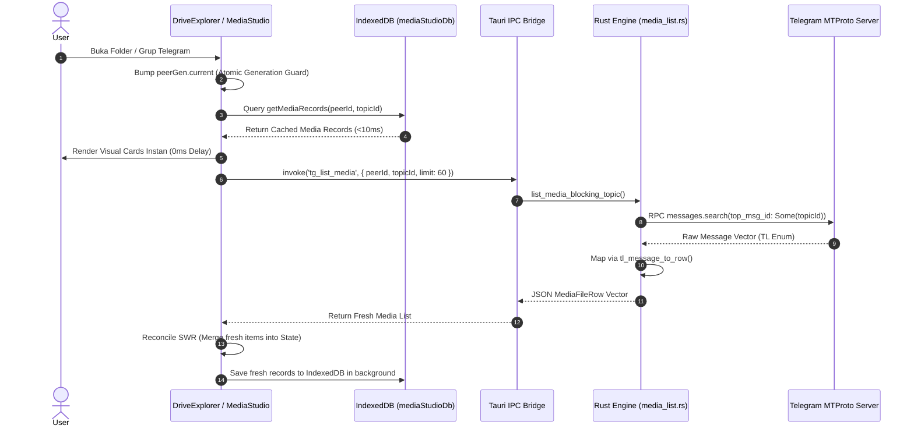
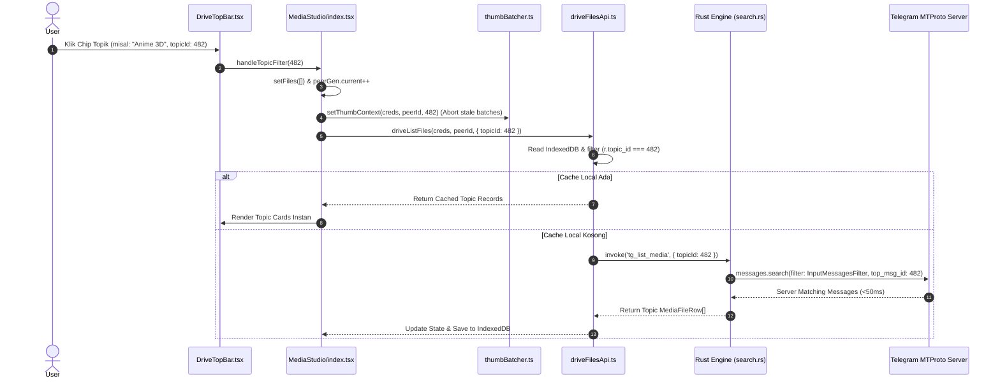
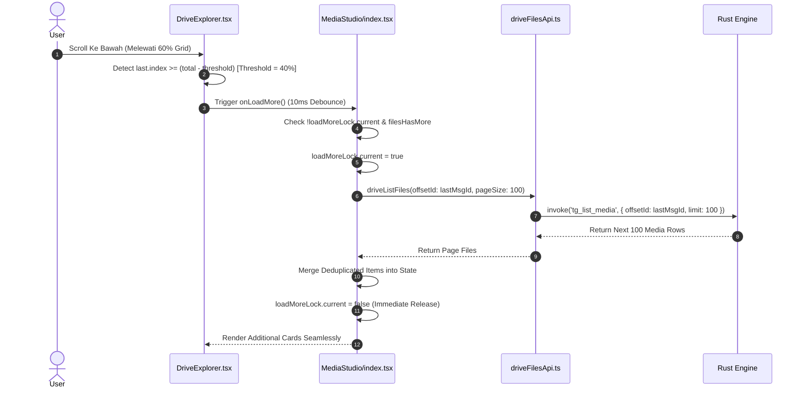
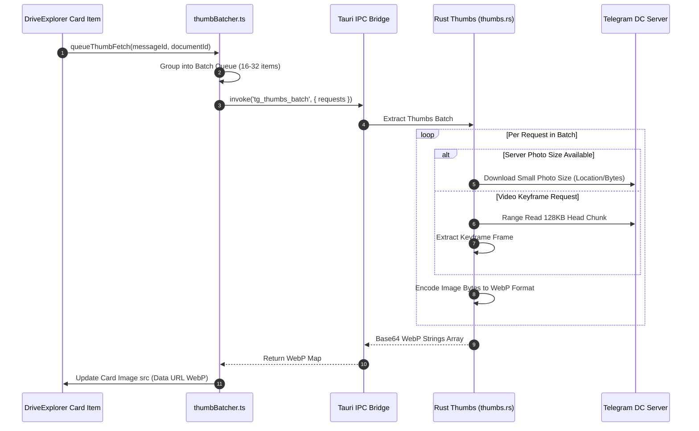
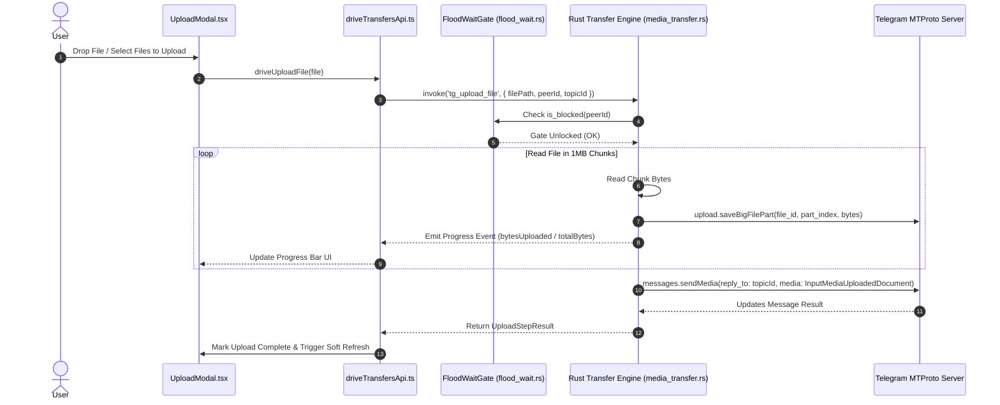
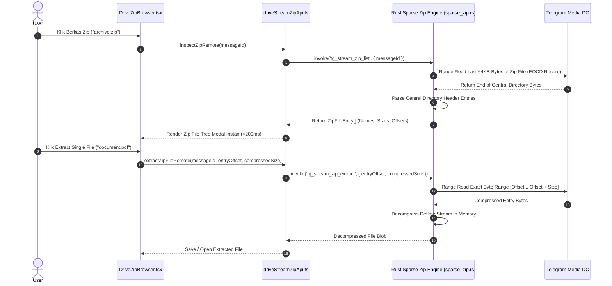
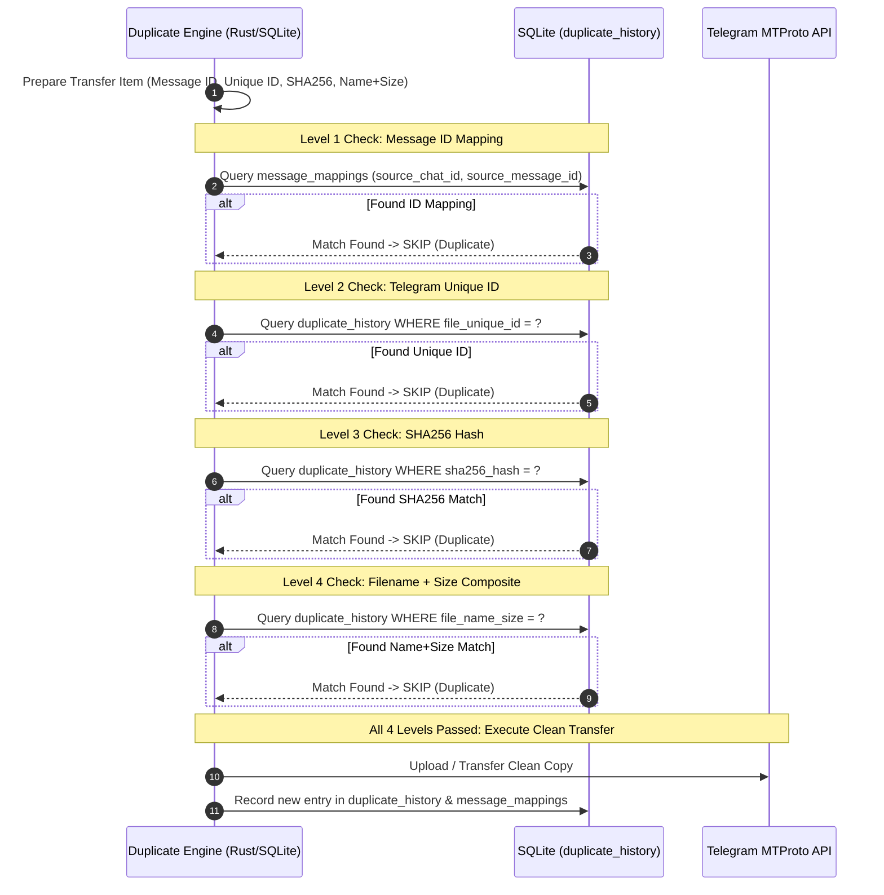
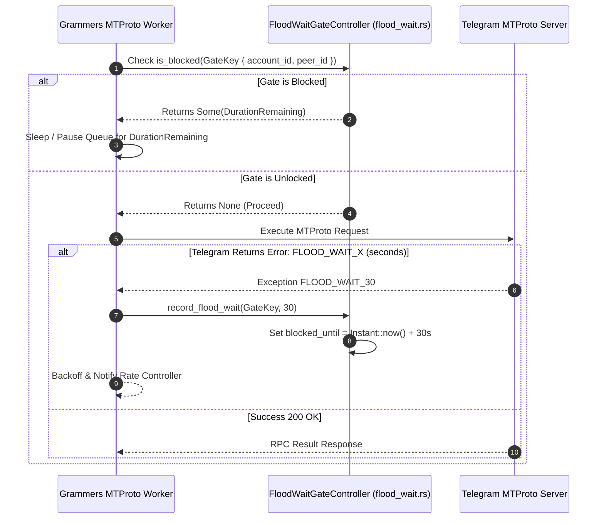
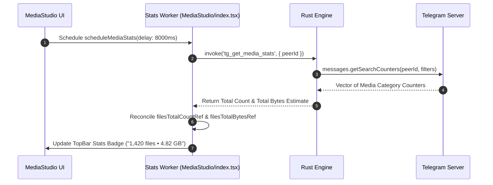
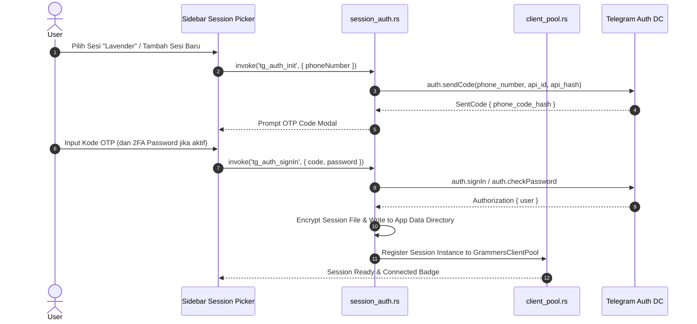

# AutoGram Master Architecture, Workflow & System Component Specification

> **Dokumen Spesifikasi Utama, Arsitektur Sistem, & Manual Workflow End-to-End AutoGram App**  
> *Versi Rujukan Terintegrasi: v2.3.88*  
> *Platform: Desktop Hybrid (Tauri + React 18 + Rust Grammers Engine + SQLite + IndexedDB)*

---

## 1. Pendahuluan & Filosofi Sistem (Core Technical Philosophy)

AutoGram adalah platform manajemen, migrasi, dan eksplorasi media Telegram berbasis desktop dengan paradigma **Telegram-as-a-Drive**. Aplikasi ini dibangun untuk menangani pustaka media berskala besar (10.000+ hingga 1.000.000+ berkas per saluran/grup) dengan kecepatan tinggi, penggunaan memori minimal, antarmuka responsif (*mobile-first & touch-first*), serta keandalan tingkat tinggi tanpa hambatan *FloodWait*.

```
┌──────────────────────────────────────────────────────────────────────────────────┐
│                             FRONTEND (React 18 + TS)                             │
│  MediaStudio ─── DriveTopBar ─── DriveExplorer ─── ThumbBatcher ─── mediaStudioDb│
└────────────────────────────────────────┬─────────────────────────────────────────┘
                                         │ Tauri IPC Invoke ('tg_*')
┌────────────────────────────────────────▼─────────────────────────────────────────┐
│                              TAURI BRIDGE (lib.rs)                               │
│  tg_list_media │ tg_open_topic_media │ tg_thumbs_batch │ tg_upload_file          │
└────────────────────────────────────────┬─────────────────────────────────────────┘
                                         │
┌────────────────────────────────────────▼─────────────────────────────────────────┐
│                      RUST CORE ENGINE (src-tauri/src)                            │
│ ┌───────────────────────────┐ ┌───────────────────────────┐ ┌──────────────────┐ │
│ │ Grammers MTProto Engine   │ │ Topic Media Feature Engine│ │ SQLite Repository│ │
│ │ (client_pool, media_list) │ │ (search, document_mapper) │ │ (topic_media.db) │ │
│ └─────────────┬─────────────┘ └─────────────┬─────────────┘ └────────┬─────────┘ │
└───────────────┼─────────────────────────────┼────────────────────────┼───────────┘
                │ MTProto API                 │ MTProto API            │ SQL I/O
┌───────────────▼─────────────────────────────▼─────────────┐ ┌────────▼──────────┐
│                   TELEGRAM MTPROTO SERVERS                │ │ LOCAL SQLITE DB   │
└───────────────────────────────────────────────────────────┘ └───────────────────┘
```

### 5 Pilar Filosofi Teknis:
1. **Grammers-Only Rust MTProto Engine**: Seluruh komunikasi Telegram API (Otentikasi, Pencarian Berkas, Download/Upload Stream, Thumbnail Extraction, Zip Streaming) dieksekusi 100% secara native di Rust menggunakan **Grammers**. Tidak ada runtime Python/Telethon yang aktif.
2. **Local-First Stale-While-Revalidate (SWR) Cache**: Render antarmuka visual terjadi secara instan (<10ms) menggunakan data hangat dari IndexedDB (`mediaStudioDb.ts`) atau SQLite (`topic_media.db`), disusul oleh pembaruan delta secara silent dari server Telegram.
3. **Server-Side MTProto Topic Filtering (`top_msg_id`)**: Pemfilteran topik pada forum supergroup Telegram dilakukan langsung di server Telegram via `messages.search` berparameter `top_msg_id`, menghasilkan pencarian <50ms tanpa scanning pesan sekensial di client.
4. **Proactive Streaming Infinite Scroll**: Antarmuka `DriveExplorer` memicu prefetch halaman berikutnya secara proaktif pada posisi 40% sebelum dasar grid (8–25 baris tersisa), sehingga pengguna tidak pernah mengalami hambatan *spinner loading*.
5. **Fail-Closed Generation Protection (`peerGen.current`)**: Setiap perubahan lokasi/topik menaikkan atomic generation counter (`peerGen.current`), yang secara otomatis menggugurkan (*abort*) callback dan request yang terlambat, menjamin 0% kebocoran data (*media bleed*) antar topik.

---

## 2. Pemetaan Struktur Direktori Repository Lintas Lapisan

```
AutoGram App/
├── database/
│   └── schema.sql                          # Skema SQLite Offline (Users, Accounts, Executions, Duplicate History)
├── docs/
│   └── architecture/
│       ├── AUTOGRAM_MASTER_ARCHITECTURE_WORKFLOW.md  # Dokumen Spesifikasi Utama Ini
│       ├── RUST_GRAMMERS_BACKEND.md        # Spesifikasi Grammers Engine
│       └── SYSTEM_ARCHITECTURE.md          # Peta Komponen Sistem
├── frontend/
│   ├── src/
│   │   ├── components/
│   │   │   └── drive/                      # Komponen Antarmuka AutoGram Drive
│   │   │       ├── Explorer/
│   │   │       │   ├── DriveExplorer.tsx   # Manajer Berkas Grid/List Virtualized UI
│   │   │       │   └── DriveMarqueeOverlay.tsx # Overlay Seleksi Kotak Drag
│   │   │       ├── Modals/
│   │   │       │   ├── DriveConfirmDialog.tsx # Dialog Konfirmasi Hapus/Pindah
│   │   │       │   ├── RemoteUrlModal.tsx     # Modal Remote Web Downloader
│   │   │       │   └── UploadModal.tsx        # Modal Antrean Unggah Berkas
│   │   │       ├── Navigation/
│   │   │       │   ├── DriveTopBar.tsx     # Filter Chip Topik, Mode Tampilan, Search, Sort
│   │   │       │   └── DriveSidebarIndex.tsx# Navigasi Chat, Folder, & Session Picker
│   │   │       └── Zip/
│   │   │           └── DriveZipBrowser.tsx # Penjelajah Berkas Kompresi Zip Remote
│   │   ├── lib/
│   │   │   ├── db/
│   │   │   │   └── mediaStudioDb.ts        # Warm Cache Layer IndexedDB
│   │   │   ├── media/
│   │   │   │   ├── thumbBatcher.ts         # Pengelola Antrean Batch Thumbnail WebP
│   │   │   │   ├── avatarBatcher.ts        # Batching Foto Profil Sidebar
│   │   │   │   └── previewCache.ts         # Cache Memory Preview Berkas
│   │   │   ├── tauri/
│   │   │   │   └── platform.ts             # Deteksi Runtime Desktop Tauri
│   │   │   └── telegram/                   # Abstraksi Telegram Drive Frontend
│   │   │       ├── core/
│   │   │       │   └── telegramBackend.ts  # Bridge Tauri IPC Invoke (`tg_*`)
│   │   │       ├── driveApi/
│   │   │       │   ├── driveFilesApi.ts    # API List, Batch Thumbs, Delete, Move
│   │   │       │   ├── driveFoldersApi.ts  # API List Dialogs/Channels & Topics
│   │   │       │   ├── driveStreamZipApi.ts# API Streaming Remote ZIP
│   │   │       │   └── driveTransfersApi.ts# API Single/Batch Upload File
│   │   │       ├── interaction/
│   │   │       │   ├── driveLoadStaging.ts # Batas Staged Pagination & Page Sizes
│   │   │       │   ├── driveLiveSync.ts    # Sinkronisasi Realtime Head Server
│   │   │       │   ├── driveSelection.ts   # Logika Seleksi Berkas Multi-Select
│   │   │       │   └── driveDrag.ts        # Logika Drag-and-Drop Berkas Internal/OS
│   │   │       └── driveTypes.ts           # Type Definition DriveFile, DriveTopic, dsb.
│   │   ├── pages/
│   │   │   └── MediaStudio/
│   │   │       ├── index.tsx               # Orchestrator Halaman Utama AutoGram Drive
│   │   │       ├── MediaStudioSidebar.tsx  # Sidebar Sesi & Topik
│   │   │       └── mediaStudioUtils.ts     # Format Bytes, Sorting, & Snapshot Storage
│   │   ├── locales/                        # Internasionalisasi (100% Zero Hardcoded Text)
│   │   │   ├── id/*.json                   # Bahasa Indonesia
│   │   │   └── en/*.json                   # Bahasa Inggris
│   │   ├── App.tsx                         # Root Router React
│   │   └── main.tsx                        # Entrypoint React Vite
│   └── src-tauri/                          # Backend Engine Rust Native
│       ├── Cargo.toml                      # Dependensi Rust (Grammers, Tauri, Rusqlite, Tokio)
│       └── src/
│           ├── lib.rs                      # Registrasi Tauri Commands (`tg_*`)
│           ├── core/
│           │   ├── telegram_ops.rs         # Handler Tauri Commands & Sync Routing
│           │   ├── tg_error.rs             # Pemetaan Error Standard & FloodWait
│           │   ├── app_db.rs               # Inisialisasi Database SQLite (`app.db`)
│           │   ├── grammers_ops/
│           │   │   ├── client_pool.rs      # Pool Koneksi Grammers MTProto
│           │   │   ├── media_list.rs       # Server Search & List Media Blocking
│           │   │   ├── media_transfer.rs   # Core Upload & Download Engine
│           │   │   ├── peer_resolver.rs    # Resolver Peer ID & LRU Peer Cache
│           │   │   └── session_auth.rs     # Login, 2FA, OTP, & Sesi Key Storage
│           │   └── grammers/               # Handler Thumbnail, Stream, & Sparse Zip
│           │       ├── thumbs.rs           # Ekstraksi WebP Server Thumbnails
│           │       ├── stream.rs           # Streaming Downloader & Seeking
│           │       └── sparse_zip.rs       # Direct Remote Zip Central Directory Reader
│           └── features/
│               └── topic_media/            # Modul Khusus Topik Media Local-First
│                   ├── models.rs           # Entity Data TopicMediaItem
│                   ├── repository.rs       # SQLite Storage Operations (`topic_media_items`)
│                   ├── service.rs          # Orchestrator Layanan Topik Media
│                   ├── commands.rs         # Tauri Commands Topic Media (`tg_open_topic_*`)
│                   ├── mtproto/
│                   │   ├── search.rs       # MTProto Search `top_msg_id`
│                   │   └── document_mapper.rs # Mapper Message TL ke Domain Model
│                   └── scheduler/
│                       ├── flood_wait.rs   # FloodWait Gate Controller Global
│                       ├── metrics.rs      # Pengukur Kinerja Scheduler
│                       ├── queue.rs        # Priority Queue Requests
│                       ├── rate_limit.rs   # Adaptive Backoff Rate Limiter
│                       └── worker_pool.rs  # DC Worker Pool Management
```

---

## 3. Spesifikasi Modul & Fungsi Detail Frontend

### A. Core Orchestrator: `MediaStudio/index.tsx`
- **`refreshFiles(opts)`**: Mengoordinasikan pembacaan data awal saat berpindah lokasi atau topik. Mengambil cache IndexedDB terlebih dahulu (Step A), kemudian memicu `driveListFiles` via IPC Rust (Step B).
- **`loadMoreFiles()`**: Dipanggil oleh listener scroll `DriveExplorer`. Mengambil halaman berkas berikutnya menggunakan `stagedLoadMorePageSize`, menggabungkan item baru dengan dedup Set ID, dan memperbarui `filesCacheRef`.
- **`syncActiveLocationLive(reason)`**: Melakukan polling silent ke Telegram head server setiap interval tertentu untuk memeriksa apakah ada pesan/media baru yang masuk.
- **`scheduleMediaStats(opts)`**: Menjalankan pembacaan total ukuran berkas dan statistik media secara bertahap tanpa mengganggu UI utama.

### B. UI Rendering Layer: `DriveExplorer.tsx`
- **Virtualization Engine**: Menggunakan layout grid/baris dinamis yang hanya me-render elemen visual pada viewport aktif.
- **Proactive Prefetch Effect (`useEffect`)**: Memeriksa indeks baris terakhir yang terlihat (`last.index`). Jika berada di posisi `total - threshold` (di mana `threshold` = 40% dari total baris), `onLoadMore()` dipanggil secara otomatis dengan debounce 10ms.
- **Selection System**: Mengintegrasikan seleksi marquee drag kotak, `Shift+Click` range select, dan `Ctrl+Click` multi-select.

### C. Frontend Telegram API Abstraksi: `driveFilesApi.ts`
- **`driveListFiles(creds, folderId, opts)`**: Fungsi utama pengambil daftar berkas. Menangani pemfilteran IndexedDB lokal berdasarkan `topic_id` (`r.topic_id === topicId`). Jika cache lokal kosong, memicu RPC Rust `tgListMedia`.
- **`driveThumbnailsBatch(creds, peerId, requests)`**: Mengirim antrean request thumbnail ke Rust via `tg_thumbs_batch` dan menyimpan blob hasil ke IndexedDB (`thumbnails` store).
- **`driveDeleteFiles(creds, peerId, messageIds)`**: Menghapus pesan media dari Telegram via `tg_delete_messages` dan membersihkan rekaman terkait dari IndexedDB.

### D. Media Queue Manager: `thumbBatcher.ts`
- **`queueThumbFetch(creds, peerId, messageId, documentId)`**: Memasukkan request thumbnail ke antrean memori.
- **`processQueue()`**: Memotong antrean menjadi batch berukuran 16–32 item, mengirimnya ke Rust IPC, dan mendistribusikan WebP blob URL ke komponen kartu yang relevan.
- **`setThumbContext(creds, peerId, topicId)`**: Dipanggil saat berpindah topik untuk membatalkan seluruh request batch dari topik sebelumnya.

### E. Warm Cache Storage: `mediaStudioDb.ts`
- **Object Store `media`**: Menyimpan metadata berkas (`MediaRecord`) dengan index `byFolder_Date`, `byFolder_Size`, `byFolder_Name`.
- **Object Store `thumbnails`**: Menyimpan binary blob thumbnail WebP berbasis `folderId_messageId`.
- **Object Store `checkpoints`**: Menyimpan status pekerjaan transfer/migrasi yang dapat dilanjutkan (*resumable*).

---

## 4. Spesifikasi Modul, Struct & Trait Detail Backend Rust

### A. Tauri IPC Commands & Entrypoint (`lib.rs` & `telegram_ops.rs`)
- **`tg_list_media`**: Pintu masuk IPC utama untuk mengambil list media dari Telegram. Memanggil `list_media_blocking_topic` di `media_list.rs`.
- **`tg_open_topic_media`**: Membuka antarmuka topik media local-first, membaca cache SQLite `topic_media_items`, dan memicu pencarian delta MTProto.
- **`tg_thumbs_batch`**: Menerima array request thumbnail, mengekstraksi thumbnail server/document via `thumbs.rs`, dan mengembalikan array Base64 WebP.

### B. Core MTProto Media List Engine (`media_list.rs`)
- **`list_media_blocking_topic()`**: Menjalankan query server Telegram:
  - Jika `topic_id > 0`: Membentuk struct `tl::functions::messages::Search` dengan `top_msg_id: Some(topic_id)`.
  - Jika `topic_id == 0`: Mengambil media saluran/grup secara umum.
- **`tl_message_to_row(msg, folder_id)`**: Mapper native yang mengonversi enum raw `tl::enums::Message` menjadi `MediaFileRow` tanpa membutuhkan objek wrapper client `PeerMap`.

### C. Telegram Client Pool & Peer Resolver (`client_pool.rs` & `peer_resolver.rs`)
- **`GrammersClientPool`**: Struct pengelola instance Grammers Client per sesi telepon/account. Menangani auto-reconnect dan session encryption at rest.
- **`resolve_peer_ref(client, peer_str)`**: Resolver serbaguna yang mengonversi format ID (`"me"`, `"-1001928374"`, `"@channel"`) menjadi `tl::enums::InputPeer` yang valid dengan caching LRU.

### D. Local-First Topic Media Repository (`repository.rs`)
- **`get_cached_page(ctx, filter_types, cursor, limit)`**: Membaca halaman berkas dari SQLite `topic_media_items` menggunakan klausa `WHERE account_id = ? AND peer_id = ? AND topic_id = ? AND is_deleted = 0 ORDER BY message_date DESC, message_id DESC`.
- **`upsert_topic_media_batch(conn, items)`**: Memasukkan atau memperbarui batch rekaman media ke SQLite dalam satu transaksi SQL atomic (`BEGIN TRANSACTION`).

### E. Global Rate Limiter & FloodWait Gate (`flood_wait.rs`)
- **`FloodWaitGateController`**: Struct thread-safe (`Arc<Mutex<HashMap<GateKey, GateState>>>`) yang mengunci seluruh operasi MTProto pada peer tertentu apabila Telegram mengembalikan error `FloodWaitError(seconds)`.

---

## 5. Desain Database & Skema Penyimpanan Data

### A. Skema SQLite Offline Desktop (`database/schema.sql` & `app.db`)

#### 1. Tabel `topic_media_items` (Index Media Topik Local-First)
```sql
CREATE TABLE IF NOT EXISTS topic_media_items (
    account_id TEXT NOT NULL,
    peer_id TEXT NOT NULL,
    topic_id INTEGER NOT NULL,
    message_id INTEGER NOT NULL,
    message_date INTEGER NOT NULL,
    edit_date INTEGER,
    grouped_id INTEGER,
    sender_id TEXT,
    caption TEXT,
    media_type TEXT NOT NULL,
    mime_type TEXT,
    file_name TEXT NOT NULL,
    file_size INTEGER NOT NULL,
    document_id INTEGER,
    access_hash INTEGER,
    dc_id INTEGER,
    file_reference BLOB,
    width INTEGER,
    height INTEGER,
    duration_ms INTEGER,
    has_server_thumb BOOLEAN DEFAULT 0,
    has_video_thumb BOOLEAN DEFAULT 0,
    is_deleted BOOLEAN DEFAULT 0,
    created_at INTEGER NOT NULL,
    updated_at INTEGER NOT NULL,
    PRIMARY KEY (account_id, peer_id, topic_id, message_id)
);

CREATE INDEX IF NOT EXISTS idx_topic_media_lookup 
ON topic_media_items (account_id, peer_id, topic_id, message_date DESC, message_id DESC);
```

#### 2. Tabel `duplicate_history` (Pencegahan Duplikasi Clean-Copy)
```sql
CREATE TABLE IF NOT EXISTS duplicate_history (
    id INTEGER PRIMARY KEY AUTOINCREMENT,
    file_unique_id TEXT NOT NULL,
    target_entity_id TEXT NOT NULL,
    target_message_id INTEGER NOT NULL,
    sha256_hash TEXT,
    file_name_size TEXT,
    created_at DATETIME DEFAULT CURRENT_TIMESTAMP,
    UNIQUE(file_unique_id, target_entity_id)
);

CREATE INDEX IF NOT EXISTS idx_duplicate_hash ON duplicate_history(sha256_hash);
```

---

### B. Skema IndexedDB Warm Cache Frontend (`mediaStudioDb.ts`)

| Object Store | Primary Key | Key Path / Indices | Deskripsi |
| :--- | :--- | :--- | :--- |
| `media` | `id` | `byFolder_Date` `[folderId+date]`<br>`byFolder_Size` `[folderId+size]` | Cache hangat berkas media per folder/grup untuk instantaneous UI paint. |
| `thumbnails` | `folderId_messageId` | `timestamp` | Binary Blob WebP thumbnail hasil ekstraksi Rust engine. |
| `checkpoints` | `jobId` | `status` | Snapshot status pekerjaan transfer/migrasi media yang sedang berjalan. |
| `actionQueue` | `id` | `status`, `createdAt` | Queue tindakan offline (hapus, pindah, rename) yang akan di-sync ke server. |

---

## 6. Diagram Sequence Workflow Lengkap (Mermaid)

### 6.1 Bootstrapping & Warm Cache Hybrid Initial Paint Workflow



---

### 6.2 Topic Selection & Server-Side Filtering Workflow



---

### 6.3 Proactive Infinite Streaming Pagination Workflow



---

### 6.4 Multi-Lane Progressive WebP Thumbnail Queue Workflow



---

### 6.5 Parallel File Uploading & Progress Callback Workflow



---

### 6.6 Remote Stream ZIP Inspection & Extraction Workflow



---

### 6.7 Clean-Copy Duplicate Prevention Engine Workflow



---

### 6.8 Smart Rate Controller & Global FloodWait Gate Workflow



---

### 6.9 Background Media Stats Walking & Dynamic Reconciler



---

### 6.10 Multi-Session Authentication & Telethon Session Auto-Import



---

## 7. Matriks Hubungan & Panggilan Inter-Module (Call Graph Matrix)

| Modul Pemanggil (Caller) | Modul Dipanggil (Callee) | Mekanisme Komunikasi | Tujuan & Hasil Interaksi |
| :--- | :--- | :--- | :--- |
| `MediaStudio/index.tsx` | `driveFilesApi.ts` | Async Function Call | Meminta daftar berkas media SWR & pagination. |
| `MediaStudio/index.tsx` | `thumbBatcher.ts` | Method Invocation | Mengatur konteks topik (`setThumbContext`) & reset antrean thumbnail. |
| `DriveExplorer.tsx` | `MediaStudio/index.tsx` | Prop Callback (`onLoadMore`) | Memicu pemuatan halaman berikutnya saat scroll mencapai threshold 40%. |
| `driveFilesApi.ts` | `telegramBackend.ts` | Async Function Call | Abstraksi API frontend ke Tauri IPC wrapper. |
| `driveFilesApi.ts` | `mediaStudioDb.ts` | IndexedDB Transaction | Membaca & menulis warm cache berkas media & thumbnail. |
| `telegramBackend.ts` | `lib.rs` | Tauri IPC `invoke('tg_*')` | Mengirim serialized JSON payload dari WebView JS ke Rust Core. |
| `telegram_ops.rs` | `media_list.rs` | Native Rust Function Call | Memanggil pengeksekusi pencarian media Telegram server-side. |
| `media_list.rs` | `client_pool.rs` | Async Client Reference | Mengambil instance Grammers MTProto client terotentikasi. |
| `media_list.rs` | `peer_resolver.rs` | Cache Lookup / RPC | Resolusi string Peer ID ke `tl::enums::InputPeer`. |
| `media_list.rs` | Telegram MTProto Server | Native TCP / MTProto | Eksekusi RPC `messages.search` berparameter `top_msg_id`. |
| `media_transfer.rs` | `flood_wait.rs` | Mutex Gate Check | Verifikasi apakah target peer sedang terkunci `FLOOD_WAIT`. |
| `service.rs` | `repository.rs` | SQLite Transaction | Menulis/membaca rekaman `topic_media_items` di `app.db`. |

---

## 8. Standar Kode, Keamanan & Kebijakan Data (Non-Negotiable Rules)

1. **100% Zero Hardcoded Text (Mandatory i18n)**:
   - Seluruh teks yang tampil di UI (modal, dialog, button, toast, tooltip, status text) wajib diekstraksi ke file locale `src/locales/id/*.json` & `src/locales/en/*.json`.
   - Menggunakan hook `const { t } = useTranslation();` dari `react-i18next`.

2. **Keamanan Sesi & Kredensial Pengguna**:
   - File sesi Telegram (`*.session`), API ID, dan API Hash diperlakukan sangat rahasia.
   - Dilarang mencetak (*log/print*) token sesi atau kredensial sensitif ke console / terminal log.
   - Sesi dienkripsi saat disimpan di direktori aplikasi lokal.

3. **Versi Aplikasi & Changelog (Rules 15 & 16)**:
   - Setiap perubahan yang selesai diimplementasi wajib diikuti dengan pembaruan file `VERSION.md` dan `CHANGELOG.md`.
   - Penulisan commit Git mengikuti konvensi `conventional-commit` dan di-push langsung ke branch `main` GitHub repository `Zy0x/AutoGram`.

---

*Dokumen ini disahkan sebagai spesifikasi arsitektur master resmi untuk pengembangan, pengujian, dan pemeliharaan lanjutan platform AutoGram App.*
