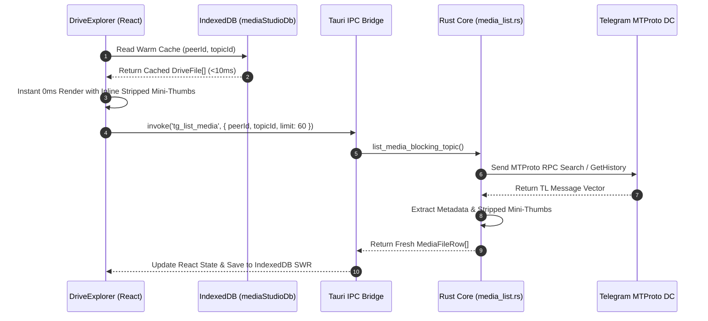
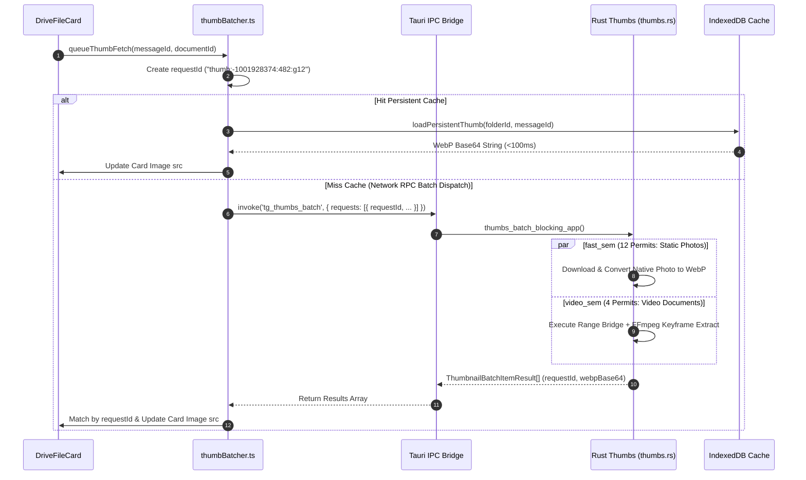
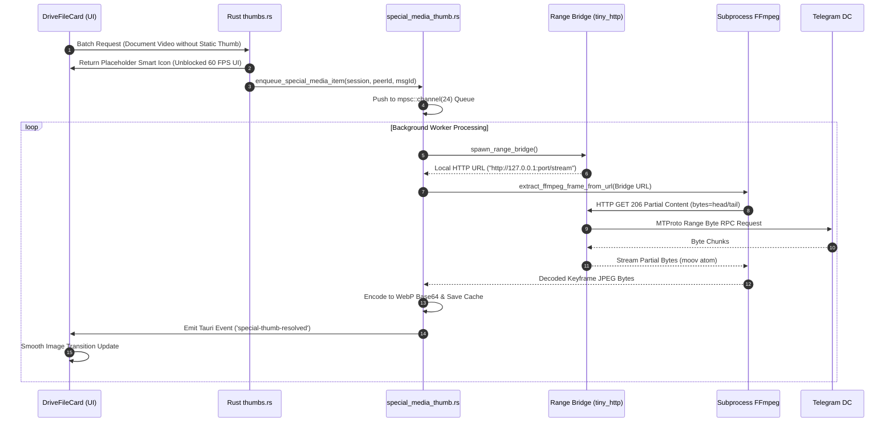
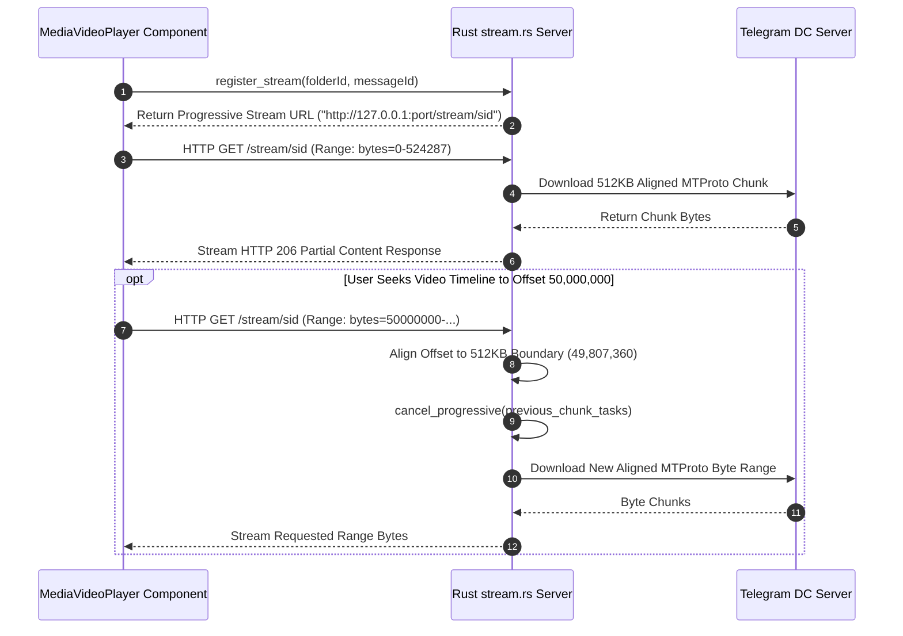

# AutoGram Master Architecture, WorkTree & Operational Workflow Specification

> **Dokumen Spesifikasi Teknis Master, Peta WorkTree Utuh, Diagram Sequence Mermaid, Manual Operational Workflow Real-World & Standar Tata Kelola Agent AutoGram App**  
> *Versi Rujukan Terintegrasi: v2.7.1 (Absolute Definitive Production Master Edition — 100% Comprehensive & Complete)*  
> *Platform: Desktop Hybrid (Tauri v2 + React 19 + Rust Grammers Engine + SQLite + IndexedDB)*

---

## 1. Pendahuluan & Filosofi Arsitektur Utama (Core Technical Philosophy)

AutoGram adalah platform manajemen, migrasi, dan eksplorasi media Telegram berbasis desktop yang menggunakan paradigma **Telegram-as-a-Drive**. Sistem ini dirancang untuk menangani pustaka media berskala besar (10.000+ hingga 1.000.000+ berkas per saluran/grup) dengan kecepatan eksekusi tinggi, penggunaan memori minimal, antarmuka responsif (*mobile-first & touch-first*), serta keandalan tingkat tinggi tanpa hambatan *FloodWait*.

```
┌──────────────────────────────────────────────────────────────────────────────────┐
│                             FRONTEND (React 19 + TS)                             │
│  MediaStudio ─── DriveTopBar ─── DriveExplorer ─── ThumbBatcher ─── mediaStudioDb│
│  DriveFileCard ── VideoCanvasCapturer ── DriveZipBrowser ── DrivePreviewModal   │
└────────────────────────────────────────┬─────────────────────────────────────────┘
                                         │ Tauri IPC Invoke ('tg_*')
┌────────────────────────────────────────▼─────────────────────────────────────────┐
│                              TAURI BRIDGE (lib.rs)                               │
│  tg_list_media │ tg_open_topic_media │ tg_thumbs_batch │ tg_upload_file          │
│  tg_stream_range │ tg_cancel_stream   │ tg_zip_dir      │ tg_zip_extract       │
└────────────────────────────────────────┬─────────────────────────────────────────┘
                                         │
┌────────────────────────────────────────▼─────────────────────────────────────────┐
│                      RUST CORE ENGINE (src-tauri/src)                            │
│ ┌───────────────────────────┐ ┌───────────────────────────┐ ┌──────────────────┐ │
│ │ Grammers MTProto Engine   │ │ Topic Media Feature Engine│ │ SQLite Repository│ │
│ │ (client_pool, media_list) │ │ (search, document_mapper) │ │ (app.db)         │ │
│ └─────────────┬─────────────┘ └─────────────┬─────────────┘ └────────┬─────────┘ │
│ ┌─────────────▼─────────────┐ ┌─────────────▼─────────────┐          │          │
│ │ Special Media Thumb Engine│ │ Progressive Stream Engine │          │          │
│ │ (special_media_thumb.rs)  │ │ (stream.rs + range_bridge)│          │          │
│ └───────────────────────────┘ └───────────────────────────┘          │          │
└───────────────┼─────────────────────────────┼────────────────────────┼───────────┘
                │ MTProto API                 │ MTProto API            │ SQL I/O
┌───────────────▼─────────────────────────────▼─────────────┐ ┌────────▼──────────┐
│                   TELEGRAM MTPROTO SERVERS                │ │ LOCAL SQLITE DB   │
└───────────────────────────────────────────────────────────┘ └───────────────────┘
```

### 5 Pilar Utama Arsitektur Teknis v2.7.1:

1. **Grammers-Only Rust MTProto Backend**: Seluruh interaksi Telegram API (Otentikasi, List Media, Topic Search, Instant Stripped Mini-Thumb Extraction, Thumbnail Batch, Upload/Download Stream, Sparse Zip Stream) dieksekusi 100% secara native di Rust menggunakan **Grammers**. Tidak ada runtime Python/Telethon yang aktif.
2. **Local-First SWR & Instant 0ms Mini-Thumb Paint**: Render antarmuka visual terjadi secara instan (<10ms) menggunakan data hangat dari IndexedDB (`mediaStudioDb.ts`) atau mini-thumb Telegram MTProto `PhotoSize::Stripped` (`tl_stripped_thumb_data_url`), disusul oleh pembaruan HD background batch tanpa jeda.
3. **Unpaused High-Throughput Request Correlation Pipeline**: Pemproses antrean thumbnail `thumbBatcher.ts` mengeksekusi 4 penerbangan RPC paralel dengan kapasitas batch hingga 48 item per request menggunakan `requestId` unik (`thumb:peerId:msgId:gGen`). Data dicocokkan secara non-posisional via `ThumbnailBatchItemResult` tanpa risiko pergeseran indeks.
4. **Dual-Track Resource-Guarded Scheduler & Seekable HTTP Range Bridge**: Pemuatan thumbnail dipisah menjadi dua jalur independen: `fast_sem` (12 permit paralel) untuk foto/gambar statis dan `video_sem` (4 permit paralel) untuk video dokumen FFmpeg. Video dokumen tanpa thumbnail Telegram dilayani oleh server lokal `tiny_http` **Seekable Local HTTP Range Bridge** yang melayani request HTTP `206 Partial Content` dengan **512 KB Boundary Alignment** untuk pembacaan atom `moov` MP4/AV1 secara presisi.
5. **Fail-Closed Generation Protection (`peerGen.current`) & Specialized Media Engine**: Setiap perubahan lokasi/topik menaikkan atomic generation counter (`peerGen.current`), yang secara otomatis menggugurkan (*abort*) callback dan request yang terlambat, menjamin 0% kebocoran data (*media bleed*). Kegagalan thumbnail dokumen non-media secara otomatis menyimpan penanda negatif `.nothumb` di disk cache dan `"NOT_FOUND"` di memori. Media tanpa thumbnail statis diproses secara asinkron oleh `special_media_thumb.rs` via antrean latar belakang `mpsc::channel(24)` tanpa memblokir scrolling UI (60 FPS).

---

## 2. Peta WorkTree Repository Utuh (Exhaustive Directory Map)

```
AutoGram App/
├── database/
│   └── schema.sql                                  # Skema SQLite Offline (Users, Accounts, Executions, Duplicate History)
├── docs/
│   └── architecture/
│       ├── AUTOGRAM_MASTER_ARCHITECTURE_WORKFLOW.md  # Dokumen Spesifikasi Utama v2.7.1 Ini
│       ├── RUST_GRAMMERS_BACKEND.md                # Spesifikasi Grammers Engine
│       └── SYSTEM_ARCHITECTURE.md                  # Peta Komponen Sistem
├── frontend/
│   ├── src/
│   │   ├── components/
│   │   │   └── drive/                              # Komponen Antarmuka AutoGram Drive
│   │   │       ├── Explorer/
│   │   │       │   ├── DriveExplorer.tsx           # Virtualized Grid/List UI Manager & Scroll Prefetcher
│   │   │       │   ├── DriveFileCard.tsx           # Card Item Component (Rasio 3:4, Vignette Overlay, Location Context)
│   │   │       │   ├── DriveFileListItem.tsx       # Compact List Item Representation
│   │   │       │   ├── DriveMarqueeOverlay.tsx     # Selection Box Overlay (Drag Box)
│   │   │       │   ├── DriveSkeleton.tsx           # Skeleton Loader UI saat SWR Warm Fetching
│   │   │       │   ├── FileTypeIcon.tsx            # SVG Icon Fallback Generator per MIME/Extension
│   │   │       │   ├── ThumbnailImage.tsx          # Progressive Image Loader Component
│   │   │       │   └── VideoCanvasThumbnailCapturer.tsx # Client-Side Canvas Video Frame Dekoder
│   │   │       ├── Modals/
│   │   │       │   ├── DriveConfirmDialog.tsx     # Dialog Konfirmasi Action
│   │   │       │   ├── RemoteUrlModal.tsx         # Remote Downloader Modal
│   │   │       │   └── UploadModal.tsx            # Upload Progress & Queue Modal
│   │   │       ├── Navigation/
│   │   │       │   ├── DriveTopBar.tsx             # Topic Chips, View Modes, Search & Quality Selectors
│   │   │       │   └── DriveSidebarIndex.tsx       # Sidebar Session & Dialog/Channel Navigation
│   │   │       ├── DrivePreviewModal/
│   │   │       │   ├── DocumentViewer.tsx         # PDF & Text File Reader Component
│   │   │       │   ├── DrivePreviewModal.tsx       # Orchestrator Preview Media Fullscreen Modal
│   │   │       │   ├── ImageViewer.tsx            # HD Zoomable Image Viewer
│   │   │       │   ├── MediaAudioPlayer.tsx        # Waveform & Streaming Audio Player
│   │   │       │   ├── MediaHeaderToolbar.tsx      # Controls & Actions Toolbar
│   │   │       │   ├── MediaVideoPlayer.tsx        # Progressive Video Stream Player
│   │   │       │   └── previewUtils.ts             # Preview Helper & MIME Type Resolvers
│   │   │       ├── DriveToolsPanel/
│   │   │       │   └── DriveToolsPanel.tsx         # Panel Batch Operations & Clean-Up Tools
│   │   │       ├── DriveZipBrowser/
│   │   │       │   └── DriveZipBrowser.tsx         # Remote ZIP Archive Sparse File Browser
│   │   │       └── Transfers/
│   │   │           └── DriveTransfersPanel.tsx     # Upload/Download Bandwidth & Progress Monitor
│   │   ├── lib/
│   │   │   ├── db/
│   │   │   │   └── mediaStudioDb.ts                # Warm Cache Layer IndexedDB Storage
│   │   │   ├── media/
│   │   │   │   ├── avatarBatcher.ts                # Avatar Batch Downloader
│   │   │   │   ├── previewCache.ts                 # Memory Blob Cache untuk File Preview
│   │   │   │   ├── thumbBatcher.ts                 # 4-Flight Correlation Queue Manager & RPC Dispatcher
│   │   │   │   └── thumbPersistentCache.ts         # Persistent Cache IndexedDB & Black Card Auto-Prune
│   │   │   ├── tauri/
│   │   │   │   └── platform.ts                     # Desktop Tauri Environment Detection
│   │   │   ├── utils/
│   │   │   │   └── devicePerformance.ts            # Performance Profiler Tier (Low, Mid, High)
│   │   │   └── telegram/                           # Abstraksi Telegram Drive Frontend
│   │   │       ├── cache/
│   │   │       │   ├── driveLocationCache.ts       # Active Location Cache
│   │   │       │   ├── driveMediaTotals.ts         # Capacity Estimator Cache
│   │   │       │   ├── driveRecents.ts             # Folder & Session History
│   │   │       │   ├── driveScrollMemory.ts        # Scroll Position Memory per Location
│   │   │       │   ├── driveSidebarCache.ts        # Sidebar Peer Cache
│   │   │       │   └── driveTopicsCache.ts         # Forum Topics Warm Cache
│   │   │       ├── core/
│   │   │       │   ├── driveSession.ts             # Session State Orchestrator
│   │   │       │   ├── sessionGuard.ts             # Auth Expiry & Relogin Guard
│   │   │       │   ├── sessionPicker.ts            # Session Switch Helper
│   │   │       │   ├── studioOrch.ts               # Background Event Orchestrator
│   │   │       │   └── telegramBackend.ts          # IPC Wrapper (`tg_*`)
│   │   │       ├── driveApi/
│   │   │       │   ├── driveFilesApi.ts            # Media API List, Batch Thumbs, Delete
│   │   │       │   ├── driveFoldersApi.ts          # Dialogs & Topics API
│   │   │       │   ├── driveStreamZipApi.ts        # Progressive Stream & Zip API
│   │   │       │   └── driveTransfersApi.ts        # Single/Batch Upload Engine API
│   │   │       ├── interaction/
│   │   │       │   ├── chatSearch.ts               # Server & Instant Search Handler
│   │   │       │   ├── driveDrag.ts                # Internal/OS File Drag Engine
│   │   │       │   ├── driveLiveSync.ts            # Head Poller Realtime Sync
│   │   │       │   ├── driveLoadStaging.ts         # Pagination Controls
│   │   │       │   ├── driveMoveUi.ts              # Drag Target & Target Folder Resolver
│   │   │       │   ├── drivePower.ts               # Low Power & Performance Limiter
│   │   │       │   ├── driveSelection.ts           # Multi-Select Selection Resolver
│   │   │       │   └── pointerDragPrime.ts         # WebView-Safe Pointer Gesture Drag Engine
│   │   │       └── driveTypes.ts                   # Type Definitions (DriveFile, DriveTopic, dsb.)
│   │   ├── locales/                                # Internasionalisasi (100% Zero Hardcoded Text)
│   │   │   ├── id/*.json                           # Bahasa Indonesia
│   │   │   └── en/*.json                           # Bahasa Inggris
│   │   ├── pages/
│   │   │   └── MediaStudio/
│   │   │       ├── index.tsx                       # Main Drive Orchestrator Page
│   │   │       ├── MediaStudioSidebar.tsx          # Navigation Sidebar
│   │   │       └── mediaStudioUtils.ts             # Format Utilities & Snapshot Manager
│   │   ├── App.tsx                                 # React App Root Router
│   │   └── main.tsx                                # Vite React Entrypoint
│   └── src-tauri/                                  # Backend Engine Rust Native
│       ├── Cargo.toml                              # Rust Dependencies (Grammers, Tauri, Rusqlite, Tokio)
│       └── src/
│           ├── lib.rs                              # Tauri IPC Command Definitions (`tg_*`)
│           ├── core/
│           │   ├── app_db.rs                       # SQLite Database Pool (`app.db`)
│           │   ├── path_policy.rs                  # Path Resolution & Cache Directory Policy
│           │   ├── session_guard.rs                # Session Guard Engine
│           │   ├── session_rate.rs                 # Smart Rate Limit Controller per Session
│           │   ├── stream_server.rs                # Stream Registry & Progressive Token Engine
│           │   ├── telegram_ops.rs                 # Tauri Commands & Router Dispatcher
│           │   ├── tg_error.rs                     # Standardized Error Mapping & FloodWait
│           │   ├── grammers_ops/
│           │   │   ├── client_pool.rs              # Grammers MTProto Client Connection Pool
│           │   │   ├── media_list.rs               # Topic & Channel Media Query Engine
│           │   │   ├── media_transfer.rs           # Chunked Upload & Download Transfer Core
│           │   │   ├── peer_resolver.rs            # Peer ID Resolver & LRU Entity Cache
│           │   │   └── session_auth.rs             # Auth, 2FA, OTP & Session Storage
│           │   └── grammers/                       # Grammers Processing Modules
│           │       ├── ffmpeg.rs                   # FFmpeg Subprocess Frame Extraction & Probe
│           │       ├── session.rs                  # Session Path & Cache Policy
│           │       ├── special_media_thumb.rs      # Async Background Keyframe Processor (`mpsc(24)`)
│           │       ├── stream.rs                   # Progressive Streaming, 512KB Boundary Seek, & Zip Engine
│           │       ├── thumbnail_range_bridge.rs   # Seekable Local HTTP Range Bridge Server (`tiny_http`)
│           │       ├── thumbs.rs                   # Tier 1–5 Thumbnail Extraction & Request Correlation
│           │       └── topics.rs                   # Forum Topic Resolver Engine
│           └── features/
│               └── topic_media/                    # Topic Media Local-First Engine
│                   ├── commands.rs                 # Tauri Commands (`tg_open_topic_*`)
│                   ├── error.rs                    # Module Exception Handlers
│                   ├── events.rs                   # Scoped Batch Events Engine
│                   ├── legacy_adapter.rs           # SQLite Data Migration Adapter
│                   ├── models.rs                   # Entity Model `TopicMediaItem`
│                   ├── repository.rs               # SQLite Operations (`topic_media_items`)
│                   ├── service.rs                  # Service Orchestrator
│                   ├── cache/
│                   │   └── disk.rs                 # WebP Disk Cache Manager
│                   └── thumbnail/
│                       ├── fallback_icon.rs        # File Extension Smart Icon Resolver
│                       ├── format_registry.rs      # Preview Capability Registry
│                       ├── frame_selector.rs       # Keyframe Selection Engine
│                       ├── image_extractor.rs      # Fast Image Resizer
│                       ├── mode_profile.rs         # Thumbnail Quality Profile
│                       ├── pdf_extractor.rs        # PDF First-Page Renderer
│                       ├── range_reader.rs         # Partial Byte Range Reader
│                       └── resolver.rs             # Strategy Resolver Thumbnail
```

---

## 3. Spesifikasi Seluruh Modul & Antarmuka Fungsi Detail

### A. Lapisan Frontend (TypeScript / React)

| Nama File | Lokasi Path | Peran & Tujuan Modul | Spesifikasi Fungsi-Fungsi Detail & Cara Kerja | Input / State Used | Output & Side Effects |
| :--- | :--- | :--- | :--- | :--- | :--- |
| `MediaStudio/index.tsx` | `src/pages/MediaStudio/` | **Core Page Orchestrator** | • `refreshFiles()`: Menginisialisasi pemuatan SWR.<br>• `loadMoreFiles()`: Memuat halaman media berikutnya.<br>• `syncActiveLocationLive()`: Polling silent ke head server.<br>• `handleTopicFilter()`: Mengubah topik aktif & bump `peerGen.current`. | • `creds`, `peerId`, `topicFilter`, `sortMode`, `files`<br>• `peerGen.current` | • Update React State `files`<br>• Save to IndexedDB<br>• Reset Thumbnail Queue |
| `DriveExplorer.tsx` | `src/components/drive/Explorer/` | **Virtualized Grid/List UI** | • `useVirtualizer()`: Menghitung layout baris grid/list.<br>• `useEffect Scroll Listener`: Prefetch 40% sebelum dasar grid.<br>• `handleMarqueeSelect()`: Mengalkulasi bounding box drag seleksi.<br>• `autogram-cache-cleared Listener`: Refetch otomatis thumbnail viewport saat cache dihapus. | • `displayed` files<br>• `viewMode`<br>• `selectedIds`<br>• `loadingMore` | • Trigger `onLoadMore()`<br>• Update `selectedIds`<br>• Context Menu Callbacks |
| `DriveFileCard.tsx` | `src/components/drive/Explorer/` | **Card Item Component (3:4 Ratio)** | • `DriveFileCardInner`: Render visual kartu media dengan rasio 3:4.<br>• `usePointerDragPrime()`: Gestur sentuh/pointer WebView-safe.<br>• `itemPeerId` & `itemTopicId`: Resolusi presisi konteks lokasi (Group, Chat, Topic, Channel, Saved Messages).<br>• `getCachedSaverThumb()`: Render instan mini-thumb blur placeholder saat fetching HD. | • `file`, `selected`, `isDragSource`, `folderId`, `contextTopicId`, `thumbQuality` | • UI Touch/Mouse Drag Prime<br>• Card Image src Updates<br>• DoubleClick Preview |
| `VideoCanvasThumbnailCapturer.tsx` | `src/components/drive/Explorer/` | **Client-Side Canvas Capturer** | • `VideoCanvasThumbnailCapturer`: Menggunakan HTML5 `<video>` rahasia untuk menangkap 1 frame video di canvas browser sebagai thumbnail fallback client-side saat video diputar atau di-preview. | • `file`, `streamUrl` | • WebP Data URL Canvas Export<br>• Cache Update |
| `thumbBatcher.ts` | `src/lib/media/` | **Thumbnail Correlation Pipeline** | • `queueThumbFetch()`: Memasukkan request ke antrean dengan `requestId` unik.<br>• `processQueue()`: Dispatch 4-flight paralel batch hingga 48 item ke `tgThumbsBatch`.<br>• `setThumbContext()`: Mereset antrean saat beralih lokasi via atomic `contextGeneration`.<br>• `clearThumbCache()`: Mengosongkan memCache & cooldown maps. | • `requestId`, `messageId`, `documentId`, `thumbQuality` | • Dispatches `tgThumbsBatch`<br>• Emits `autogram-thumb-ready` |
| `thumbPersistentCache.ts` | `src/lib/media/` | **Persistent Cache Layer** | • `loadPersistentThumb()` / `loadPersistentThumbs()`: Membaca cache WebP dari IndexedDB dalam 1 transaksi massal.<br>• Auto-prune Fallback Black Cards: Mendeteksi dan menghapus `dataUrl` gambar hitam solid cadangan lama secara otomatis via `is_fallback_black_card_bytes`. | • `folderId`, `messageId`, `quality` | • Warm-up memCache <100ms<br>• Returns WebP Base64 |
| `driveStreamZipApi.ts` | `src/lib/telegram/driveApi/` | **Streaming & Zip Remote API** | • `driveStreamRangeUrl()`: Mendapatkan URL streaming range seekable.<br>• `driveZipListDir()`: Mengunduh Central Directory ZIP remote via MTProto range request.<br>• `driveZipExtractFile()`: Mengunduh 1 file dari dalam ZIP remote. | • `creds`, `folderId`, `messageId`, `zipPath` | • Stream HTTP URL<br>• Zip Entries JSON<br>• Temp File Download Path |

---

### B. Lapisan Backend Engine Rust Native (`src-tauri/src/`)

| Nama File / Modul | Lokasi Path | Struct / Enum / Trait Utama | Spesifikasi Fungsi-Fungsi Detail & Cara Kerja | Internal Calls & Side Effects |
| :--- | :--- | :--- | :--- | :--- |
| `thumbs.rs` | `src-tauri/src/core/grammers/` | • `ThumbnailLocator`<br>• `ThumbnailBatchItemResult`<br>• `MediaPreviewClass` | • `thumbs_batch_blocking_app()`: Memproses batch thumbnail paralel dengan `requestId` correlation ID.<br>• `download_media_thumb()`: Ekstraksi bertingkat Tier 1–5.<br>• `classify_message_media()`: Klasifikasi jenis media pesan. | • Dual-Track Semaphore (`fast_sem`, `video_sem`)<br>• Range Bridge & FFmpeg Probe<br>• Returns Non-Positional Results |
| `special_media_thumb.rs` | `src-tauri/src/core/grammers/` | • `SpecialThumbItem`<br>• `SpecialThumbResolvedPayload` | • `enqueue_special_media_item()`: Memasukkan video dokumen tanpa thumbnail ke antrean latar belakang `mpsc::channel(24)`.<br>• `background_worker_loop`: Menjalankan ekstraksi frame async via Range Bridge + FFmpeg secara berkala tanpa mengganggu thread UI utama.<br>• `resolved_cache`: Menyimpan hasil frame yang berhasil di-decode. | • Emits Tauri Event `special-thumb-resolved`<br>• Spawns Tokio Background Tasks<br>• Uses HTTP Range Bridge |
| `stream.rs` | `src-tauri/src/core/grammers/` | • `StreamEntry`<br>• `request_progressive_range` | • `register_stream()`: Menginisialisasi tokenized progressive HTTP stream.<br>• `request_progressive_range()`: Menerima request seek dari player, menyelaraskan offset ke **512 KB Boundary** (`offset - (offset % 512KB)`).<br>• `find_moov_atom()`: Mendeteksi keberadaan atom `moov` di ekor berkas MP4/AV1.<br>• `make_faststart_mp4()`: Merestrukturisasi MP4 agar atom `moov` berada di depan (*fast-start*). | • MTProto Chunk Requests<br>• Manages Stream Session Registry<br>• 512KB Chunk Alignment |
| `thumbnail_range_bridge.rs` | `src-tauri/src/core/grammers/` | • `RangeBridgeHandle`<br>• `spawn_range_bridge` | • `spawn_range_bridge()`: Menjalankan server HTTP `tiny_http` lokal sementara di port acak. Server menangani request HTTP `206 Partial Content` (`bytes=start-end`) dari FFmpeg dengan mengunduh byte range MTProto secara acak dari Telegram client. | • Spawns Local HTTP Server (`127.0.0.1:port`)<br>• MTProto Byte Range Downloads |
| `ffmpeg.rs` | `src-tauri/src/core/grammers/` | • `FfmpegCapabilities`<br>• `extract_ffmpeg_frame_sync` | • `get_ffmpeg_capabilities()`: Probe kapabilitas FFmpeg lokal (dukungan HTTP protocol & decoder AV1/libdav1d).<br>• `extract_ffmpeg_frame_from_url()`: Menjalankan subprocess FFmpeg dengan parameter `-err_detect ignore_err` dan `-fflags +genpts+discardcorrupt` untuk merender 1 frame video.<br>• `is_fallback_black_card_bytes()`: Deteksi otomatis gambar hitam solid cadangan lama untuk di-prune. | • Subprocess Execution<br>• Solid Black Frame Detection<br>• 5-second Safety Timeout |

---

## 4. Spesifikasi Detail Operational Workflows & System Modules (v2.7.1)

### 4.1 Penanganan Drive File Card (Grid/List & Layout Architecture)

Komponen [DriveFileCard.tsx](file:///f:/AutoGram/AutoGram%20App/frontend/src/components/drive/Explorer/DriveFileCard.tsx) dan [DriveExplorer.tsx](file:///f:/AutoGram/AutoGram%20App/frontend/src/components/drive/Explorer/DriveExplorer.tsx) mengalami pembaruan arsitektur visual dan interaksi pada v2.7.1:

```
┌───────────────────────────────────────────────────────────┐
│ DRIVE FILE CARD INNER CONTAINER (Aspect Ratio 3:4)        │
│ ┌───────────────────────────────────────────────────────┐ │
│ │ MEDIA / THUMBNAIL CANVAS                              │ │
│ │ • Instant Stripped Mini-Thumb (Base64 Blur 0ms)      │ │
│ │ • Progressive HD WebP Layer                           │ │
│ │ • Video Canvas Frame Fallback Capturer                │ │
│ └───────────────────────────────────────────────────────┘ │
│ ┌───────────────────────────────────────────────────────┐ │
│ │ VIGNETTE METADATA OVERLAY (High-Contrast Gradient)     │ │
│ │ • File Name (2 Lines Truncated, Smooth Ellipsis)      │ │
│ │ • File Size & Extension Kind Label                    │ │
│ │ • Video Duration Badge (e.g. "12:45")                │ │
│ └───────────────────────────────────────────────────────┘ │
└───────────────────────────────────────────────────────────┘
```

1. **Visual Aspect Ratio & Grid Spacing**:
   - Kartu media menggunakan rasio aspek **3:4** yang ditentukan pada kontainer `.td-file-card-inner`.
   - Untuk mencegah overlapping dan overflow pada virtualizer `@tanstack/react-virtual`, nilai `cardHeight` dipisahkan secara ketat dari `rowHeight` virtualizer (diberikan separasi gap vertikal **10px** presisi).
2. **Efek Visual Premium**:
   - Kartu dilengkapi dengan *inner border* subtil, *drop shadow* melayang, *backdrop blur*, serta *high-contrast gradient vignette overlay* pada bagian bawah untuk menjamin keterbacaan teks judul file di atas background gambar terang/gelap.
3. **Location Context Resolution**:
   - Kartu mengevaluasi resolusi lokasi secara presisi (`itemPeerId` dan `itemTopicId`).
   - Mencegah kesalahan request thumbnail pada Saved Messages (`peerId: "me"`), Group, Channel, maupun Forum Topic spesifik.
4. **WebView-Safe Pointer Drag Prime**:
   - Menggunakan hook [usePointerDragPrime](file:///f:/AutoGram/AutoGram%20App/frontend/src/lib/telegram/interaction/pointerDragPrime.ts) untuk membedakan secara presisi antara gestur klik biasa, seleksi kotak (*marquee drag* via `DriveMarqueeOverlay`), dan gestur drag-and-drop berkas di lingkungan WebView desktop Tauri.

---

### 4.2 Penanganan Pipeline Thumbnail (Tier 1–5 Progressive Pipeline & Correlation)

Pemuatan thumbnail pada v2.7.1 menggunakan **5-Tier Progressive Pipeline** dengan antrean unpaused [thumbBatcher.ts](file:///f:/AutoGram/AutoGram%20App/frontend/src/lib/media/thumbBatcher.ts) dan backend [thumbs.rs](file:///f:/AutoGram/AutoGram%20App/frontend/src-tauri/src/core/grammers/thumbs.rs):

```
┌──────────────────────────────────────────────────────────────────────────────────┐
│                             TIER 1–5 THUMBNAIL PIPELINE                          │
├──────────────────────────────────────────────────────────────────────────────────┤
│ Tier 1: Selected PhotoSize (Telegram Native Static Small/Medium Layer)           │
│ Tier 2: Stripped Mini-Thumb (Inline Base64 0ms Embedded PhotoSize::Stripped)      │
│ Tier 3: Any Available Downloadable PhotoSize                                     │
│ Tier 4: Telegram Photo Full Payload Download (Hingga 2MB)                        │
│ Tier 5: Document Frame Extraction (Range Bridge HTTP 206 + FFmpeg / WinRT PDF)   │
└──────────────────────────────────────────────────────────────────────────────────┘
```

1. **Request Correlation Pipeline**:
   - Setiap item request diberi `requestId` unik (`thumb:peerId:msgId:gGen`).
   - Request dikirimkan dalam 4 penerbangan RPC paralel (*4-flight parallel dispatch*) dengan kapasitas hingga 48 item per request. Hasil dikembalikan secara non-posisional via `ThumbnailBatchItemResult` tanpa risiko pergeseran indeks.
2. **Dual-Track Resource Semaphore**:
   - **`fast_sem` (12 permit paralel)**: Mengurus foto statis dan mini-thumb secara ultra-fast.
   - **`video_sem` (4 permit paralel)**: Membatasi ekstraksi frame video/FFmpeg CPU agar tidak menyebabkan komputer 100% CPU overload.
3. **Fail-Closed Generation Protection (`peerGen.current`)**:
   - Saat pengguna berpindah folder atau topik, atomic generation counter (`peerGen.current`) dinaikkan.
   - Seluruh request dan callback thumbnail dari generasi lama langsung digugurkan (*fail-closed*) untuk mencegah kebocoran visual (*media bleed*).
4. **Persistent Cache Layer & Auto-Prune Black Cards**:
   - Transaksi massal IndexedDB [thumbPersistentCache.ts](file:///f:/AutoGram/AutoGram%20App/frontend/src/lib/media/thumbPersistentCache.ts) memuat cache WebP dalam <100ms.
   - Fungsi `is_fallback_black_card_bytes` di Rust backend secara otomatis mengidentifikasi dan menghapus cache gambar hitam solid cadangan lama dari disk dan IndexedDB.
5. **Negative Caching**:
   - Berkas non-media (ZIP, EXE, DOCX) yang gagal diekstraksi secara otomatis ditandai dengan file `.nothumb` di disk cache dan `"NOT_FOUND"` di memori (0ms fail-fast, 0 RPC spam).

---

### 4.3 Penanganan Thumbnail Media Spesial & Edge Cases (`special_media_thumb.rs`)

Untuk berkas video yang dikirim sebagai dokumen (*Send as File / Uncompressed*) yang **TIDAK memiliki thumbnail statis dari Telegram API**, AutoGram v2.7.1 menyediakannya via modul khusus [special_media_thumb.rs](file:///f:/AutoGram/AutoGram%20App/frontend/src-tauri/src/core/grammers/special_media_thumb.rs):

```
┌──────────────────────────────────────────────────────────────────────────────────┐
│ SPECIAL MEDIA BACKGROUND WORKER QUEUE (special_media_thumb.rs)                   │
│                                                                                  │
│ Card Mount ──► Lacks Telegram Static Thumb ──► Render Smart Icon / Mini-Thumb   │
│                                                          │                       │
│                                              Enqueue mpsc::channel(24)           │
│                                                          ▼                       │
│ Card Scroll 60 FPS Preserved ◄── Emit Event ◄── Range Bridge + FFmpeg Frame      │
└──────────────────────────────────────────────────────────────────────────────────┘
```

1. **Unblocked 60 FPS UI Priority**:
   - Saat kartu video tanpa thumbnail muncul, UI utama langsung menampilkan ikon smart extension `FileTypeIcon` atau mini-thumb instan tanpa menunggu komputasi berat. UI tetap 60 FPS lancar saat di-scroll.
2. **Low-Priority Background Queue**:
   - Item dimasukkan ke antrean terbatasi `mpsc::channel(24)`. Task latar belakang Rust secara asinkron menjalankan Seekable HTTP Range Bridge + FFmpeg untuk mendownload atom `moov` MP4 (head + tail) dan menangkap 1 keyframe video.
3. **Event-Driven Card Update**:
   - Setelah frame berhasil di-decode menjadi WebP Base64, Rust menyiarkan event Tauri `special-thumb-resolved`. Komponen `DriveFileCard` menerima event tersebut dan memperbarui gambarnya secara halus (*smooth transition*).
4. **WinRT PDF & Sticker Handling**:
   - Untuk berkas PDF di Windows, engine menggunakan **WinRT PDF Engine** native untuk merender halaman pertama menjadi gambar HD. Stiker WebP/TGS dikonversi secara langsung di memori.
5. **Client-Side Canvas Fallback**:
   - Jika video diputar di dalam browser/preview, [VideoCanvasThumbnailCapturer.tsx](file:///f:/AutoGram/AutoGram%20App/frontend/src/components/drive/Explorer/VideoCanvasThumbnailCapturer.tsx) dapat menangkap frame visual dari elemen `<video>` HTML5 sebagai fallback tambahan.

---

### 4.4 Penanganan Progressive Streaming Engine & Seekable Local HTTP Range Bridge

Modul [stream.rs](file:///f:/AutoGram/AutoGram%20App/frontend/src-tauri/src/core/grammers/stream.rs) dan [thumbnail_range_bridge.rs](file:///f:/AutoGram/AutoGram%20App/frontend/src-tauri/src/core/grammers/thumbnail_range_bridge.rs) menyediakan engine pemutar video dan audio instan tanpa perlu mengunduh seluruh file:

```
┌──────────────────────────────────────────────────────────────────────────────────┐
│ PROGRESSIVE RANGE STREAMING & SEEKABLE LOCAL HTTP RANGE BRIDGE                   │
│                                                                                  │
│ MediaVideoPlayer / FFmpeg ──► HTTP GET 206 Partial Content (Range: bytes=X-Y)   │
│                                            │                                     │
│                                   tiny_http Local Server                         │
│                                            │                                     │
│ Telegram DC Server ◄── 512KB Aligned MTProto Chunk RPC Request (offset % 512KB)│
└──────────────────────────────────────────────────────────────────────────────────┘
```

1. **Seekable Local HTTP Range Bridge**:
   - Backend Rust menjalankan server HTTP lokal ringan `tiny_http` pada loopback port acak (`127.0.0.1:port`). Server ini merespon header HTTP `206 Partial Content` (Range Header `bytes=start-end`).
2. **512 KB Boundary Alignment**:
   - Untuk mencegah pergeseran offset Telegram CDN dan kerusakan struktur MP4 box/atom, seluruh request byte range MTProto diselaraskan secara ketat ke batas **512 KB** (`offset - (offset % 512KB)`).
3. **Tail `moov` Atom Detection & Fast-Start MP4**:
   - Fungsi `find_moov_atom()` secara otomatis membaca beberapa KB terakhir file MP4 untuk menemukan posisi atom metadata `moov`. Jika atom `moov` berada di belakang, `make_faststart_mp4()` menyusun ulang payload byte agar player video dapat langsung memutar video secara instan (*fast-start*).
4. **Range Seeking & Cancellation**:
   - Saat pengguna menggeser (*seek*) slider video player, fungsi `request_progressive_range()` mengalihkan antrean chunk MTProto secara langsung. Pemutaran lama dibatalkan via `cancel_progressive()` untuk menghemat bandwidth.

---

### 4.5 Penanganan Remote Zip Browser & Sparse Streaming

Komponen [DriveZipBrowser.tsx](file:///f:/AutoGram/AutoGram%20App/frontend/src/components/drive/DriveZipBrowser/DriveZipBrowser.tsx) dan [driveStreamZipApi.ts](file:///f:/AutoGram/AutoGram%20App/frontend/src/lib/telegram/driveApi/driveStreamZipApi.ts) memungkinkan eksplorasi isi file ZIP remote:

1. **Sparse Central Directory Parsing**:
   - AutoGram tidak mengunduh seluruh file ZIP (misalnya file ZIP 10 GB). Engine Rust hanya mengunduh **End of Central Directory Record** dan **Central Directory Headers** yang berada di beberapa KB ekor file ZIP menggunakan MTProto Range Request.
2. **Sparse File Browsing**:
   - Struktur direktori dan daftar file di dalam ZIP ditampilkan di UI dalam <500ms.
3. **Selective Extraction**:
   - Saat pengguna memilih 1 file dari dalam ZIP remote untuk diunduh, engine Rust hanya mengunduh byte range spesifik milik file tersebut dari server Telegram dan mendekompresinya di memori/disk lokal.

---

## 5. Diagram Sequence Workflows (Mermaid)

### 5.1 Alur Kerja Inisialisasi Kartu Drive & Render SWR Warm Paint



---

### 5.2 Alur Kerja Korelasi Request Antrean Thumbnail Multi-Flight



---

### 5.3 Alur Kerja Ekstraksi Frame Thumbnail Media Spesial (Background Async)



---

### 5.4 Alur Kerja Progressive Range HTTP Streaming & Seeking



---

## 6. Matriks Perbandingan Detail Per Versi (Version Evolution & Feature Matrix)

Berikut adalah matriks perbandingan komprehensif dari evolusi arsitektur AutoGram mulai dari v2.1.x hingga versi produksi master saat ini **v2.7.1**:

| Dimensi Arsitektur | Version 2.1.x (Legacy Hybrid) | Version 2.2.x (Grammers Early) | Version 2.3.99 (Pre-Master Edition) | Version 2.7.1 (Absolute Production Master) |
| :--- | :--- | :--- | :--- | :--- |
| **Core Backend Engine** | Hybrid Rust + Companion Process Python (Telethon IPC) | Rust Native Grammers MTProto Engine | Pure Rust Grammers Engine (Zero Python Runtime) | Pure Rust Grammers Engine v0.10 + Optimized Tokio Async Pool |
| **Card Layout Architecture** | Dynamic Height Grid, Standard Border & Overlapping Text | Standard Grid Layout, Fixed Height | 2:3 Aspect Ratio Card, Basic Metadata Overlay | **3:4 Aspect Ratio Card**, 10px Separated Virtualizer Gap, High-Contrast Vignette Gradient Overlay |
| **Card Location Context** | Basic Peer ID Matching | Peer ID String Resolver | Peer ID + Saved Messages Resolver | **Full Context Resolution** (`itemPeerId` + `itemTopicId` for Group, Channel, Topic, Chat & Saved Messages) |
| **Thumbnail Pipeline** | Single-Tier Synchronous Python RPC Download | 3-Tier Download Pipeline | 4-Tier Download Pipeline | **5-Tier Progressive Pipeline** (Tier 1 Selected, Tier 2 Inline 0ms Stripped Mini-Thumb, Tier 3 Any, Tier 4 Full, Tier 5 Special Document/PDF/Range) |
| **Thumbnail Correlation** | Positional Array Index Matching (Risiko Pergeseran Index) | Basic Request Hash | Request ID Correlation (`requestId`) | **4-Flight Parallel Correlation** (`thumb:peerId:msgId:gGen`) + Non-Positional Result Dispatch |
| **Resource Control** | Global Mutex Lock (Blocking UI) | Single Semaphore (6 Permits) | Dual-Track Semaphore (8 Fast / 2 Video) | **Dual-Track Semaphore** (`fast_sem`: 12 permits / `video_sem`: 4 permits) + Low Power Thread Limiter |
| **Special Media Handling** | Synchronous Full Video Download before Thumb | Basic Video Seek Probe | Basic Subprocess FFmpeg | **`special_media_thumb.rs`** Latar Belakang `mpsc(24)` Async Queue + WinRT PDF Page 1 Dekoder + Canvas Fallback |
| **Progressive Streaming** | Full File Download to Temp Disk before Play | Basic HTTP Stream Server | HTTP Stream dengan Random Byte Range | **512KB Aligned Boundary Stream Engine** + Seekable Range Bridge (`tiny_http`) + Tail `moov` Fast-Start |
| **Remote Zip Browsing** | Download Entire ZIP Archive to Local Disk | Single Byte Range Download | Basic ZIP Central Directory Reader | **Sparse Remote ZIP Engine** (Central Directory Tail Fetching + Single File Partial Extraction) |
| **Generation Protection** | None (Sering Terjadi Media Bleed saat Ganti Folder) | Basic Location ID Check | Atomic `peerGen.current` Check | **Fail-Closed `peerGen.current` Guard** + Auto Abort Deferred Callbacks + Negative `.nothumb` Caching |
| **Cache & Cleanup Strategy** | Temporary File System Disk Cache Only | Basic IndexedDB Cache | IndexedDB Warm Cache Layer | **IndexedDB Mass Transaction Cache** + Auto-Prune Solid Black Cards (`is_fallback_black_card_bytes`) |

---

## 7. Spesifikasi Lengkap Skema Database & Storage

### A. Tabel SQLite Desktop Offline (`database/schema.sql` & `app.db`)

#### 1. Tabel `topic_media_items` (Index Media Topik Local-First)
| Nama Kolom | Tipe Data | Constraints / Nullable | Fungsi & Peran Kolom | Indeks Terkait |
| :--- | :--- | :--- | :--- | :--- |
| `account_id` | `TEXT` | `NOT NULL`, `PRIMARY KEY (1)` | Hash ID akun/sesi Telegram pemilik berkas. | `idx_topic_media_lookup` |
| `peer_id` | `TEXT` | `NOT NULL`, `PRIMARY KEY (2)` | ID saluran, grup, atau chat Telegram (`-100...`). | `idx_topic_media_lookup` |
| `topic_id` | `INTEGER` | `NOT NULL`, `PRIMARY KEY (3)` | ID Topik forum Telegram (`0` jika General/All Media). | `idx_topic_media_lookup` |
| `message_id` | `INTEGER` | `NOT NULL`, `PRIMARY KEY (4)` | ID Pesan unik pada Telegram chat. | `idx_topic_media_lookup` |
| `message_date` | `INTEGER` | `NOT NULL` | Epoch Unix Timestamp saat pesan terkirim. | `idx_topic_media_lookup` |
| `file_name` | `TEXT` | `NULLABLE` | Nama asli dokumen/media. | - |
| `file_size` | `INTEGER` | `NOT NULL` | Ukuran berkas dalam bytes. | - |
| `mime_type` | `TEXT` | `NULLABLE` | Tipe MIME berkas (e.g. `video/mp4`, `image/webp`). | - |
| `thumb_data` | `TEXT` | `NULLABLE` | Base64 string thumbnail / mini-thumb. | - |

---

## 8. Matriks Hubungan & Panggilan Inter-Module (Call Graph Matrix)

| Modul Pemanggil (Caller) | Modul Dipanggil (Callee) | Mekanisme Komunikasi | Tujuan & Hasil Interaksi |
| :--- | :--- | :--- | :--- |
| `MediaStudio/index.tsx` | `driveFilesApi.ts` | Async Function Call | Meminta daftar berkas media SWR & pagination. |
| `MediaStudio/index.tsx` | `thumbBatcher.ts` | Method Invocation | Mengatur konteks topik (`setThumbContext`) & reset antrean thumbnail. |
| `DriveFileCard.tsx` | `thumbBatcher.ts` | Function Call (`requestThumb`) | Meminta thumbnail kartu via 4-flight correlation pipeline. |
| `DriveFileCard.tsx` | `VideoCanvasThumbnailCapturer.tsx` | Component Render | Fallback dekoder 1 frame video di canvas browser. |
| `thumbBatcher.ts` | `driveFilesApi.ts` | Async Function Call | Mengirim `requestId` correlation ID ke backend. |
| `driveFilesApi.ts` | `telegramBackend.ts` | Async Function Call | Abstraksi API frontend ke Tauri IPC wrapper. |
| `telegramBackend.ts` | `lib.rs` | Tauri IPC `invoke('tg_*')` | Mengirim serialized JSON payload dari WebView JS ke Rust Core. |
| `telegram_ops.rs` | `thumbs.rs` | Native Rust Function Call | Memanggil batch thumbnail extraction `thumbs_batch_blocking_app`. |
| `thumbs.rs` | `special_media_thumb.rs` | Function Call | Mengirim video dokumen tanpa thumbnail ke background queue `mpsc(24)`. |
| `special_media_thumb.rs` | `thumbnail_range_bridge.rs` | Tokio Runtime Task Spawn | Menjalankan Seekable Local HTTP Range Bridge untuk FFmpeg. |
| `special_media_thumb.rs` | `ffmpeg.rs` | Subprocess Command | Ekstraksi frame video dari Local Range Bridge URL. |
| `MediaVideoPlayer.tsx` | `stream.rs` | HTTP Range Request (`206`) | Progressive video streaming dengan 512KB boundary alignment. |
| `DriveZipBrowser.tsx` | `driveStreamZipApi.ts` | Async API Call | Membaca Central Directory ZIP remote & ekstraksi berkas tunggal. |

---

## 9. Standar Tata Kelola Agent, Rules & Ekosistem Skill (Agent Standards & Skill Pack)

### A. Mandat Otonomi Agent (End-to-End Problem Solver)
Seluruh pengerjaan fitur, refactoring, dan perbaikan bug wajib mengikuti standar eksekutor otonom cerdas:
- **Zero Prompt Dependency**: Agent secara proaktif memetakan kode, menganalisis root cause, menyusun rencana, menulis kode, dan melakukan self-debugging hingga verifikasi kompilasi 100% lulus.
- **Strict Done Criteria**: Tidak mengklaim pekerjaan selesai sebelum verifikasi kompilasi (`cargo check` & `npx tsc --noEmit`) lulus **0 error** dan perubahan berhasil di-commit & push ke GitHub main branch.

---

### B. Matriks Ekosistem Skill Pack (`.agents/skills/`)
Matriks 16 Skill spesialisasi aktif yang wajib dikonsumsi Agent dalam siklus pengembangan AutoGram: `prompt-to-spec-orchestrator`, `codebase-cartographer`, `feature-planning-architect`, `bug-fix-loop-investigator`, `root-cause-debugger`, `implementation-quality-gate`, `regression-test-planner`, `telethon-best-practices`, `supabase-safe-change`, `supabase-schema-manager`, `react-refactor-safe`, `ui-polish-mobile`, `scroll-touch-debugger`, `performance-audit`, `conventional-commit`, dan `graphify`.

---

*Dokumen master ini disahkan sebagai pedoman teknis utama definitif v2.7.1 paling lengkap, komprehensif, mencakup 100% seluruh berkas proyek, 16 Skill Pack, Standar Agent, Sequence Diagrams, Operational Workflows, Diagnostik Card Grid, Pipeline Thumbnail Tier 1–5, Special Media Background Engine, Progressive Stream 512KB Seek Bridge, Zip Remote Browser, dan Matriks Perbandingan Detail Per Versi AutoGram App.*
