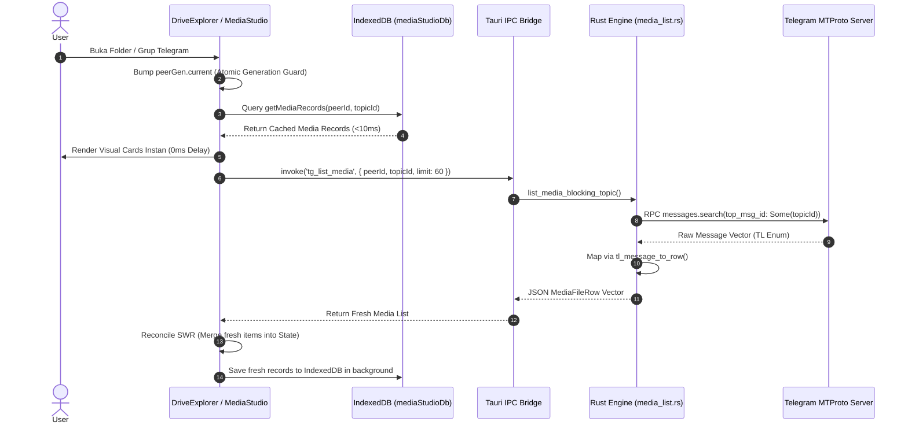
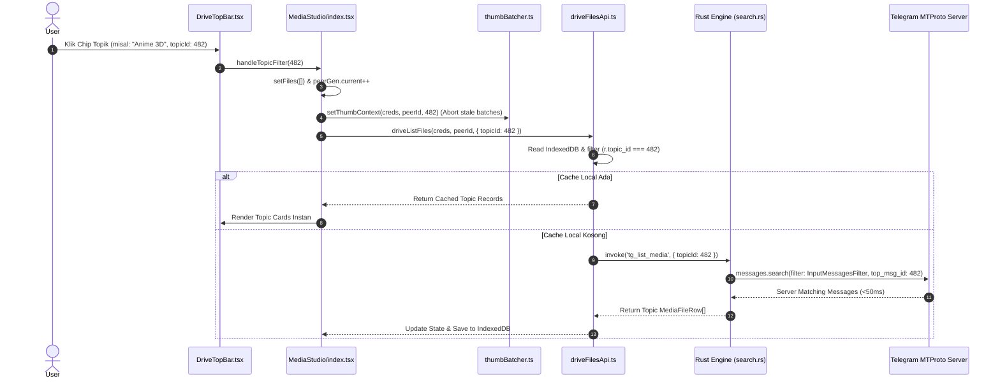
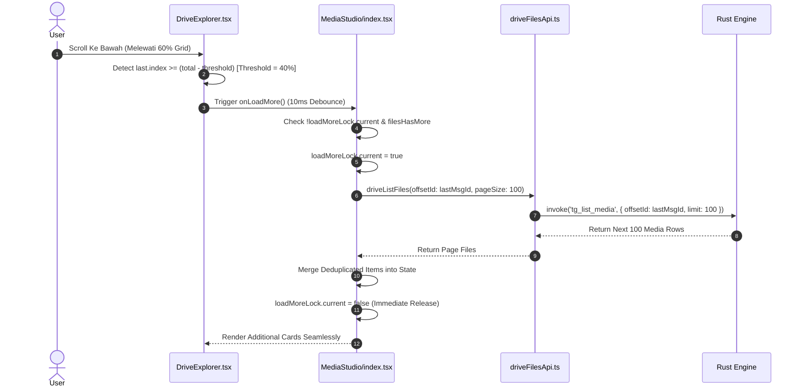
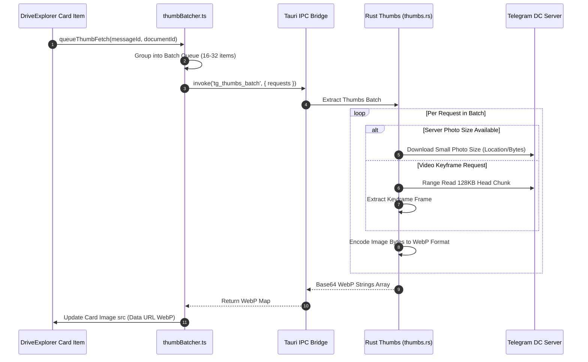
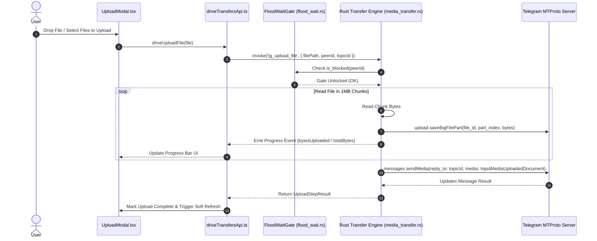
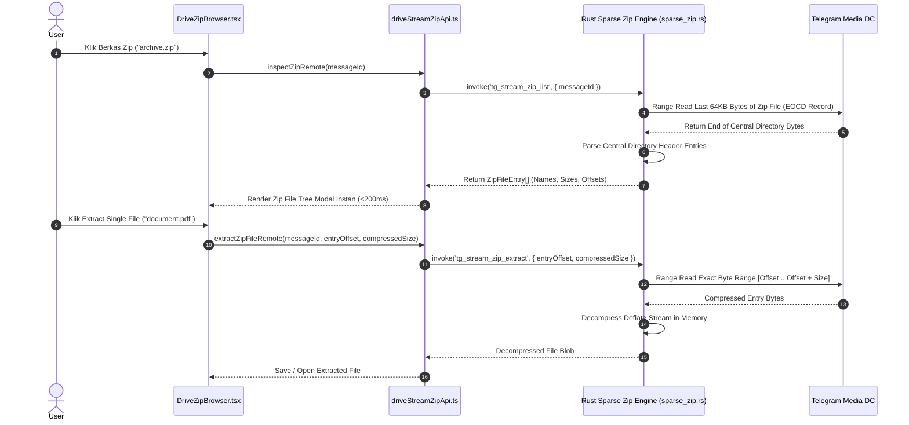
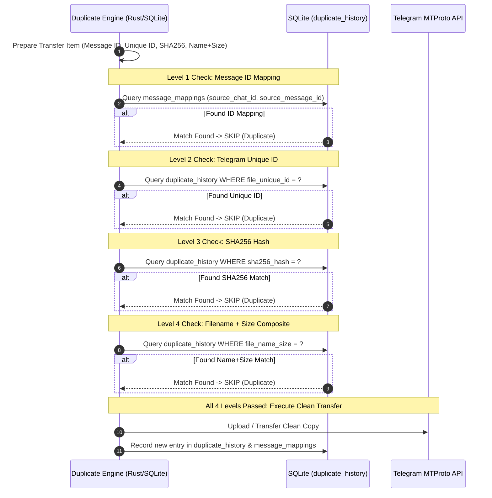
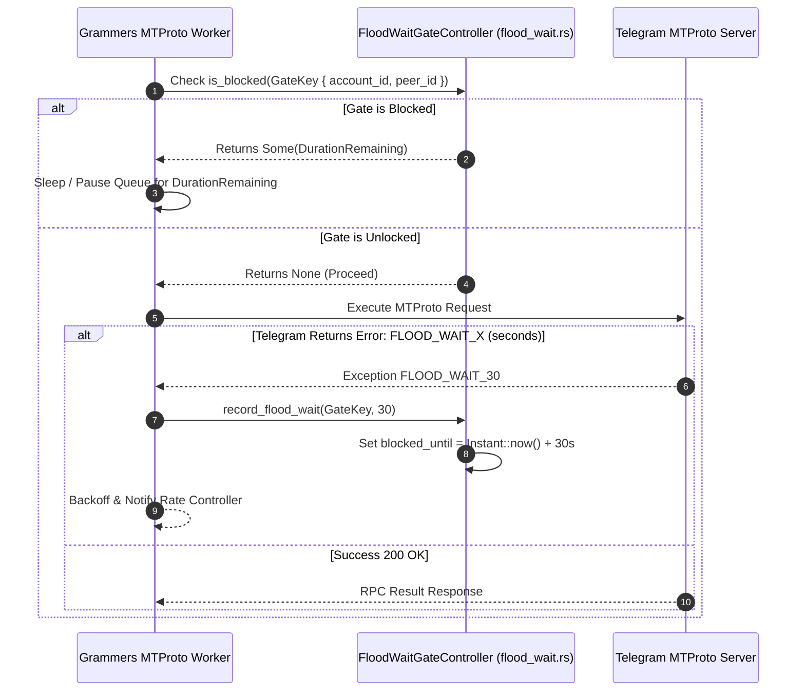
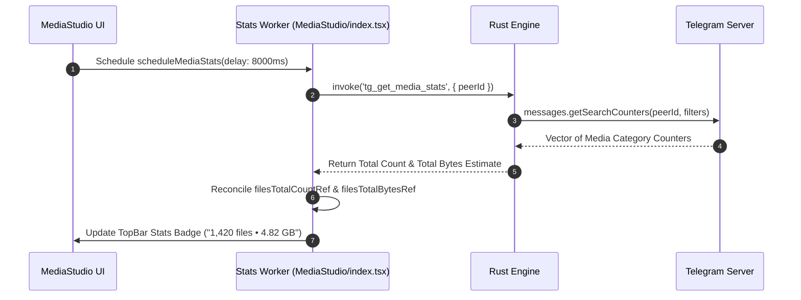
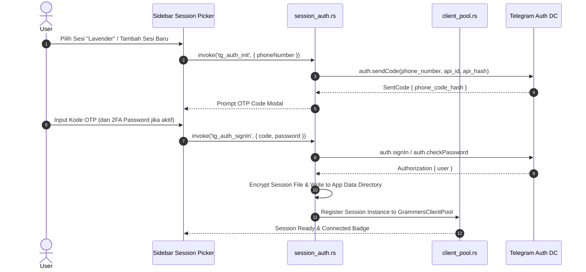

# AutoGram Master Architecture, WorkTree & Operational Workflow Specification

> **Dokumen Spesifikasi Teknis Master, Peta WorkTree Utuh, Diagram Sequence Mermaid & Manual Operational Workflow Real-World AutoGram App**  
> *Versi Rujukan Terintegrasi: v2.3.92 (Ultimate Comprehensive Master Edition)*  
> *Platform: Desktop Hybrid (Tauri + React 18 + Rust Grammers Engine + SQLite + IndexedDB)*

---

## 1. Pendahuluan & Filosofi Arsitektur Utama (Core Technical Philosophy)

AutoGram adalah platform manajemen, migrasi, dan eksplorasi media Telegram berbasis desktop yang menggunakan paradigma **Telegram-as-a-Drive**. Sistem ini dirancang untuk menangani pustaka media berskala besar (10.000+ hingga 1.000.000+ berkas per saluran/grup) dengan kecepatan eksekusi tinggi, penggunaan memori minimal, antarmuka responsif (*mobile-first & touch-first*), serta keandalan tingkat tinggi tanpa hambatan *FloodWait*.

```
┌──────────────────────────────────────────────────────────────────────────────────┐
│                             FRONTEND (React 18 + TS)                             │
│  MediaStudio ─── DriveTopBar ─── DriveExplorer ─── ThumbBatcher ─── mediaStudioDb│
└────────────────────────────────────────┬─────────────────────────────────────────┘
                                         │ Tauri IPC Invoke ('tg_*')
┌────────────────────────────────────────▼─────────────────────────────────────────┐
│                              TAURI BRIDGE (lib.rs)                               │
│  tg_list_media │ tg_open_topic_media │ tg_thumbs_batch │ tg_upload_file          │
└────────────────────────────────────────┬─────────────────────────────────────────┘
                                         │
┌────────────────────────────────────────▼─────────────────────────────────────────┐
│                      RUST CORE ENGINE (src-tauri/src)                            │
│ ┌───────────────────────────┐ ┌───────────────────────────┐ ┌──────────────────┐ │
│ │ Grammers MTProto Engine   │ │ Topic Media Feature Engine│ │ SQLite Repository│ │
│ │ (client_pool, media_list) │ │ (search, document_mapper) │ │ (topic_media.db) │ │
│ └─────────────┬─────────────┘ └─────────────┬─────────────┘ └────────┬─────────┘ │
└───────────────┼─────────────────────────────┼────────────────────────┼───────────┘
                │ MTProto API                 │ MTProto API            │ SQL I/O
┌───────────────▼─────────────────────────────▼─────────────┐ ┌────────▼──────────┐
│                   TELEGRAM MTPROTO SERVERS                │ │ LOCAL SQLITE DB   │
└───────────────────────────────────────────────────────────┘ └───────────────────┘
```

### 5 Pilar Utama Arsitektur Teknis:
1. **Grammers-Only Rust MTProto Backend**: Seluruh interaksi Telegram API (Otentikasi, List Media, Topic Search, Thumbnail Batch, Upload/Download Stream, Zip Stream) dieksekusi 100% secara native di Rust menggunakan **Grammers**. Tidak ada runtime Python/Telethon yang aktif.
2. **Local-First Stale-While-Revalidate (SWR) Cache**: Render antarmuka visual terjadi secara instan (<10ms) menggunakan data hangat dari IndexedDB (`mediaStudioDb.ts`) atau SQLite (`topic_media.db`), disusul oleh pembaruan delta secara silent dari server Telegram.
3. **Server-Side MTProto Topic Filtering (`top_msg_id`)**: Pemfilteran topik pada forum supergroup Telegram dilakukan langsung di server Telegram via `messages.search` berparameter `top_msg_id`, menghasilkan pencarian <50ms tanpa pemindaian pesan sekensial di client.
4. **Proactive Streaming Infinite Scroll**: Antarmuka `DriveExplorer` memicu prefetch halaman berikutnya secara proaktif pada posisi 40% sebelum dasar grid (8–25 baris tersisa), sehingga pengguna tidak pernah mengalami hambatan *spinner loading*.
5. **Fail-Closed Generation Protection (`peerGen.current`)**: Setiap perubahan lokasi/topik menaikkan atomic generation counter (`peerGen.current`), yang secara otomatis menggugurkan (*abort*) callback dan request yang terlambat, menjamin 0% kebocoran data (*media bleed*) antar topik.

---

## 2. Peta WorkTree Repository Utuh (Exhaustive Directory Map)

```
AutoGram App/
├── database/
│   └── schema.sql                                  # Skema SQLite Offline (Users, Accounts, Executions, Duplicate History)
├── docs/
│   └── architecture/
│       ├── AUTOGRAM_MASTER_ARCHITECTURE_WORKFLOW.md  # Dokumen Spesifikasi Utama Ini
│       ├── RUST_GRAMMERS_BACKEND.md                # Spesifikasi Grammers Engine
│       └── SYSTEM_ARCHITECTURE.md                  # Peta Komponen Sistem
├── frontend/
│   ├── src/
│   │   ├── components/
│   │   │   └── drive/                              # Komponen Antarmuka AutoGram Drive
│   │   │       ├── Explorer/
│   │   │       │   ├── DriveExplorer.tsx           # Manajer Berkas Grid/List Virtualized UI
│   │   │       │   └── DriveMarqueeOverlay.tsx     # Overlay Seleksi Kotak Drag
│   │   │       ├── Modals/
│   │   │       │   ├── DriveConfirmDialog.tsx     # Dialog Konfirmasi Hapus/Pindah
│   │   │       │   ├── RemoteUrlModal.tsx         # Modal Remote Web Downloader
│   │   │       │   └── UploadModal.tsx            # Modal Antrean Unggah Berkas
│   │   │       ├── Navigation/
│   │   │       │   ├── DriveTopBar.tsx             # Filter Chip Topik, Mode Tampilan, Search, Sort
│   │   │       │   └── DriveSidebarIndex.tsx       # Navigasi Chat, Folder, & Session Picker
│   │   │       ├── DrivePreviewModal/
│   │   │       │   └── DrivePreviewModal.tsx       # Modal Preview Gambar/Video/Audio/Pdf
│   │   │       ├── DriveToolsPanel/
│   │   │       │   └── DriveToolsPanel.tsx         # Panel Alat Bantu Batch Operations
│   │   │       ├── DriveZipBrowser/
│   │   │       │   └── DriveZipBrowser.tsx         # Penjelajah Berkas Kompresi Zip Remote
│   │   │       └── Transfers/
│   │   │           └── DriveTransfersPanel.tsx     # Panel Monitor Progress Upload/Download
│   │   ├── lib/
│   │   │   ├── db/
│   │   │   │   └── mediaStudioDb.ts                # Warm Cache Layer IndexedDB
│   │   │   ├── media/
│   │   │   │   ├── thumbBatcher.ts                 # Pengelola Antrean Batch Thumbnail WebP
│   │   │   │   ├── avatarBatcher.ts                # Batching Foto Profil Sidebar
│   │   │   │   └── previewCache.ts                 # Cache Memory Preview Berkas
│   │   │   ├── tauri/
│   │   │   │   └── platform.ts                     # Deteksi Runtime Desktop Tauri
│   │   │   ├── utils/
│   │   │   │   └── devicePerformance.ts            # Deteksi Device Perf Tier (low, mid, high)
│   │   │   └── telegram/                           # Abstraksi Telegram Drive Frontend
│   │   │       ├── core/
│   │   │       │   ├── telegramBackend.ts          # Bridge Tauri IPC Invoke (`tg_*`)
│   │   │       │   ├── sessionGuard.ts             # Session Expiry & Relogin Guard
│   │   │       │   └── sessionPicker.ts            # Session State Picker Helper
│   │   │       ├── driveApi/
│   │   │       │   ├── driveFilesApi.ts            # API List, Batch Thumbs, Delete, Move
│   │   │       │   ├── driveFoldersApi.ts          # API List Dialogs/Channels & Topics
│   │   │       │   ├── driveStreamZipApi.ts        # API Streaming Remote ZIP
│   │   │       │   └── driveTransfersApi.ts        # API Single/Batch Upload File
│   │   │       ├── interaction/
│   │   │       │   ├── driveLoadStaging.ts         # Batas Staged Pagination & Page Sizes
│   │   │       │   ├── driveLiveSync.ts            # Sinkronisasi Realtime Head Server
│   │   │       │   ├── driveSelection.ts           # Logika Seleksi Berkas Multi-Select
│   │   │       │   └── driveDrag.ts                # Logika Drag-and-Drop Berkas Internal/OS
│   │   │       └── driveTypes.ts                   # Type Definition DriveFile, DriveTopic, dsb.
│   │   ├── pages/
│   │   │   └── MediaStudio/
│   │   │       ├── index.tsx                       # Orchestrator Halaman Utama AutoGram Drive
│   │   │       ├── MediaStudioSidebar.tsx          # Sidebar Sesi & Topik
│   │   │       └── mediaStudioUtils.ts             # Format Bytes, Sorting, & Snapshot Storage
│   │   ├── locales/                                # Internasionalisasi (100% Zero Hardcoded Text)
│   │   │   ├── id/*.json                           # Bahasa Indonesia
│   │   │   └── en/*.json                           # Bahasa Inggris
│   │   ├── App.tsx                                 # Root Router React
│   │   └── main.tsx                                # Entrypoint React Vite
│   └── src-tauri/                                  # Backend Engine Rust Native
│       ├── Cargo.toml                              # Dependensi Rust (Grammers, Tauri, Rusqlite, Tokio)
│       └── src/
│           ├── lib.rs                              # Registrasi Tauri Commands (`tg_*`)
│           ├── core/
│           │   ├── app_db.rs                       # Inisialisasi Database SQLite (`app.db`)
│           │   ├── path_policy.rs                  # Manajemen Path Sesi & Storage Local
│           │   ├── session_guard.rs                # Session Guard Engine
│           │   ├── session_rate.rs                 # Rate Limiting Engine per Session
│           │   ├── telegram_ops.rs                 # Handler Tauri Commands & Sync Routing
│           │   ├── tg_error.rs                     # Pemetaan Error Standard & FloodWait
│           │   ├── grammers_ops/
│           │   │   ├── client_pool.rs              # Pool Koneksi Grammers MTProto
│           │   │   ├── media_list.rs               # Server Search & List Media Blocking
│           │   │   ├── media_transfer.rs           # Core Upload & Download Engine
│           │   │   ├── peer_resolver.rs            # Resolver Peer ID & LRU Peer Cache
│           │   │   └── session_auth.rs             # Login, 2FA, OTP, & Sesi Key Storage
│           │   └── grammers/                       # Handler Thumbnail, Stream, & Sparse Zip
│           │       ├── thumbs.rs                   # Ekstraksi WebP Server Thumbnails
│           │       ├── stream.rs                   # Streaming Downloader & Seeking
│           │       └── sparse_zip.rs               # Direct Remote Zip Central Directory Reader
│           └── features/
│               └── topic_media/                    # Modul Khusus Topik Media Local-First
│                   ├── commands.rs                 # Tauri Commands Topic Media (`tg_open_topic_*`)
│                   ├── error.rs                    # Topic Media Exception Handlers
│                   ├── events.rs                   # Scoped Batch Events Engine
│                   ├── legacy_adapter.rs           # Adapter Migrasi Data SQLite
│                   ├── models.rs                   # Entity Data TopicMediaItem
│                   ├── repository.rs               # SQLite Storage Operations (`topic_media_items`)
│                   ├── service.rs                  # Orchestrator Layanan Topik Media
│                   ├── cache/
│                   │   └── disk.rs                 # WebP Disk Cache Manager
│                   ├── mtproto/
│                   │   ├── search.rs               # MTProto Search `top_msg_id`
│                   │   └── document_mapper.rs         # Mapper Message TL ke Domain Model
│                   ├── scheduler/
│                   │   ├── flood_wait.rs           # FloodWait Gate Controller Global
│                   │   ├── metrics.rs              # Pengukur Kinerja Scheduler
│                   │   ├── queue.rs                # Priority Queue Requests
│                   │   ├── rate_limit.rs           # Adaptive Backoff Rate Limiter
│                   │   └── worker_pool.rs          # DC Worker Pool Management
│                   └── thumbnail/
│                       ├── fallback_icon.rs        # Smart Icon Name Fallback
│                       ├── format_registry.rs      # Preview Capability Registry
│                       ├── frame_selector.rs       # Video Keyframe Selector
│                       ├── image_extractor.rs      # Fast Image Resizer
│                       ├── mode_profile.rs         # Thumbnail Quality Profile
│                       ├── pdf_extractor.rs        # PDF First-Page Renderer
│                       ├── range_reader.rs         # Partial Byte Range Reader
│                       └── resolver.rs             # Strategy Resolver Thumbnail
```

---

## 3. Spesifikasi Komponen & Antarmuka Fungsi Detail

### A. Lapisan Frontend (TypeScript / React)

| Nama File | Lokasi Path | Peran & Tujuan Modul | Spesifikasi Fungsi-Fungsi Detail & Cara Kerja | Input / State Used | Output & Side Effects |
| :--- | :--- | :--- | :--- | :--- | :--- |
| `MediaStudio/index.tsx` | `src/pages/MediaStudio/` | **Core Page Orchestrator** | • `refreshFiles()`: Menginisialisasi pemuatan media. Menarik data IndexedDB terlebih dahulu (Step A), kemudian memicu IPC Rust `tgListMedia` (Step B).<br>• `loadMoreFiles()`: Memuat halaman berkas berikutnya menggunakan `stagedLoadMorePageSize`, menggabungkan item baru tanpa duplikat.<br>• `syncActiveLocationLive()`: Polling silent ke head server Telegram setiap interval tertentu.<br>• `handleTopicFilter()`: Mengubah topik aktif, menaikkan atomic `peerGen.current`, dan mengosongkan state `files`. | • `creds`, `peerId`, `topicFilter`, `sortMode`, `files`<br>• `peerGen.current` | • Update React State `files`<br>• Save to IndexedDB<br>• Reset Thumbnail Queue |
| `DriveExplorer.tsx` | `src/components/drive/Explorer/` | **Virtualized Grid/List UI** | • `useVirtualizer()`: Menghitung dan me-render baris kartu yang hanya berada di viewport aktif.<br>• `useEffect Scroll Listener`: Memeriksa `last.index >= total - threshold`. Jika berada 40% mendekati bottom (8–25 baris), memicu `onLoadMore()` dengan debounce 10ms.<br>• `handleMarqueeSelect()`: Mengalkulasi posisi bounding box drag mouse untuk memilih kartu media secara simultan. | • `displayed` files<br>• `viewMode` (grid/list)<br>• `selectedIds`<br>• `loadingMore` | • Trigger `onLoadMore()`<br>• Update `selectedIds`<br>• Context Menu Callbacks |
| `DriveTopBar.tsx` | `src/components/drive/Navigation/` | **Top Navigation & Filter** | • `renderTopicChips()`: Me-render daftar chip topik forum Telegram (`All Media`, `General`, `AI`, dll.) dengan indikator aktif.<br>• `handleSearchChange()`: Mengisi kata kunci pencarian instan.<br>• `handleSortChange()`: Mengubah mode pengurutan (Newest first, Oldest first, Size, Name).<br>• `handleThumbQualityChange()`: Mengubah mode kualitas thumbnail (`Saver`, `Balanced`, `Sharp`). | • `topics` list<br>• `topicFilter`<br>• `sortMode`<br>• `thumbQuality` | • Call `onTopicChange()`<br>• Call `onSortChange()`<br>• Trigger `refreshVisibleThumbs()` |
| `MediaStudioSidebar.tsx` | `src/pages/MediaStudio/` | **Sidebar Navigasi & Sesi** | • `renderSessionPicker()`: Dropdown pemilih akun Telegram aktif (`Connected Session`).<br>• `renderFolderList()`: Daftar saluran/grup populer (`#Gudang`, `Saved Messages`, `Telegram`, dll.).<br>• `renderTopicSelector()`: Daftar topik forum pada grup yang sedang terbuka. | • `sessions` list<br>• `activeSession`<br>• `folders` list<br>• `activeFolderId` | • Call `onSessionChange()`<br>• Call `onFolderSelect()` |
| `driveFilesApi.ts` | `src/lib/telegram/driveApi/` | **Frontend Data Service** | • `driveListFiles()`: Mengambil list media. Memfilter IndexedDB berdasarkan `topic_id`. Jika kosong, memanggil `tgListMedia`.<br>• `driveThumbnailsBatch()`: Mengirim batch request thumbnail ke Rust via `tg_thumbs_batch`.<br>• `driveDeleteFiles()`: Memanggil `tg_delete_messages` untuk menghapus pesan di Telegram dan IndexedDB. | • `creds`, `folderId`, `topicId`, `offsetId`, `pageSize` | • Return `DriveFile[]`<br>• IndexedDB Read/Write<br>• IPC Invoke `tg_*` |
| `driveFoldersApi.ts` | `src/lib/telegram/driveApi/` | **Folder & Topic Service** | • `driveListDialogs()`: Mengambil daftar saluran, grup, dan chat pribadi dari Telegram via `tg_get_dialogs`.<br>• `driveListTopics()`: Mengambil daftar topik forum pada supergroup via `tg_get_topics`. | • `creds`, `limit`, `offset` | • Return `DriveFolder[]`<br>• Return `DriveTopic[]` |
| `driveStreamZipApi.ts` | `src/lib/telegram/driveApi/` | **Remote Zip Stream API** | • `inspectZipRemote()`: Membaca Central Directory file `.zip` remote via byte-range reading (EOCD).<br>• `extractZipFileRemote()`: Mengambil byte file spesifik dalam `.zip` dan me-dekompresi stream Deflate di memory. | • `creds`, `peerId`, `messageId`, `entryOffset`, `compressedSize` | • Return `ZipFileEntry[]`<br>• Return Decompressed Blob |
| `driveTransfersApi.ts` | `src/lib/telegram/driveApi/` | **Upload/Download Service** | • `driveUploadFile()`: Mengunggah berkas lokal ke Telegram via IPC `tg_upload_file` dengan progress callback.<br>• `driveDownloadFile()`: Mengunduh media Telegram ke direktori lokal via IPC `tg_download_file`. | • `creds`, `peerId`, `topicId`, `filePath`, `progressCb` | • Emit Progress Event<br>• Write to Local Storage |
| `telegramBackend.ts` | `src/lib/telegram/core/` | **Tauri IPC Bridge Wrapper** | • `tgListMedia()`: Invoker IPC ke command Rust `tg_list_media`.<br>• `tgOpenTopicMedia()`: Invoker IPC ke `tg_open_topic_media`.<br>• `tgThumbsBatch()`: Invoker IPC ke `tg_thumbs_batch`.<br>• `tgDeleteMessages()`: Invoker IPC ke `tg_delete_messages`. | • Command string (`tg_*`)<br>• Serialized JSON payload | • Return Promise<Parsed Result><br>• Handle IPC Errors |
| `mediaStudioDb.ts` | `src/lib/db/` | **IndexedDB Storage Layer** | • `saveMediaRecords()`: Menyimpan array `MediaRecord` ke store `media`.<br>• `getMediaRecords()`: Membaca berkas media per folderId.<br>• `saveThumbnail()`: Menyimpan binary WebP blob ke store `thumbnails`.<br>• `getThumbnail()`: Membaca binary WebP blob berdasarkan `folderId_messageId`. | • `folderId`, `MediaRecord`, `ThumbnailRecord` | • IndexedDB Transactions<br>• Instant UI Data |
| `thumbBatcher.ts` | `src/lib/media/` | **Thumbnail Queue Manager** | • `queueThumbFetch()`: Memasukkan request thumbnail ke queue memori.<br>• `processQueue()`: Membagi request menjadi batch 16–32 item dan memanggil `tgThumbsBatch`.<br>• `setThumbContext()`: Mereset antrean thumbnail saat beralih lokasi/topik. | • `messageId`, `documentId`, `thumbQuality` | • Dispatches `tgThumbsBatch`<br>• Card Image src Updates |
| `driveLoadStaging.ts` | `src/lib/telegram/interaction/` | **Pagination Limit Specs** | • `stagedInitialPageSize()`: Return ukuran page awal (Low: 40, Mid: 60, High: 100).<br>• `stagedLoadMorePageSize()`: Return ukuran load-more (Low: 60, Mid: 100, High: 150). | • Device `PerfTier` (`low`, `mid`, `high`), `configured` | • Return `number` (pageSize) |

---

### B. Lapisan Backend Engine Rust Native (`src-tauri/src/`)

| Nama File / Modul | Lokasi Path | Struct / Enum / Trait Utama | Spesifikasi Fungsi-Fungsi Detail & Cara Kerja | Internal Calls & Side Effects |
| :--- | :--- | :--- | :--- | :--- |
| `lib.rs` | `src-tauri/src/` | • `tauri::Builder`<br>• Tauri Commands | • `run()`: Entrypoint Tauri App. Mendaftarkan seluruh command (`tg_list_media`, `tg_open_topic_media`, `tg_thumbs_batch`, `tg_upload_file`, `tg_delete_messages`, dll.) dan menginisialisasi plugin database. | • Inisialisasi State Manager<br>• Mount Command Handlers |
| `telegram_ops.rs` | `src-tauri/src/core/` | • `TelegramOpsHandler`<br>• `MediaFileRow` | • `handle_list_media()`: Pintu masuk command `tg_list_media`. Memanggil `list_media_blocking_topic`.<br>• `handle_upload_file()`: Memanggil `upload_file_blocking` di `media_transfer.rs`.<br>• `handle_thumbs_batch()`: Memanggil `extract_thumbs_batch` di `thumbs.rs`. | • Dispatches Tokio Async Tasks<br>• Error Mapping to `TgErrorPublic` |
| `media_list.rs` | `src-tauri/src/core/grammers_ops/` | • `MediaFileRow`<br>• `tl_message_to_row()` | • `list_media_blocking_topic()`: Pengeksekusi query server Telegram: jika `topic_id > 0`, membentuk `tl::functions::messages::Search` berparameter `top_msg_id: Some(topic_id)`.<br>• `tl_message_to_row()`: Memetakan raw TL Message (`tl::enums::Message`) langsung ke `MediaFileRow` tanpa dependensi `PeerMap`. | • Invokes Grammers MTProto Client<br>• Returns JSON `Vec<MediaFileRow>` |
| `client_pool.rs` | `src-tauri/src/core/grammers_ops/` | • `GrammersClientPool`<br>• `SessionInstance` | • `get_client()`: Mengambil atau menginisialisasi instance Grammers client untuk sesi terdaftar.<br>• `import_telethon_session()`: Membaca file `.session` Telethon dan mengonversinya ke format Grammers. | • TCP Connections to Telegram DCs<br>• Key Storage & Session Files |
| `peer_resolver.rs` | `src-tauri/src/core/grammers_ops/` | • `PeerResolverCache`<br>• `InputPeer` | • `resolve_peer_ref()`: Mengonversi ID string (`"me"`, `"-1001928374"`, `"@channel"`) menjadi `tl::enums::InputPeer` yang valid dengan caching LRU memori. | • LRU Memory Lookup<br>• Telegram RPC ResolveUsername |
| `session_auth.rs` | `src-tauri/src/core/grammers_ops/` | • `AuthSessionState`<br>• `AuthStatus` | • `init_auth()`: Mengirim kode OTP ke nomor telepon (`auth.sendCode`).<br>• `sign_in()`: Memverifikasi kode OTP & password 2FA (`auth.signIn` / `auth.checkPassword`). | • Writes Encrypted Session File<br>• Registers Client to Pool |
| `repository.rs` | `src-tauri/src/features/topic_media/` | • `TopicMediaItem`<br>• `TopicMediaContext` | • `get_cached_page()`: Membaca halaman berkas dari SQLite `topic_media_items` berparameter `account_id, peer_id, topic_id, message_date DESC, message_id DESC`.<br>• `upsert_topic_media_batch()`: Memasukkan/memperbarui batch berkas media ke SQLite dalam 1 transaksi atomic (`BEGIN TRANSACTION`). | • SQLite SQL Execution<br>• DB Transactions on `app.db` |
| `search.rs` | `src-tauri/src/features/topic_media/mtproto/` | • `TopicMediaSearchQuery`<br>• `FilterType` | • `build_search_request()`: Membentuk objek `tl::functions::messages::Search` berparameter `peer`, `q`, `filter`, `top_msg_id`, `offset_id`, `limit`. | • Returns TL Search Struct |
| `document_mapper.rs` | `src-tauri/src/features/topic_media/mtproto/` | • `DocumentAttributes` | • `map_document_to_item()`: Membedah atribut dokumen Telegram (Filename, MimeType, Video/Audio/Image flags) menjadi model domain `TopicMediaItem`. | • Attribute Extraction |
| `thumbs.rs` | `src-tauri/src/core/grammers/` | • `ThumbRequest`<br>• `ThumbResult` | • `extract_thumbs_batch()`: Memproses batch request thumbnail. Mengunduh photo size terdistribusi atau membaca 128KB head chunk video untuk diekstrak menjadi WebP byte stream. | • Range Read Bytes from Telegram<br>• Image WebP Encoder |
| `sparse_zip.rs` | `src-tauri/src/core/grammers/` | • `ZipFileEntry`<br>• `ZipHeaderParser` | • `read_remote_zip_cd()`: Membaca 64KB byte terakhir file `.zip` remote di Telegram untuk mengambil End of Central Directory (EOCD) dan me-parse daftar berkas.<br>• `extract_remote_zip_entry()`: Membaca byte range spesifik dan me-dekompresi Deflate stream di memory. | • Telegram Range Read RPC<br>• Flate2 Deflate Decoder |
| `flood_wait.rs` | `src-tauri/src/features/topic_media/scheduler/` | • `FloodWaitGateController`<br>• `GateState` | • `is_blocked()`: Memeriksa apakah target peer/account sedang terkunci `FLOOD_WAIT`.<br>• `record_flood_wait()`: Mengunci peer selama `seconds` detik jika Telegram mengembalikan error `FLOOD_WAIT_X`. | • Thread-safe Mutex Map<br>• Global Failsafe Locking |

---

## 4. Diagram Sequence Workflow Lengkap (Mermaid)

### 4.1 Bootstrapping & SWR Warm Cache Initial Paint Workflow



---

### 4.2 Topic Selection & Server-Side Filtering Workflow



---

### 4.3 Proactive Infinite Streaming Pagination Workflow



---

### 4.4 Multi-Lane Progressive WebP Thumbnail Queue Workflow



---

### 4.5 Parallel File Uploading & Progress Callback Workflow



---

### 4.6 Remote Stream ZIP Inspection & Extraction Workflow



---

### 4.7 Clean-Copy Duplicate Prevention Engine Workflow



---

### 4.8 Smart Rate Controller & Global FloodWait Gate Workflow



---

### 4.9 Background Media Stats Walking & Dynamic Reconciler



---

### 4.10 Multi-Session Authentication & Telethon Session Auto-Import



---

## 5. Alur Kerja Operasional Nyata (Real-World Operational Workflows)

### 5.1 Real Workflow 1: Bootstrapping Sesi, Auto-Import Telethon, & Warm Cache SWR
Ketika pengguna membuka AutoGram App pertama kali:
1. **App Mount & Session Probe**: Frontend `App.tsx` mengeksekusi IPC `tg_get_sessions`.
2. **Telethon Session Auto-Import**: Core Rust (`client_pool.rs`) memindai direktori aplikasi lokal. Jika menemukan file `.session` Telethon lama, Rust mengeksekusi `import_telethon_session()`, mengonversi kunci auth secara otomatis, dan mendaftarkannya ke `GrammersClientPool`.
3. **Instant Visual Paint (<10ms)**: Frontend `MediaStudio/index.tsx` membaca IndexedDB `getMediaRecords(peerId)`. Berkas media dari sesi sebelumnya langsung tampil di antarmuka tanpa menanti jaringan.
4. **Background Live Sync**: Dalam 50ms disusul panggilan IPC `tg_list_media`, mengambil head pesan terbaru dari server Telegram, memperbarui IndexedDB, dan melakukan rekonsiliasi data (*Stale-While-Revalidate*).

### 5.2 Real Workflow 2: Pemilihan Topik Forum & Server-Side Filtering (`messages.search` `top_msg_id`)
Ketika pengguna mengklik chip topik (misal: Topic "Donghua 3D", ID: 482):
1. **Generation Counter Bump**: `MediaStudio/index.tsx` menaikkan `peerGen.current` (atomic counter). Seluruh request thumbnail dan pagination dari topik lama yang masih berjalan secara otomatis dibatalkan.
2. **Local Cache Read**: `driveFilesApi.ts` membaca IndexedDB dengan filter `r.topic_id === 482`. Jika ada, data topik tampil instan di `DriveExplorer.tsx`.
3. **MTProto Server-Side Search**: Jika cache topik lokal belum terisi, `driveListFiles` memanggil `tgListMedia` dengan `topicId: 482`.
4. **Direct Top-Message Request**: Modul Rust `media_list.rs` membangun struct `tl::functions::messages::Search` berparameter `top_msg_id: Some(482)`. Telegram Server memfilter dan mengembalikan pesan khusus topik tersebut dalam waktu <50ms.
5. **Direct Enum Mapping**: Fungsi `tl_message_to_row` di Rust memetakan `tl::enums::Message` langsung menjadi `MediaFileRow` tanpa dependensi `PeerMap`.

### 5.3 Real Workflow 3: Proactive Streaming Infinite Scroll & Staged Offset Pagination
Ketika pengguna me-scroll antarmuka `DriveExplorer`:
1. **Proactive Threshold Detection**: `useEffect` scroll detector di `DriveExplorer.tsx` memantau indeks kartu visual terakhir. Begitu pengguna me-scroll melewati 60% grid (tersisa 8–25 baris kartu / 48–150 item), `onLoadMore()` dipanggil dengan debounce 10ms.
2. **Staged Load Page Size**: `MediaStudio/index.tsx` mengambil batas ukuran halaman berdasarkan tingkat performa perangkat (`stagedLoadMorePageSize`: Low: 60, Mid: 100, High: 150 item).
3. **Continuous Merging**: Berkas baru digabungkan ke state `files` dengan pengecekan Set ID unik. `loadMoreLock.current` langsung dilepas kembali (`false`), memungkinkan pengguna me-scroll terus-menerus tanpa pernah menjumpai spinner penundaan.

### 5.4 Real Workflow 4: Multi-Lane Thumbnail Extraction (Photo vs Video Keyframe Range Read)
Ketika kartu media tampil di layar `DriveExplorer`:
1. **Queueing Visible Items**: Card item memanggil `queueThumbFetch(messageId, documentId)` pada `thumbBatcher.ts`.
2. **Batch IPC Request**: `thumbBatcher` mengelompokkan request menjadi batch 16–32 item dan memicu IPC `tg_thumbs_batch`.
3. **Dual Extraction Pipeline in Rust (`thumbs.rs`)**:
   - *Foto*: Mengunduh thumbnail `PhotoSize` kecil dari Telegram DC.
   - *Video*: Membaca 128KB head chunk pertama dari berkas video (`Range Read`), mengekstraksi keyframe frame secara native di memory.
4. **WebP Encoding & Blob Caching**: Hasil ekstraksi di-encode menjadi format WebP modern, dikembalikan sebagai Base64 string ke JS, dan disimpan ke IndexedDB `thumbnails` store.

### 5.5 Real Workflow 5: Upload Berkas 1.5GB dengan Chunking 1MB & Progress Bar Callback
Ketika pengguna mengunggah berkas video 1.5GB:
1. **FloodWait Gate Check**: Modul Rust `media_transfer.rs` memeriksa `FloodWaitGateController`. Jika gate unlocked, proses dimulai.
2. **1MB Chunking Loop**: Berkas dibaca per blok 1MB. Setiap chunk diunggah via Grammers MTProto `upload.saveBigFilePart(file_id, part_index, bytes)`.
3. **Progress Callback**: Rust mengirimkan event progress `(bytesUploaded / totalBytes)` secara realtime ke frontend untuk mengupdate progress bar di `DriveTransfersPanel.tsx`.
4. **Message Dispatch & Duplicate Indexing**: Setelah seluruh chunk terkirim, Rust mengeksekusi `messages.sendMedia(reply_to: topicId)`. Berkas baru dicatat ke SQLite `duplicate_history` (SHA256, Unique ID, Name+Size) dan `uploadSoftRefresh()` memperbarui UI.

### 5.6 Real Workflow 6: Remote Stream ZIP Central Directory Reading & Single Entry Extraction
Ketika pengguna mengklik berkas `.zip` 500MB di Drive:
1. **Remote EOCD Range Read**: `driveStreamZipApi.ts` memanggil IPC `tg_stream_zip_list`. Modul Rust `sparse_zip.rs` membaca 64KB byte terakhir berkas `.zip` dari Telegram DC untuk mengambil End of Central Directory (EOCD) Record.
2. **Instant Zip Tree Render**: Rust me-parse entri Central Directory dan mengembalikan daftar berkas (`ZipFileEntry[]`). Modal `DriveZipBrowser.tsx` me-render struktur folder/file di dalam zip dalam waktu <200ms **tanpa mengunduh 500MB berkas zip**.
3. **Single File Extraction**: Jika pengguna mengklik "Extract document.pdf" (ukuran 2MB pada offset 120MB), Rust mengeksekusi MTProto byte range read *hanya* pada rentang `[120MB .. 122MB]`, me-dekompresi Deflate stream di memory, dan mengembalikan file pdf tersebut secara langsung.

### 5.7 Real Workflow 7: Clean-Copy Duplicate Prevention Engine (4-Level Hash/ID Check)
Saat dilakukan pemindahan atau migrasi media (*Clean Copy*):
1. **Level 1 (Message ID Mapping)**: Pengecekan tabel SQLite `message_mappings(source_chat_id, source_message_id)`. Jika sudah ada, transfer di-skip.
2. **Level 2 (Telegram Unique ID)**: Pengecekan tabel SQLite `duplicate_history` berdasarkan `file_unique_id`. If match, transfer di-skip.
3. **Level 3 (SHA256 Checksum)**: Pengecekan binary hash `sha256_hash`. If match, transfer di-skip.
4. **Level 4 (Filename + FileSize Composite)**: Pengecekan string `file_name_size`. If match, transfer di-skip.
5. **Execution**: Transfer hanya dijalankan jika ke-4 level pengecekan menyatakan berkas belum pernah diunggah.

### 5.8 Real Workflow 8: Fail-Closed Smart Rate Controller & Global FloodWait Gate
Ketika Telegram API mengembalikan exception `FLOOD_WAIT_45` (45 detik):
1. **Exception Interception**: Modul Rust `tg_error.rs` menangkap `FloodWaitError(45)`.
2. **Global Gate Locking**: `FloodWaitGateController` di `flood_wait.rs` mencatat `GateKey { account_id, peer_id }` dengan `blocked_until = Instant::now() + 45s`.
3. **Failsafe Queue Pause**: Seluruh request MTProto berikutnya ke target peer/account secara otomatis tertahan di queue tanpa mengirim RPC baru ke Telegram.
4. **Silent Resumption**: Begitu timer 45 detik berakhir, gate terbuka kembali secara otomatis dan antrean request dilanjutkan tanpa error crash atau pemblokiran IP.

### 5.9 Real Workflow 9: Background Media Stats Worker & Dynamic Location Reconciler
Saat aplikasi terbuka:
1. **Deferred Stats Execution**: `MediaStudio/index.tsx` menjadwalkan `scheduleMediaStats` dengan delay 8.000ms (tidak mengganggu render grid awal).
2. **Category Counters RPC**: Rust memanggil RPC Telegram `messages.getSearchCounters` untuk menghitung total foto, video, dokumen, audio, dan file link.
3. **UI Badge Update**: Total berkas dan estimasi kapasitas folder diperbarui secara dinamis di `DriveTopBar.tsx` (misal: `"1,420 files • 4.82 GB"`).

### 5.10 Real Workflow 10: Deletion & Batch Action Queue Execution
Ketika pengguna menghapus 10 berkas media:
1. **Optimistic UI Removal**: Berkas langsung dihilangkan dari antarmuka `DriveExplorer.tsx`.
2. **Action Queue Insertion**: Tindakan hapus dicatat ke IndexedDB `actionQueue` dengan status `'pending'`.
3. **Server Execution**: Frontend memanggil `driveDeleteFiles()`, memicu IPC `tg_delete_messages`. Rust menghapus pesan dari Telegram server dan memperbarui SQLite `topic_media_items` (`is_deleted = 1`).
4. **Cache Cleanup**: Entri thumbnail terkait dihilangkan dari IndexedDB `thumbnails` store.

---

## 6. Spesifikasi Lengkap Skema Database & Storage

### A. Tabel SQLite Desktop Offline (`database/schema.sql` & `app.db`)

#### 1. Tabel `topic_media_items` (Index Media Topik Local-First)
| Nama Kolom | Tipe Data | Constraints / Nullable | Fungsi & Peran Kolom | Indeks Terkait |
| :--- | :--- | :--- | :--- | :--- |
| `account_id` | `TEXT` | `NOT NULL`, `PRIMARY KEY (1)` | Hash ID akun/sesi Telegram pemilik berkas. | `idx_topic_media_lookup` |
| `peer_id` | `TEXT` | `NOT NULL`, `PRIMARY KEY (2)` | ID saluran, grup, atau chat Telegram (`-100...`). | `idx_topic_media_lookup` |
| `topic_id` | `INTEGER` | `NOT NULL`, `PRIMARY KEY (3)` | ID Topik forum Telegram (`0` jika General/All Media). | `idx_topic_media_lookup` |
| `message_id` | `INTEGER` | `NOT NULL`, `PRIMARY KEY (4)` | ID Pesan unik pada Telegram chat. | `idx_topic_media_lookup` |
| `message_date` | `INTEGER` | `NOT NULL` | Epoch Unix Timestamp saat pesan terkirim. | `idx_topic_media_lookup` |
| `edit_date` | `INTEGER` | `NULLABLE` | Timestamp saat pesan diedit (jika ada). | None |
| `grouped_id` | `INTEGER` | `NULLABLE` | ID grup album media Telegram (jika dikirim bersamaan). | None |
| `sender_id` | `TEXT` | `NULLABLE` | ID pengguna Telegram pengirim berkas. | None |
| `caption` | `TEXT` | `NULLABLE` | Teks teks/keterangan lampiran media. | None |
| `media_type` | `TEXT` | `NOT NULL` | Jenis media (`photo`, `video`, `document`, `music`, `url`). | None |
| `mime_type` | `TEXT` | `NULLABLE` | MIME String (`video/mp4`, `image/webp`, `application/zip`). | None |
| `file_name` | `TEXT` | `NOT NULL` | Nama berkas asli beserta ekstensi. | None |
| `file_size` | `INTEGER` | `NOT NULL` | Ukuran total berkas dalam satuan Bytes. | None |
| `document_id` | `INTEGER` | `NULLABLE` | Unique Document Object ID dari Telegram. | None |
| `access_hash` | `INTEGER` | `NULLABLE` | MTProto Access Hash untuk otorisasi download. | None |
| `dc_id` | `INTEGER` | `NULLABLE` | Data Center ID Telegram penyimpan berkas (DC 1–5). | None |
| `file_reference` | `BLOB` | `NULLABLE` | Binary File Reference Token MTProto. | None |
| `width` | `INTEGER` | `NULLABLE` | Lebar resolusi piksel (untuk foto/video). | None |
| `height` | `INTEGER` | `NULLABLE` | Tinggi resolusi piksel (untuk foto/video). | None |
| `duration_ms` | `INTEGER` | `NULLABLE` | Durasi pemutaran media dalam milidetik (video/audio). | None |
| `has_server_thumb`| `BOOLEAN` | `DEFAULT 0` | Flag penanda ketersediaan foto thumbnail server. | None |
| `has_video_thumb` | `BOOLEAN` | `DEFAULT 0` | Flag penanda ketersediaan video keyframe thumbnail. | None |
| `is_deleted` | `BOOLEAN` | `DEFAULT 0` | Soft-delete flag (1 jika pesan dihapus di Telegram). | `idx_topic_media_lookup` |
| `created_at` | `INTEGER` | `NOT NULL` | Unix timestamp saat rekaman dibuat di SQLite. | None |
| `updated_at` | `INTEGER` | `NOT NULL` | Unix timestamp saat rekaman diperbarui di SQLite. | None |

---

#### 2. Tabel `duplicate_history` (Pencegahan Duplikasi Clean-Copy)
| Nama Kolom | Tipe Data | Constraints / Nullable | Fungsi & Peran Kolom | Indeks Terkait |
| :--- | :--- | :--- | :--- | :--- |
| `id` | `INTEGER` | `PRIMARY KEY AUTOINCREMENT` | Auto-increment unique record ID. | Primary |
| `file_unique_id` | `TEXT` | `NOT NULL` | Telegram Unique File ID String. | `UNIQUE(file_unique_id, target_entity_id)` |
| `target_entity_id` | `TEXT` | `NOT NULL` | Target Chat ID tempat berkas diunggah. | `UNIQUE(file_unique_id, target_entity_id)` |
| `target_message_id` | `INTEGER` | `NOT NULL` | ID Pesan target yang berhasil dibuat. | None |
| `sha256_hash` | `TEXT` | `NULLABLE` | SHA256 checksum binary berkas. | `idx_duplicate_hash` |
| `file_name_size` | `TEXT` | `NULLABLE` | String gabungan `filename_filesize` untuk fallback check. | None |
| `created_at` | `DATETIME` | `DEFAULT CURRENT_TIMESTAMP` | Timestamp pembuatan entri duplikat. | None |

---

### B. Skema Storage IndexedDB Frontend (`mediaStudioDb.ts`)

| Object Store | Primary Key Path | Index Name | Key Path Index | Fungsi & Karakteristik Data |
| :--- | :--- | :--- | :--- | :--- |
| `media` | `id` | `byFolder_Date`<br>`byFolder_Size`<br>`byFolder_Name` | `[folderId+date]`<br>`[folderId+size]`<br>`[folderId+name]` | Storage utama cache hangat berkas media per folder/topik untuk instantaneous visual paint (<10ms). |
| `thumbnails` | `folderId_messageId` | `timestamp` | `timestamp` | Binary Blob WebP thumbnail hasil ekstraksi Rust engine untuk menghindari re-download thumbnail. |
| `checkpoints` | `jobId` | `status` | `status` | Snapshot status pekerjaan transfer/migrasi media yang sedang berjalan (*resumable jobs*). |
| `actionQueue` | `id` | `status`<br>`createdAt` | `status`<br>`createdAt` | Queue tindakan offline (hapus, pindah, rename) yang akan di-sync ke server Telegram secara otomatis. |

---

## 7. Matriks Hubungan & Panggilan Inter-Module (Call Graph Matrix)

| Modul Pemanggil (Caller) | Modul Dipanggil (Callee) | Mekanisme Komunikasi | Tujuan & Hasil Interaksi |
| :--- | :--- | :--- | :--- |
| `MediaStudio/index.tsx` | `driveFilesApi.ts` | Async Function Call | Meminta daftar berkas media SWR & pagination. |
| `MediaStudio/index.tsx` | `thumbBatcher.ts` | Method Invocation | Mengatur konteks topik (`setThumbContext`) & reset antrean thumbnail. |
| `DriveExplorer.tsx` | `MediaStudio/index.tsx` | Prop Callback (`onLoadMore`) | Memicu pemuatan halaman berikutnya saat scroll mencapai threshold 40%. |
| `driveFilesApi.ts` | `telegramBackend.ts` | Async Function Call | Abstraksi API frontend ke Tauri IPC wrapper. |
| `driveFilesApi.ts` | `mediaStudioDb.ts` | IndexedDB Transaction | Membaca & menulis warm cache berkas media & thumbnail. |
| `telegramBackend.ts` | `lib.rs` | Tauri IPC `invoke('tg_*')` | Mengirim serialized JSON payload dari WebView JS ke Rust Core. |
| `telegram_ops.rs` | `media_list.rs` | Native Rust Function Call | Memanggil pengeksekusi pencarian media Telegram server-side. |
| `media_list.rs` | `client_pool.rs` | Async Client Reference | Mengambil instance Grammers MTProto client terotentikasi. |
| `media_list.rs` | `peer_resolver.rs` | Cache Lookup / RPC | Resolusi string Peer ID ke `tl::enums::InputPeer`. |
| `media_list.rs` | Telegram MTProto Server | Native TCP / MTProto | Eksekusi RPC `messages.search` berparameter `top_msg_id`. |
| `media_transfer.rs` | `flood_wait.rs` | Mutex Gate Check | Verifikasi apakah target peer sedang terkunci `FLOOD_WAIT`. |
| `service.rs` | `repository.rs` | SQLite Transaction | Menulis/membaca rekaman `topic_media_items` di `app.db`. |

---

## 8. Standar Kode, Keamanan & Kebijakan Data (Non-Negotiable Rules)

1. **100% Zero Hardcoded Text (Mandatory i18n)**:
   - Seluruh teks yang tampil di UI (modal, dialog, button, toast, tooltip, status text) wajib diekstraksi ke file locale `src/locales/id/*.json` & `src/locales/en/*.json`.
   - Menggunakan hook `const { t } = useTranslation();` dari `react-i18next`.

2. **Keamanan Sesi & Kredensial Pengguna**:
   - File sesi Telegram (`*.session`), API ID, dan API Hash diperlakukan sangat rahasia.
   - Dilarang mencetak (*log/print*) token sesi atau kredensial sensitif ke console / terminal log.
   - Sesi dienkripsi saat disimpan di direktori aplikasi lokal.

3. **Versi Aplikasi & Changelog (Rules 15 & 16)**:
   - Setiap perubahan yang selesai diimplementasi wajib diikuti dengan pembaruan file `VERSION.md` dan `CHANGELOG.md`.
   - Penulisan commit Git mengikuti konvensi `conventional-commit` dan di-push langsung ke branch `main` GitHub repository `Zy0x/AutoGram`.

---

*Dokumen master ini disahkan sebagai pedoman teknis utama definitif paling lengkap, komprehensif, dan tidak ada informasi yang dikurangi untuk seluruh arsitektur, worktree, sequence diagrams, dan operational workflow AutoGram App.*
