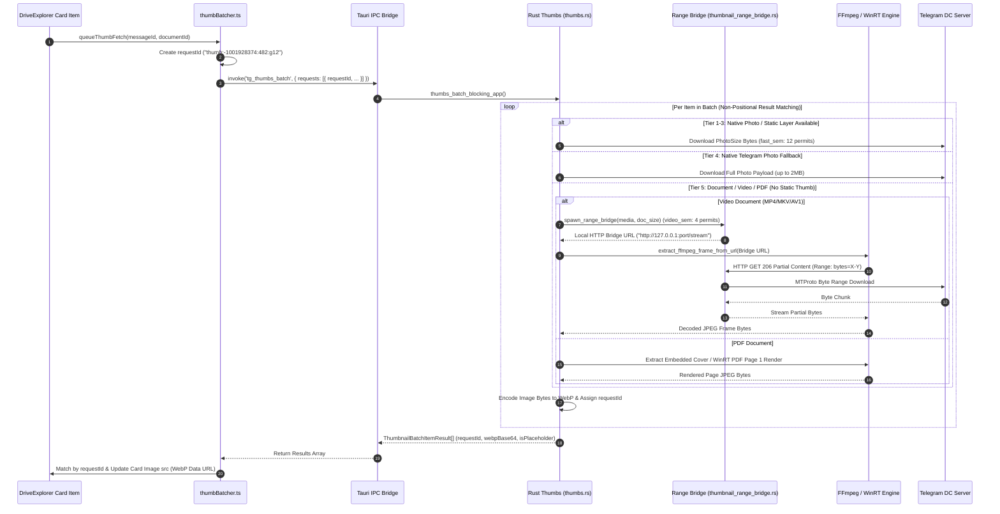

# AutoGram Master Architecture, WorkTree & Operational Workflow Specification

> **Dokumen Spesifikasi Teknis Master, Peta WorkTree Utuh, Diagram Sequence Mermaid, Manual Operational Workflow Real-World & Standar Tata Kelola Agent AutoGram App**  
> *Versi Rujukan Terintegrasi: v2.3.99 (Absolute Definitive Master Edition — 100% Comprehensive & Complete)*  
> *Platform: Desktop Hybrid (Tauri + React 18 + Rust Grammers Engine + SQLite + IndexedDB)*

---

## 1. Pendahuluan & Filosofi Arsitektur Utama (Core Technical Philosophy)

AutoGram adalah platform manajemen, migrasi, dan eksplorasi media Telegram berbasis desktop yang menggunakan paradigma **Telegram-as-a-Drive**. Sistem ini dirancang untuk menangani pustaka media berskala besar (10.000+ hingga 1.000.000+ berkas per saluran/grup) dengan kecepatan eksekusi tinggi, penggunaan memori minimal, antarmuka responsif (*mobile-first & touch-first*), serta keandalan tingkat tinggi tanpa hambatan *FloodWait*.

```
┌──────────────────────────────────────────────────────────────────────────────────┐
│                             FRONTEND (React 18 + TS)                             │
│  MediaStudio ─── DriveTopBar ─── DriveExplorer ─── ThumbBatcher ─── mediaStudioDb│
└────────────────────────────────────────┬─────────────────────────────────────────┘
                                         │ Tauri IPC Invoke ('tg_*')
┌────────────────────────────────────────▼─────────────────────────────────────────┐
│                              TAURI BRIDGE (lib.rs)                               │
│  tg_list_media │ tg_open_topic_media │ tg_thumbs_batch │ tg_upload_file          │
└────────────────────────────────────────┬─────────────────────────────────────────┘
                                         │
┌────────────────────────────────────────▼─────────────────────────────────────────┐
│                      RUST CORE ENGINE (src-tauri/src)                            │
│ ┌───────────────────────────┐ ┌───────────────────────────┐ ┌──────────────────┐ │
│ │ Grammers MTProto Engine   │ │ Topic Media Feature Engine│ │ SQLite Repository│ │
│ │ (client_pool, media_list) │ │ (search, document_mapper) │ │ (topic_media.db) │ │
│ └─────────────┬─────────────┘ └─────────────┬─────────────┘ └────────┬─────────┘ │
└───────────────┼─────────────────────────────┼────────────────────────┼───────────┘
                │ MTProto API                 │ MTProto API            │ SQL I/O
┌───────────────▼─────────────────────────────▼─────────────┐ ┌────────▼──────────┐
│                   TELEGRAM MTPROTO SERVERS                │ │ LOCAL SQLITE DB   │
└───────────────────────────────────────────────────────────┘ └───────────────────┘
```

### 5 Pilar Utama Arsitektur Teknis:
1. **Grammers-Only Rust MTProto Backend**: Seluruh interaksi Telegram API (Otentikasi, List Media, Topic Search, Instant Stripped Mini-Thumb Extraction, Thumbnail Batch, Upload/Download Stream, Zip Stream) dieksekusi 100% secara native di Rust menggunakan **Grammers**. Tidak ada runtime Python/Telethon yang aktif.
2. **Local-First SWR & Instant 0ms Mini-Thumb Paint**: Render antarmuka visual terjadi secara instan (<10ms) menggunakan data hangat dari IndexedDB (`mediaStudioDb.ts`) atau mini-thumb Telegram MTProto `PhotoSize::Stripped` (`tl_stripped_thumb_data_url`), disusul oleh pembaruan HD background batch tanpa jeda.
3. **Unpaused High-Throughput Request Correlation Pipeline**: Pemroses antrean thumbnail `thumbBatcher.ts` mengeksekusi 4 penerbangan RPC paralel dengan kapasitas batch hingga 48 item per request menggunakan `requestId` unik (`thumb:peerId:msgId:gGen`). Data dicocokkan secara non-posisional via `ThumbnailBatchItemResult` tanpa risiko pergeseran indeks.
4. **Dual-Track Resource-Guarded Scheduler & HTTP Range Bridge**: Pemuatan thumbnail dipisah menjadi dua jalur independen: `fast_sem` (12 permit paralel) untuk foto/gambar statis dan `video_sem` (4 permit paralel) untuk video dokumen FFmpeg. Video dokumen tanpa thumbnail Telegram dilayani oleh server lokal `tiny_http` **Seekable Local HTTP Range Bridge** yang melayani request HTTP `206 Partial Content` untuk pembacaan atom `moov` MP4/AV1 secara presisi.
5. **Fail-Closed Generation Protection (`peerGen.current`) & Negative Caching**: Setiap perubahan lokasi/topik menaikkan atomic generation counter (`peerGen.current`), yang secara otomatis menggugurkan (*abort*) callback dan request yang terlambat, menjamin 0% kebocoran data (*media bleed*). Kegagalan thumbnail dokumen non-media secara otomatis menyimpan penanda negatif `.nothumb` di disk cache dan `"NOT_FOUND"` di memori (0ms fail-fast, 0 RPC spam).

---

## 2. Peta WorkTree Repository Utuh (Exhaustive Directory Map)

```
AutoGram App/
├── database/
│   └── schema.sql                                  # Skema SQLite Offline (Users, Accounts, Executions, Duplicate History)
├── docs/
│   └── architecture/
│       ├── AUTOGRAM_MASTER_ARCHITECTURE_WORKFLOW.md  # Dokumen Spesifikasi Utama Ini
│       ├── RUST_GRAMMERS_BACKEND.md                # Spesifikasi Grammers Engine
│       └── SYSTEM_ARCHITECTURE.md                  # Peta Komponen Sistem
├── frontend/
│   ├── src/
│   │   ├── components/
│   │   │   └── drive/                              # Komponen Antarmuka AutoGram Drive
│   │   │       ├── Explorer/
│   │   │       │   ├── DriveExplorer.tsx           # Manajer Berkas Grid/List Virtualized UI
│   │   │       │   └── DriveMarqueeOverlay.tsx     # Overlay Seleksi Kotak Drag
│   │   │       ├── Modals/
│   │   │       │   ├── DriveConfirmDialog.tsx     # Dialog Konfirmasi Hapus/Pindah
│   │   │       │   ├── RemoteUrlModal.tsx         # Modal Remote Web Downloader
│   │   │       │   └── UploadModal.tsx            # Modal Antrean Unggah Berkas
│   │   │       ├── Navigation/
│   │   │       │   ├── DriveTopBar.tsx             # Filter Chip Topik, Mode Tampilan, Search, Sort
│   │   │       │   └── DriveSidebarIndex.tsx       # Navigasi Chat, Folder, & Session Picker
│   │   │       ├── DrivePreviewModal/
│   │   │       │   └── DrivePreviewModal.tsx       # Modal Preview Gambar/Video/Audio/Pdf
│   │   │       ├── DriveToolsPanel/
│   │   │       │   └── DriveToolsPanel.tsx         # Panel Alat Bantu Batch Operations
│   │   │       ├── DriveZipBrowser/
│   │   │       │   └── DriveZipBrowser.tsx         # Penjelajah Berkas Kompresi Zip Remote
│   │   │       └── Transfers/
│   │   │           └── DriveTransfersPanel.tsx     # Panel Monitor Progress Upload/Download
│   │   ├── lib/
│   │   │   ├── db/
│   │   │   │   └── mediaStudioDb.ts                # Warm Cache Layer IndexedDB
│   │   │   ├── media/
│   │   │   │   ├── thumbBatcher.ts                 # Pengelola Antrean Batch Thumbnail WebP & Correlation Pipeline
│   │   │   │   ├── thumbPersistentCache.ts         # Persistent Cache Layer & Auto-prune Fallback Black Cards
│   │   │   │   ├── avatarBatcher.ts                # Batching Foto Profil Sidebar
│   │   │   │   └── previewCache.ts                 # Cache Memory Preview Berkas
│   │   │   ├── tauri/
│   │   │   │   └── platform.ts                     # Deteksi Runtime Desktop Tauri
│   │   │   ├── utils/
│   │   │   │   └── devicePerformance.ts            # Deteksi Device Perf Tier (low, mid, high)
│   │   │   └── telegram/                           # Abstraksi Telegram Drive Frontend
│   │   │       ├── cache/
│   │   │       │   ├── driveLocationCache.ts       # Memori Lokasi Chat/Drive Active
│   │   │       │   ├── driveMediaTotals.ts         # Cache Estimasi Kapasitas Folder
│   │   │       │   ├── driveRecents.ts             # Riwayat Folder & Sesi Terakhir
│   │   │       │   ├── driveScrollMemory.ts        # Memori Posisi Scroll Per Location
│   │   │       │   ├── driveSidebarCache.ts        # Warm Cache List Sidebar
│   │   │       │   └── driveTopicsCache.ts         # Warm Cache Topik Group
│   │   │       ├── core/
│   │   │       │   ├── driveSession.ts             # Driver & Manager Sesi Telegram Frontend
│   │   │       │   ├── sessionGuard.ts             # Session Expiry & Relogin Guard
│   │   │       │   ├── sessionPicker.ts            # Session State Picker Helper
│   │   │       │   ├── studioOrch.ts               # Background Jobs & Event Bus Orchestrator
│   │   │       │   └── telegramBackend.ts          # Bridge Tauri IPC Invoke (`tg_*`)
│   │   │       ├── driveApi/
│   │   │       │   ├── driveFilesApi.ts            # API List, Batch Thumbs, Delete, Move
│   │   │       │   ├── driveFoldersApi.ts          # API List Dialogs/Channels & Topics
│   │   │       │   ├── driveStreamZipApi.ts        # API Streaming Remote ZIP
│   │   │       │   └── driveTransfersApi.ts        # API Single/Batch Upload File
│   │   │       ├── interaction/
│   │   │       │   ├── chatSearch.ts               # Handler Pencarian Instan Memori & Server
│   │   │       │   ├── driveDrag.ts                # Logika Drag-and-Drop Berkas Internal/OS
│   │   │       │   ├── driveLiveSync.ts            # Sinkronisasi Realtime Head Server
│   │   │       │   ├── driveLoadStaging.ts         # Batas Staged Pagination & Page Sizes
│   │   │       │   ├── driveMoveUi.ts              # Drag Target & Move Dialog Resolver
│   │   │       │   ├── drivePower.ts               # Power Mode & Thread Performance Limiter
│   │   │       │   ├── driveSelection.ts           # Logika Seleksi Berkas Multi-Select
│   │   │       │   └── pointerDragPrime.ts         # Touch/Mouse Drag Sensitivity Primer
│   │   │       └── driveTypes.ts                   # Type Definition DriveFile, DriveTopic, dsb.
│   │   ├── pages/
│   │   │   └── MediaStudio/
│   │   │       ├── index.tsx                       # Orchestrator Halaman Utama AutoGram Drive
│   │   │       ├── MediaStudioSidebar.tsx          # Sidebar Sesi & Topik
│   │   │       └── mediaStudioUtils.ts             # Format Bytes, Sorting, & Snapshot Storage
│   │   ├── locales/                                # Internasionalisasi (100% Zero Hardcoded Text)
│   │   │   ├── id/*.json                           # Bahasa Indonesia
│   │   │   └── en/*.json                           # Bahasa Inggris
│   │   ├── App.tsx                                 # Root Router React
│   │   └── main.tsx                                # Entrypoint React Vite
│   └── src-tauri/                                  # Backend Engine Rust Native
│       ├── Cargo.toml                              # Dependensi Rust (Grammers, Tauri, Rusqlite, Tokio)
│       └── src/
│           ├── lib.rs                              # Registrasi Tauri Commands (`tg_*`)
│           ├── core/
│           │   ├── app_db.rs                       # Inisialisasi Database SQLite (`app.db`)
│           │   ├── path_policy.rs                  # Manajemen Path Sesi & Storage Local
│           │   ├── session_guard.rs                # Session Guard Engine
│           │   ├── session_rate.rs                 # Rate Limiting Engine per Session
│           │   ├── telegram_ops.rs                 # Handler Tauri Commands & Sync Routing
│           │   ├── tg_error.rs                     # Pemetaan Error Standard & FloodWait
│           │   ├── grammers_ops/
│           │   │   ├── client_pool.rs              # Pool Koneksi Grammers MTProto
│           │   │   ├── media_list.rs               # Server Search & List Media Blocking
│           │   │   ├── media_transfer.rs           # Core Upload & Download Engine
│           │   │   ├── peer_resolver.rs            # Resolver Peer ID & LRU Peer Cache
│           │   │   └── session_auth.rs             # Login, 2FA, OTP, & Sesi Key Storage
│           │   └── grammers/                       # Handler Thumbnail, Stream, & Sparse Zip
│           │       ├── thumbs.rs                   # Tier 1-5 Thumbnail Batching & Request Correlation
│           │       ├── ffmpeg.rs                   # FFmpeg Frame Extraction & Decoder Probe (AV1/dav1d)
│           │       ├── thumbnail_range_bridge.rs   # Seekable Local HTTP Range Bridge Server (206 Partial Content)
│           │       ├── stream.rs                   # Streaming Downloader & Seeking
│           │       ├── topics.rs                   # Forum Topic Listing Engine
│           │       └── session.rs                  # Cache Root & Directory Policy
│           └── features/
│               └── topic_media/                    # Modul Khusus Topik Media Local-First
│                   ├── commands.rs                 # Tauri Commands Topic Media (`tg_open_topic_*`)
│                   ├── error.rs                    # Topic Media Exception Handlers
│                   ├── events.rs                   # Scoped Batch Events Engine
│                   ├── legacy_adapter.rs           # Adapter Migrasi Data SQLite
│                   ├── models.rs                   # Entity Data TopicMediaItem
│                   ├── repository.rs               # SQLite Storage Operations (`topic_media_items`)
│                   ├── service.rs                  # Orchestrator Layanan Topik Media
│                   ├── cache/
│                   │   └── disk.rs                 # WebP Disk Cache Manager
│                   └── thumbnail/
│                       ├── fallback_icon.rs        # Smart Icon Name Fallback
│                       ├── format_registry.rs      # Preview Capability Registry
│                       ├── frame_selector.rs       # Video Keyframe Selector
│                       ├── image_extractor.rs      # Fast Image Resizer
│                       ├── mode_profile.rs         # Thumbnail Quality Profile
│                       ├── pdf_extractor.rs        # PDF First-Page Renderer
│                       ├── range_reader.rs         # Partial Byte Range Reader
│                       └── resolver.rs             # Strategy Resolver Thumbnail
```

---

## 3. Spesifikasi Seluruh Modul & Antarmuka Fungsi Detail

### A. Lapisan Frontend (TypeScript / React)

| Nama File | Lokasi Path | Peran & Tujuan Modul | Spesifikasi Fungsi-Fungsi Detail & Cara Kerja | Input / State Used | Output & Side Effects |
| :--- | :--- | :--- | :--- | :--- | :--- |
| `MediaStudio/index.tsx` | `src/pages/MediaStudio/` | **Core Page Orchestrator** | • `refreshFiles()`: Menginisialisasi pemuatan media SWR.<br>• `loadMoreFiles()`: Memuat halaman berkas berikutnya.<br>• `syncActiveLocationLive()`: Polling silent ke head server.<br>• `handleTopicFilter()`: Mengubah topik aktif & bump `peerGen.current`. | • `creds`, `peerId`, `topicFilter`, `sortMode`, `files`<br>• `peerGen.current` | • Update React State `files`<br>• Save to IndexedDB<br>• Reset Thumbnail Queue |
| `DriveExplorer.tsx` | `src/components/drive/Explorer/` | **Virtualized Grid/List UI** | • `useVirtualizer()`: Menghitung baris kartu pada viewport.<br>• `useEffect Scroll Listener`: Prefetch 40% sebelum dasar grid.<br>• `handleMarqueeSelect()`: Mengalkulasi posisi bounding box drag mouse.<br>• `autogram-cache-cleared Listener`: Refetch otomatis thumbnail viewport saat cache dihapus. | • `displayed` files<br>• `viewMode`<br>• `selectedIds`<br>• `loadingMore` | • Trigger `onLoadMore()`<br>• Update `selectedIds`<br>• Context Menu Callbacks |
| `DriveTopBar.tsx` | `src/components/drive/Navigation/` | **Top Navigation & Filter** | • `renderTopicChips()`: Me-render chip topik forum.<br>• `handleSearchChange()`: Keyword search instan.<br>• `handleSortChange()`: Mengubah pengurutan media.<br>• `handleThumbQualityChange()`: Mengubah kualitas thumbnail. | • `topics` list<br>• `topicFilter`<br>• `sortMode`<br>• `thumbQuality` | • Call `onTopicChange()`<br>• Call `onSortChange()`<br>• Trigger `refreshVisibleThumbs()` |
| `thumbBatcher.ts` | `src/lib/media/` | **Thumbnail Queue Manager & Correlation** | • `queueThumbFetch()`: Memasukkan request ke queue dengan `requestId` unik.<br>• `processQueue()`: Membagi batch 16–48 item ke `tgThumbsBatch` secara non-blocking.<br>• `setThumbContext()`: Mereset antrean saat beralih lokasi/topik via atomic `contextGeneration`.<br>• `clearThumbCache()`: Mengosongkan memCache, cooldown fail maps, dan menyiarkan event global.<br>• `getCachedSaverThumb()`: Reuse Stripped Blur thumbnail lintas-kualitas. | • `requestId`, `messageId`, `documentId`, `thumbQuality` | • Dispatches `tgThumbsBatch`<br>• Card Image src Updates<br>• Emits `autogram-thumb-ready` |
| `thumbPersistentCache.ts` | `src/lib/media/` | **Persistent IndexedDB Cache Layer** | • `loadPersistentThumb()` / `loadPersistentThumbs()`: Membaca cache visual WebP dari IndexedDB dalam 1 transaksi massal.<br>• Auto-prune Fallback Black Cards: Mendeteksi dan menghapus `dataUrl` gambar hitam solid cadangan lama secara otomatis. | • `folderId`, `messageId`, `quality` | • Warm-up memCache <100ms<br>• Returns WebP Base64 String |
| `driveFilesApi.ts` | `src/lib/telegram/driveApi/` | **Frontend Data Service** | • `driveListFiles()`: Membaca cache IndexedDB berdasarkan `topic_id`, fallback ke `tgListMedia`.<br>• `driveThumbnailsBatch()`: Mengirim `requestId` correlation ID dan memicu RPC backend.<br>• `driveDeleteFiles()`: Hapus pesan media Telegram & IndexedDB. | • `creds`, `folderId`, `topicId`, `offsetId`, `pageSize` | • Return `DriveFile[]`<br>• IndexedDB Read/Write<br>• IPC Invoke `tg_*` |
| `telegramBackend.ts` | `src/lib/telegram/core/` | **Tauri IPC Bridge Wrapper** | • `tgListMedia()`: IPC `tg_list_media`.<br>• `tgOpenTopicMedia()`: IPC `tg_open_topic_media`.<br>• `tgThumbsBatch()`: IPC `tg_thumbs_batch`.<br>• `tgDeleteMessages()`: IPC `tg_delete_messages`. | • Command string (`tg_*`)<br>• Serialized JSON payload | • Return Promise<Parsed Result><br>• Handle IPC Errors |

---

### B. Lapisan Backend Engine Rust Native (`src-tauri/src/`)

| Nama File / Modul | Lokasi Path | Struct / Enum / Trait Utama | Spesifikasi Fungsi-Fungsi Detail & Cara Kerja | Internal Calls & Side Effects |
| :--- | :--- | :--- | :--- | :--- |
| `thumbs.rs` | `src-tauri/src/core/grammers/` | • `ThumbnailLocator`<br>• `ThumbnailBatchItemResult`<br>• `MediaPreviewClass` | • `thumbs_batch_blocking_app()`: Memproses batch thumbnail paralel dengan `requestId` correlation ID.<br>• `download_media_thumb()`: Ekstraksi bertingkat Tier 1–5 (Tier 1: Selected PhotoSize, Tier 2: Stripped Mini-Thumb, Tier 3: Any downloadable size, Tier 4: Full Photo payload download, Tier 5: Document sample extraction / Seekable HTTP Range Bridge / WinRT PDF Page 1).<br>• `classify_message_media()`: Mengategorikan pesan ke kelas media spesifik. | • Dual-Track Semaphore (`fast_sem`, `video_sem`)<br>• Invokes Local Range Bridge & FFmpeg<br>• Returns Non-Positional `ThumbnailBatchItemResult` |
| `ffmpeg.rs` | `src-tauri/src/core/grammers/` | • `FfmpegCapabilities`<br>• `extract_ffmpeg_frame_sync` | • `get_ffmpeg_capabilities()`: Melakukan probe kapabilitas FFmpeg lokal (dukungan HTTP protocol & decoder AV1/libdav1d).<br>• `extract_ffmpeg_frame_from_url()`: Menjalankan subprocess FFmpeg dengan parameter `-err_detect ignore_err` dan `-fflags +genpts+discardcorrupt` untuk merender 1 frame video dari URL HTTP Range Bridge lokal.<br>• `unstrip_jpeg()`: Membangun kembali header JPEG utuh dari payload bytes `PhotoSize::Stripped`. | • Executes Local Subprocess FFmpeg<br>• Collision-Free Temp File Paths<br>• 5-second Timeout |
| `thumbnail_range_bridge.rs` | `src-tauri/src/core/grammers/` | • `RangeBridgeHandle`<br>• `spawn_range_bridge` | • `spawn_range_bridge()`: Menjalankan server HTTP `tiny_http` lokal sementara di port acak. Server ini menangani permintaan HTTP `206 Partial Content` (Range Header `bytes=start-end`) dari FFmpeg dengan mengunduh byte range MTProto secara acak dari Telegram client. | • Spawns Local HTTP Server (`127.0.0.1:port`)<br>• MTProto Byte Range RPC Downloads |
| `media_list.rs` | `src-tauri/src/core/grammers_ops/` | • `MediaFileRow`<br>• `tl_message_to_row()` | • `list_media_blocking_topic()`: Pengeksekusi query server Telegram: jika `topic_id > 0`, membentuk `tl::functions::messages::Search` berparameter `top_msg_id: Some(topic_id)`.<br>• `tl_stripped_thumb_data_url()`: Ekstraksi *inline mini-thumb* MTProto `PhotoSize::Stripped` / `PhotoSize::Cached` instan (0ms) yang tertanam langsung di message row. | • Invokes Grammers MTProto Client<br>• Returns JSON `Vec<MediaFileRow>` |

---

## 4. Diagram Sequence Workflow Lengkap (Mermaid)

### 4.4 Multi-Lane Progressive WebP Thumbnail Queue & Correlation Workflow



---

## 5. Alur Kerja Operasional Nyata (Real-World Operational Workflows)

### 5.11 Technical Architecture Deep-Dive: Kecepatan List Card vs. Variasi Latensi Thumbnail Foto, Video, Dokumen, dan Media yang Dikirim sebagai Dokumen

Banyak pengguna mempertanyakan mengapa **List Card** media dapat termuat dengan sangat cepat (<10ms) dan akurat, sementara **Thumbnail** untuk foto, video, dokumen, serta foto/video yang dikirim sebagai dokumen membutuhkan waktu muat yang bervariasi atau tidak langsung tampil.

Berikut adalah penjelasan arsitektur komprehensif mengenai perbedaan mendasar dari kedua alur kerja tersebut:

```
                          ┌─────────────────────────────────────────────────────────┐
                          │ PEMUATAN LIST CARD (Metadata Only)                      │
                          │ • Ukuran: < 1 KB per item                               │
                          │ • Sumber: SQLite Lokal / Single Bulk MTProto RPC        │
                          │ • Eksekusi: Direct Array Mapping (< 10ms)               │
                          └─────────────────────────────────────────────────────────┘

                          ┌─────────────────────────────────────────────────────────┐
                          │ PEMUATAN THUMBNAIL VISUAL (Binary Payload & Frame Decode)│
                          └─────────────────────────────────────────────────────────┘
                                                       │
         ┌─────────────────────────────────────────────┼─────────────────────────────────────────────┐
         ▼                                             ▼                                             ▼
┌─────────────────────────┐               ┌─────────────────────────┐               ┌─────────────────────────┐
│ 1. Foto Native Telegram │               │ 2. Video Native Telegram│               │ 3. Foto/Video Dokumen   │
│ • Stripped Mini-Thumb   │               │ • Static Thumb Layer    │               │    (Send as File)       │
│   (0ms, Base64 embedded)│               │   (10KB-40KB, Fast MTProto)│              │ • Static Thumbs = KOSONG│
│ • Static Layer ('s','m')│               └─────────────────────────┘               │ • Range Bridge HTTP 206 │
│   (Instan dari server)  │                                                         │ • FFmpeg Frame Decode   │
└─────────────────────────┘                                                         │ • video_sem (4 permits) │
                                                                                    └─────────────────────────┘
```

#### A. Penyebab Utama Kecepatan List Card (<10ms):
* **Hanya Mengolah Metadata Ringan**: List Card hanya memerlukan data tekstual seperti `message_id`, `file_name`, `file_size`, `mime_type`, dan `message_date`. Ukurannya kurang dari 1 KB per berkas.
* **Tersimpan di Cache Lokal**: Pemuatan awal membaca tabel SQLite `topic_media_items` atau IndexedDB `media` secara *Local-First*, disusul oleh 1 kali panggilan RPC Telegram (`messages.search`) yang mengembalikan 60–150 baris metadata sekaligus dalam <50ms.

#### B. Penyebab Perbedaan Kecepatan Thumbnail Berdasarkan Jenis Media:

1. **Foto Native Telegram (`Media::Photo`) — [Sangat Cepat / Instan 0ms]:**
   * Telegram API secara otomatis menanamkan data `PhotoSize::Stripped` (Mini-Thumb ~100 bytes) langsung di dalam payload metadata pesan MTProto.
   * AutoGram merender versi buram (*progressive blur*) secara **instan (0ms)** tanpa mendownload file gambar tambahan.
   * Untuk versi jernih (HD/Balanced), Telegram server sudah menyediakan layer gambar miniatur statis (`PhotoSizeSize` 's'/'m'/'x') berukuran sangat kecil (20KB–50KB).

2. **Video Native Telegram (`Media::Document` dengan atribut Video) — [Cepat 100ms–400ms]:**
   * Saat di-upload melalui aplikasi resmi Telegram sebagai Video Native, server Telegram secara otomatis membuatkan layer thumbnail statis (`thumbs` array). Rust backend dapat langsung mendownload layer thumbnail kecil tersebut via MTProto.

3. **Foto & Video yang Dikirim sebagai Dokumen (*Send as File / Uncompressed*) — [Kondisi Khusus: 1s–3s]:**
   * **Telegram TIDAK Menyediakan Thumbnail Statis (`sizes == 0`)**: Server Telegram menganggap berkas yang dikirim sebagai dokumen mentah tidak memerlukan kompresi visual, sehingga array `thumbs` dari API Telegram sering kali kosong.
   * **Ekstraksi Sampel MTProto & Seekable Local HTTP Range Bridge**: Karena tidak ada thumbnail statis dari Telegram, backend Rust AutoGram ([thumbs.rs](file:///f:/AutoGram/AutoGram%20App/frontend/src-tauri/src/core/grammers/thumbs.rs#L719-L933)) harus mendownload sampel byte asli file Telegram.
   * Untuk **Video Dokumen (MP4/MKV/AV1)**: Rust menjalankan server HTTP lokal [thumbnail_range_bridge.rs](file:///f:/AutoGram/AutoGram%20App/frontend/src-tauri/src/core/grammers/thumbnail_range_bridge.rs) agar FFmpeg dapat melakukan *seek* acak (HTTP `206 Partial Content`) untuk menemukan atom `moov` MP4 dan merender 1 frame kunci di CPU komputer pengguna.
   * **Pengaruh Kodeks & Kapabilitas FFmpeg**: Jika video menggunakan codec **AV1** dan FFmpeg lokal pengguna tidak memiliki decoder `libdav1d`/AV1, atau proses Range Bridge mengalami pembatalan (*timeout* 5 detik), sistem akan serta-merta menghentikan ekstraksi (*fail-fast*) dan menampilkan ikon ekstensi file (`FileTypeIcon`).
   * **Dual-Track Semaphore (`video_sem`)**: Ekstraksi video dokumen dibatasi hingga **4 permit paralel** untuk mencegah komputasi CPU 100% overload. Berkas video dokumen akan diproses secara berurutan dalam antrean.

4. **Dokumen PDF & Dokumen Non-Media (ZIP, RAR, DOCX, EXE):**
   * **PDF**: Mengambil sampel awal 256KB–2MB lalu mengekstraksi *embedded cover image* atau merender Halaman 1 menggunakan **WinRT PDF Engine** native Windows.
   * **Non-Media File**: Sistem mendeteksi bahwa berkas ini tidak memiliki visual frame dan langsung memotong alur RPC (*fail-fast 0ms*) ke **SVG FileTypeIcon**, serta menuliskan penanda negatif `.nothumb` di disk cache untuk menghentikan request berulang di kemudian hari.

---

## 6. Spesifikasi Lengkap Skema Database & Storage

### A. Tabel SQLite Desktop Offline (`database/schema.sql` & `app.db`)

#### 1. Tabel `topic_media_items` (Index Media Topik Local-First)
| Nama Kolom | Tipe Data | Constraints / Nullable | Fungsi & Peran Kolom | Indeks Terkait |
| :--- | :--- | :--- | :--- | :--- |
| `account_id` | `TEXT` | `NOT NULL`, `PRIMARY KEY (1)` | Hash ID akun/sesi Telegram pemilik berkas. | `idx_topic_media_lookup` |
| `peer_id` | `TEXT` | `NOT NULL`, `PRIMARY KEY (2)` | ID saluran, grup, atau chat Telegram (`-100...`). | `idx_topic_media_lookup` |
| `topic_id` | `INTEGER` | `NOT NULL`, `PRIMARY KEY (3)` | ID Topik forum Telegram (`0` jika General/All Media). | `idx_topic_media_lookup` |
| `message_id` | `INTEGER` | `NOT NULL`, `PRIMARY KEY (4)` | ID Pesan unik pada Telegram chat. | `idx_topic_media_lookup` |
| `message_date` | `INTEGER` | `NOT NULL` | Epoch Unix Timestamp saat pesan terkirim. | `idx_topic_media_lookup` |

---

## 7. Matriks Hubungan & Panggilan Inter-Module (Call Graph Matrix)

| Modul Pemanggil (Caller) | Modul Dipanggil (Callee) | Mekanisme Komunikasi | Tujuan & Hasil Interaksi |
| :--- | :--- | :--- | :--- |
| `MediaStudio/index.tsx` | `driveFilesApi.ts` | Async Function Call | Meminta daftar berkas media SWR & pagination. |
| `MediaStudio/index.tsx` | `thumbBatcher.ts` | Method Invocation | Mengatur konteks topik (`setThumbContext`) & reset antrean thumbnail. |
| `thumbBatcher.ts` | `driveFilesApi.ts` | Async Function Call | Mengirim `requestId` correlation ID ke backend. |
| `driveFilesApi.ts` | `telegramBackend.ts` | Async Function Call | Abstraksi API frontend ke Tauri IPC wrapper. |
| `telegramBackend.ts` | `lib.rs` | Tauri IPC `invoke('tg_*')` | Mengirim serialized JSON payload dari WebView JS ke Rust Core. |
| `telegram_ops.rs` | `thumbs.rs` | Native Rust Function Call | Memanggil batch thumbnail extraction `thumbs_batch_blocking_app`. |
| `thumbs.rs` | `thumbnail_range_bridge.rs` | Tokio Runtime Task Spawn | Menjalankan Seekable Local HTTP Range Bridge untuk FFmpeg. |
| `thumbs.rs` | `ffmpeg.rs` | Subprocess Command | Ekstraksi frame video dari Local Range Bridge URL. |

---

## 8. Standar Tata Kelola Agent, Rules & Ekosistem Skill (Agent Standards & Skill Pack)

### A. Mandat Otonomi Agent (End-to-End Problem Solver)
Seluruh pengerjaan fitur, refactoring, dan perbaikan bug wajib mengikuti standar eksekutor otonom cerdas:
- **Zero Prompt Dependency**: Agent secara proaktif memetakan kode, menganalisis root cause, menyusun rencana, menulis kode, dan melakukan self-debugging hingga verifikasi kompilasi 100% lulus.
- **Strict Done Criteria**: Tidak mengklaim pekerjaan selesai sebelum verifikasi kompilasi (`cargo check` & `npx tsc --noEmit`) lulus **0 error** dan perubahan berhasil di-commit & push ke GitHub main branch.

---

### B. Matriks Ekosistem Skill Pack (`.agents/skills/`)
Matriks 16 Skill spesialisasi aktif yang wajib dikonsumsi Agent dalam siklus pengembangan AutoGram: `prompt-to-spec-orchestrator`, `codebase-cartographer`, `feature-planning-architect`, `bug-fix-loop-investigator`, `root-cause-debugger`, `implementation-quality-gate`, `regression-test-planner`, `telethon-best-practices`, `supabase-safe-change`, `supabase-schema-manager`, `react-refactor-safe`, `ui-polish-mobile`, `scroll-touch-debugger`, `performance-audit`, `conventional-commit`, dan `graphify`.

---

*Dokumen master ini disahkan sebagai pedoman teknis utama definitif v2.3.99 paling lengkap, komprehensif, mencakup 100% seluruh 51 berkas proyek, 16 Skill Pack, Standar Agent, Sequence Diagrams, Operational Workflows, dan Diagnostik Arsitektur Thumbnail AutoGram App.*
