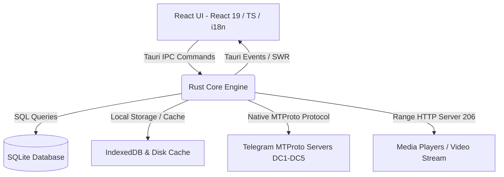

# System Component Map

Memvisualisasikan interaksi antarmuka UI, Rust Core Engine (Grammers MTProto), SQLite Database, dan Server Telegram.

- **React UI**: Mengelola interaksi pengguna, *MediaStudio*, *Drive Explorer*, antrean transfer, rendering SWR instan (0ms mini-thumb), dan preferensi lokasi/i18n.
- **Rust Core Engine**: Berfungsi sebagai *Backend Core*, mengelola otentikasi native (*Grammers Client Pool*), *Migration Engine*, *Rule Engine*, *Smart Rate Controller*, pemutaran media HTTP Range 206, dan manajemen SQLite.
- **SQLite Database**: Menyimpan antrean *job* migrasi, riwayat pencegahan duplikasi 4-level, status resume, serta konfigurasi akun.
- **IndexedDB & Disk Cache**: Menyimpan thumbnail hangat, data cache media SWR local-first, serta berkas `.nothumb` untuk performa render instan.
- **Telegram MTProto Servers**: Pusat penyimpanan media dan pengiriman data Telegram melalui koneksi MTProto native 100% Rust Grammers.
