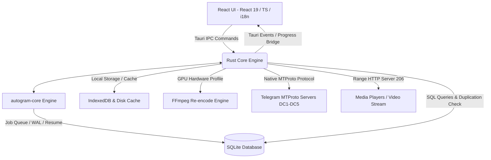

# System Component Map

Memvisualisasikan interaksi antarmuka React UI, Rust Core Engine, Shared Modular Core `autogram-core`, SQLite Database, dan Server Telegram MTProto.

- **React UI**: Mengelola interaksi pengguna, *MediaStudio*, *Drive Explorer*, *Transfer Manager*, preferensi hardware/GPU, rendering SWR instan (0ms mini-thumb), dan dukungan 100% i18n key parity.
- **Rust Core Engine**: Berfungsi sebagai *Backend Core*, mengelola otentikasi native multi-akun (*Grammers Client Pool*), *Studio Orchestrated Upload*, *Smart 3x3 Grid Album Chunking Engine*, *Migration Engine*, *Rule Engine*, *Smart Rate Controller*, pemutaran media HTTP Range 206, dan manajemen SQLite.
- **Shared Modular Core (`autogram-core`)**: Menyediakan lapisan keandalan produksi (`src-tauri/src/core/autogram_core`), mencakup *persistent job queue* dengan SQLite WAL, *job dependency graph*, *segment & byte offset checkpoint resume*, *faststart MP4 repair*, *policy & intent engine*, *account scoring system* (0-100), dan *audit trail logging*.
- **SQLite Database**: Menyimpan antrean *job* migrasi & studio upload, riwayat checkpoint offset, riwayat pencegahan duplikasi 4-level, status resume, serta konfigurasi akun.
- **IndexedDB & Disk Cache**: Menyimpan thumbnail hangat, data cache media SWR local-first, serta berkas penanda `.nothumb` & `"NOT_FOUND"` untuk performa render instan.
- **FFmpeg Re-encode & GPU Engine**: Melakukan validasi container media, ekstraksi frame thumbnail video, serta re-encode video hemat/berkualitas tinggi menggunakan GPU nyata (NVENC, AMF, QSV, CPU) sesuai alokasi hardware dinamis.
- **Telegram MTProto Servers**: Pusat penyimpanan media dan pengiriman data Telegram melalui koneksi MTProto native 100% Rust Grammers.

